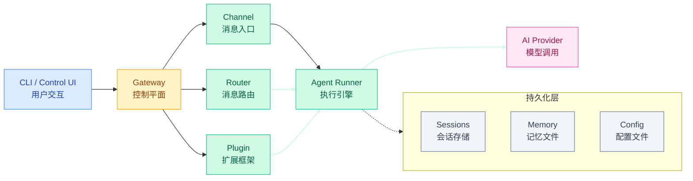
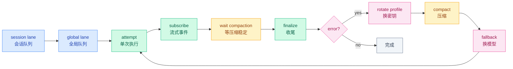
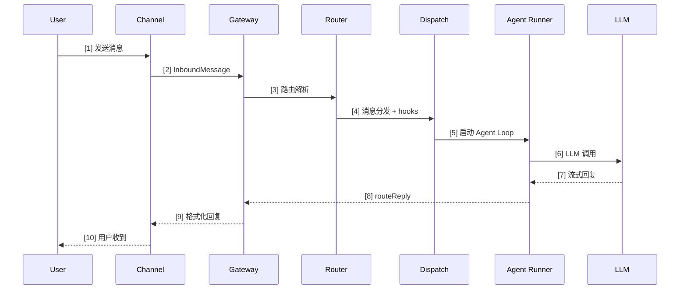

# 01 · 分层架构全景

> **学习要点**
> - OpenClaw 的整体架构分几层？每层的核心组件和职责是什么？
> - 智能体 5 层状态机如何驱动消息从入站到回复的完整转化？
> - Gateway 为什么是"控制平面"和"单一事实来源"？
> - 新手最容易忽略哪三条规则？

---

## 1. 一句话版

```
OpenClaw = 一个自托管 Gateway 网关 + 一个 AI Agent + 很多通道、插件和节点
```

- **自托管**：运行在自己的电脑或服务器上，配置、会话、记忆默认都在本机
- **核心设计问题**：OpenClaw 的智能体为什么"能长期跑"，而不是只在 demo 里跑一次？

答案在于多层架构的**韧性设计**——会话持久化、队列并发控制、状态机容错、模型故障转移。每一层都有独立的容错和重试逻辑，单点故障不会导致整个 Agent 卡死。

---

## 2. 整体分层架构



### 各层职责

| 层级 | 核心组件 | 源码目录 | 职责 |
|:----:|----------|----------|------|
| **接入层** | CLI / Control UI | `src/cli/` | 用户交互界面，命令行或浏览器控制面板 |
| **网关层** | Gateway | `src/gateway/` | 控制平面，管理连接、会话生命周期、配置热重载 |
| **通道与路由层** | Channel / Router / Plugin | `src/channels/`, `src/routing/`, `src/plugins/` | 消息入口适配，路由分发，插件扩展 |
| **执行层** | Agent Runner | `src/agents/embedded-agent-runner/` | 智能体循环（Agent Loop），LLM 调用、工具执行、流式输出 |
| **模型层** | AI Provider | `src/providers/` | 对接各类大模型 API，统一接口屏蔽差异 |
| **持久化层** | Sessions / Memory / Config | `src/config/` | 会话历史、记忆文件、配置存储 |

> **核心规则**：所有会话状态由网关"主控"。UI 客户端必须查询网关获取会话列表和 Token 计数，不读本地文件。

---

## 3. 智能体 5 层状态机

真实链路不是一次 `model.generate()`，而是**多层状态机**协同工作。这是 OpenClaw 能够"长期运行"的核心机制：



| 状态 | 所属层 | 职责 | 容错 |
|:----:|:------:|------|:----:|
| **session lane** | 接入层 | 会话级队列，保证同一会话消息串行 | concurrency=1 |
| **global lane** | 接入层 | 全局并发控制，限制同时运行数 | maxPending 兜底 |
| **attempt** | 执行层 | 单次真实执行事务，调用 LLM + 工具 | 超时中止 |
| **subscribe** | 执行层 | 流式事件稳定化，收集增量消息 | 事件缓冲 + 幂等 |
| **wait compaction** | 网关层 | 压缩等待，腾出上下文空间 | compactionRetryPromise |
| **finalize** | 执行层 | 收尾：回复整形、持久化 | 异常捕获 |
| **rotate profile** | 模型层 | 密钥轮换，换账号重试 | 多 profile 轮换 |
| **compact** | 网关层 | 压缩旧对话为摘要 | reserveTokensFloor |
| **fallback** | 模型层 | 模型回退，换一个模型继续 | 多候选 Fallback 列表 |

---

## 4. 消息完整旅程

从用户发送消息到收到回复的**完整跨层链路**（含调用链源码路径）：



| 步骤 | 组件 | 关键文件 | 说明 |
|:----:|------|----------|------|
| [1] | User | — | 用户通过任意通道发送消息 |
| [2] | Channel | `src/channels/` | 适配器接收并标准化为 InboundMessage |
| [3] | Gateway | `src/gateway/server.impl.ts` | 认证与会话绑定 |
| [4] | Router | `src/routing/resolve-route.ts` | 解析 session key，确定目标 Agent |
| [5] | Dispatch | `src/auto-reply/dispatch.ts` | 执行 hooks，编排自动回复 |
| [6] | Agent | `src/agents/embedded-agent-runner/run.ts` | 构建上下文、调用 LLM |
| [7] | LLM | `src/providers/` | 模型推理，流式返回 Token |
| [8] | Gateway | `src/gateway/server-chat.ts` | routeReply 回复路由 |
| [9] | Channel | — | 格式化为目标通道消息 |
| [10] | User | — | 收到回复 |

### 核心调用链（文本版）

```
src/entry.ts → src/runtime.ts → src/gateway/server.impl.ts
    → src/gateway/auth.ts → src/routing/resolve-route.ts
    → src/auto-reply/dispatch.ts → src/agents/embedded-agent-runner/run.ts
    → src/providers/anthropic.ts (或 openai.ts)
    → src/agents/openclaw-tools.ts (多轮循环)
    → src/auto-reply/reply/ → src/channels/ → 用户
```

---

## 5. 完整架构全景图

```mermaid
flowchart LR
    subgraph CHANNELS["📡 通道层"]
        TG[Telegram]
        WA[WhatsApp]
        DC[Discord]
        SL[Slack]
        WEB[WebChat]
        MS[Microsoft Teams]
    end

    subgraph GATEWAY["⚙️ 网关层"]
        CAPI[HTTP API]
        WS[WebSocket<br/>连接管理]
        AUTH[Auth<br/>速率限制]
    end

    subgraph ROUTING["🔀 路由层"]
        ROU[Router<br/>resolve-route.ts]
        KEY[Session Key<br/>session-key.ts]
    end

    subgraph EXECUTION["🤖 执行层"]
        DISP[Dispatch<br/>dispatch.ts]
        AGENT[Agent Runner<br/>embedded-agent-runner]
        TOOL[Tool System<br/>openclaw-tools.ts]
        CTX[Context Guard<br/>context-window-guard.ts]
        FALL[Model Fallback<br/>model-fallback.ts]
    end

    subgraph PLUGIN["🧩 插件层"]
        PL[Plugin Loader<br/>plugins/loader.ts]
        PR[Plugin Registry<br/>plugins/]
    end

    subgraph STORAGE["💾 存储层"]
        SESS[Session Store<br/>config/sessions/store.ts]
        MED[Media Store<br/>media/]
        CFG[Config IO<br/>config/io.ts]
    end

    subgraph PROVIDER["🔌 模型层"]
        ANTH[Anthropic<br/>Claude]
        OPE[OpenAI<br/>GPT]
        OLL[Ollama<br/>Local]
    end

    subgraph SIDECAR["🧰 附属能力"]
        CR[Cron<br/>定时任务]
        MEM[Memory<br/>记忆系统]
        SEC[Security<br/>安全审计]
        NODE[Nodes<br/>节点扩展]
    end

    CHANNELS --> GATEWAY
    GATEWAY --> ROUTING
    ROUTING --> EXECUTION
    EXECUTION --> PROVIDER
    EXECUTION --> PLUGIN
    EXECUTION --> STORAGE
    EXECUTION --- SIDECAR
    PLUGIN --> PROVIDER
    PLUGIN --> STORAGE
    SIDECAR --> STORAGE
    SIDECAR --> GATEWAY
```



---

## 6. 部署模式

| 模式 | 说明 | 适用场景 | 安全等级 |
|:----:|------|----------|:--------:|
| **本地部署** | 直接运行在本地机器 | 开发/测试 | 🟢 高 |
| **Docker 部署** | 使用 Docker 容器 | 生产环境 | 🟡 中 |
| **云服务器** | 部署到云服务器 | 远程访问 | 🟡 中 |
| **节点连接** | 移动端/桌面端作为节点 | 能力扩展 | 🔴 注意网络安全 |

---

## 7. 自检清单

| 检查项 | 说明 | 预期答案 |
|--------|------|----------|
| **消息路径** | 消息从通道到模型经过了哪 10 步？ | 能画出消息完整旅程 |
| **并发安全** | 同一会话的消息会乱序吗？ | 不会，Session Lane concurrency=1 |
| **容错链路** | 模型调用失败后有哪些兜底？ | Profile 轮换 → Fallback 模型 |
| **会话隔离** | Alice 和 Bob 通过同一 Bot 发消息互看隐私？ | 不会，per-channel-peer 隔离 |
| **配置热重载** | 改了通道配置需要重启吗？ | 不需要，hybrid 模式即时生效 |

---

## 8. 新手 3 条规则

| # | 规则 | 说明 |
|:-:|------|------|
| ① | **Gateway 要一直运行** | 它停了，所有通道和 Control UI 都失连 |
| ② | **先用 Control UI 验证，再接聊天软件** | 确认 AI 能回复，再接 Telegram/WhatsApp |
| ③ | **远程访问看安全配置** | 不要随便把 18789 端口暴露到公网 |

---

> **相关模块**：[02 - 核心概念模型](02-core-concepts.md) · [03 - 核心源码索引](03-core-source-index.md) · [02 - 网关与控制平面](../02-gateway-control/01-gateway-positioning.md) · [03 - 执行引擎](../03-execution-engine/01-agent-loop-workflow.md) · [04 - 路由与会话管理](../04-routing-session/01-routing-engine.md)
