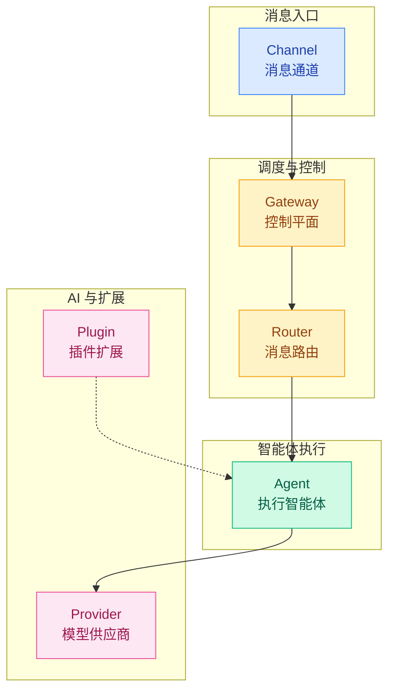
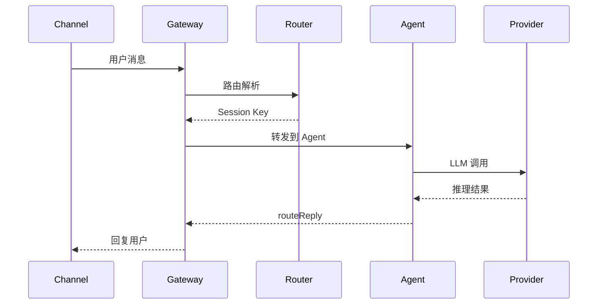

# 02 · 核心概念模型

> **学习要点**
> - OpenClaw 的六大核心实体是什么？它们之间如何分层协作？
> - 各核心概念对应的详细学习模块在哪里？

---

## 1. 六大核心实体

OpenClaw 的架构由**六大核心实体**构成，它们分层协作完成从消息接收到底层模型调用的完整链路：

| 实体 | 一句话定位 | 生命周期 | 详细模块 |
|:----:|-----------|:--------:|----------|
| **Channel** | 消息入口，接收用户消息并标准化 | 通道持续运行 | [04 · 通道与节点架构](../04-routing-session/04-channels-nodes.md) |
| **Gateway** | 调度中心，管理连接、会话、配置 | 进程级持续运行 | [02 · 网关与控制平面](../02-gateway-control/01-gateway-positioning.md) |
| **Router** | 决策中枢，解析 Session Key | 每次消息触发 | [04 · 路由层与 Session Key](../04-routing-session/01-routing-engine.md) |
| **Agent** | 执行智能体，推理+工具+记忆 | 会话级别 | [03 · 智能体执行引擎](../03-execution-engine/01-agent-loop-workflow.md) |
| **Provider** | 模型供应商，统一调用接口 | 全局配置 | [08 · Provider 与模型](../08-provider-models/01-provider-adapters.md) |
| **Plugin** | 扩展骨架，新增通道/工具/Provider | 启动时加载 | [09 · 插件系统](../09-extensions/01-plugin-system.md) |

---

## 2. 核心概念速览

### Agent Loop（智能体循环）

> 将一条消息转化为操作和最终回复的完整路径。不是一次 `model.generate()`，而是多层状态机协同。
> **详见**：[03 · Agent Loop 工作流](../03-execution-engine/01-agent-loop-workflow.md)

### Agent Runtime（运行时）

> 定义 Agent 的"工作方式"：`pi`（默认，完整循环）、`codex`（代码执行）、`claude-cli`（CLI 任务）、`acp`（外部 Agent）。
> 新手先用默认 `pi`，确认 Provider 稳定后再研究其他。

### Agent Workspace（工作区）

> Agent 的工作目录，包含 AGENTS.md（工作手册）和 SOUL.md（人格说明）。
> **详见**：[09 · 工作区配置](../09-extensions/05-workspace-config.md)

### 队列模式

> 当新消息在 Agent 执行中到达时，决定处理方式：`collect`（合并）、`steer`（导向）、`followup`（排队）、`interrupt`（中断）。
> **详见**：[03 · 队列与并发控制](../03-execution-engine/02-concurrency-control.md)

### Session Key（会话键）

> 路由的核心标识，格式 `agent:{agentId}:{channel}:{scope}:{peerId}`，决定消息属于哪个会话。
> **详见**：[04 · 路由层与 Session Key](../04-routing-session/01-routing-engine.md)

### dmScope（会话隔离）

> 控制 DM 会话的隔离粒度：`main`（单用户）、`per-peer`（按用户跨通道）、`per-channel-peer`（推荐多用户）。
> **详见**：[04 · 路由层与 Session Key](../04-routing-session/01-routing-engine.md)

---

## 3. 完整协作关系

---

> **相关模块**：[01 - 分层架构全景](01-layered-architecture.md) · [03 - 核心源码索引](03-core-source-index.md) · 各概念对应的详细模块见上表
