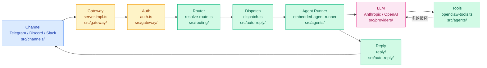
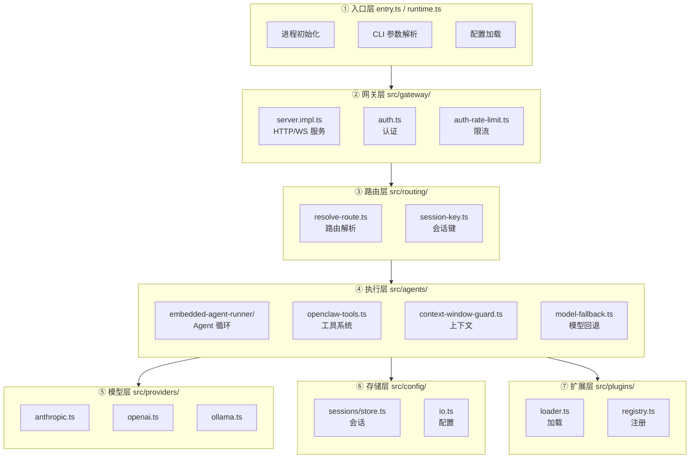

# 03 · 核心源码索引

> **学习要点**
> - OpenClaw 各模块的源码结构是怎样的？关键入口文件在哪里？
> - 从用户消息到 AI 回复，完整的代码调用链路是什么？
> - 如何根据功能需求快速定位到对应的源码文件？

---

## 1. 模块索引

下表按调用顺序列出 OpenClaw 的核心模块及其源码入口：

| 调用顺序 | 模块 | 关键文件 | 功能说明 |
|:---:|------|----------|----------|
| ① | **CLI 入口** | `src/entry.ts`, `src/runtime.ts` | 进程初始化、命令行参数解析、CLI profile 加载 |
| ② | **命令注册** | `src/cli/program.ts`, `src/commands/` | 命令树构建、懒加载子命令模块、快路径路由 |
| ③ | **Gateway 入口** | `src/gateway/server.impl.ts` | HTTP/WebSocket 服务启动、连接生命周期管理 |
| ④ | **WS 认证** | `src/gateway/auth.ts`, `src/gateway/auth-rate-limit.ts` | 握手挑战、Token 验证、连接速率限制 |
| ⑤ | **方法鉴权** | `src/gateway/auth-mode-policy.ts`, `src/gateway/auth-surface-resolution.ts` | role + scope 检查、鉴权策略决议 |
| ⑥ | **通道管理** | `src/channels/` | Telegram / Discord / Slack / WhatsApp 等通道适配器 |
| ⑦ | **路由解析** | `src/routing/resolve-route.ts`, `src/routing/session-key.ts` | 消息路由目标解析、Session Key 生成与管理 |
| ⑧ | **自动回复** | `src/auto-reply/dispatch.ts`, `src/auto-reply/reply/` | 消息分发编排、钩子执行、回复格式化 |
| ⑨ | **Agent 调度** | `src/agents/embedded-agent-runner/` | 智能体运行循环：Lane 排队、会话管理、工具执行 |
| ⑩ | **单次执行** | `src/agents/embedded-agent-runner/run.ts` | 单次 LLM 调用事务、上下文组装、流式输出 |
| ⑪ | **事件订阅** | `src/agents/embedded-agent-runner/subscribe.ts` | Pi 事件桥接、lifecycle/assistant/tool 三流分离 |
| ⑫ | **工具系统** | `src/agents/openclaw-tools.ts`, `src/agents/openclaw-plugin-tools.ts` | 工具清单构造、工具调用执行、插件工具注册 |
| ⑬ | **上下文守护** | `src/agents/context-window-guard.ts` | 上下文窗口预检、Token 上限检测、溢出保护 |
| ⑭ | **模型回退** | `src/agents/model-fallback.ts`, `src/agents/failover-error.ts` | 多候选模型轮换、Profile 冷却、指数退避 |
| ⑮ | **会话存储** | `src/config/sessions/store.ts` | sessions.json 元数据读写、jsonl 对话记录 |
| ⑯ | **媒体管理** | `src/media/`, `src/media-understanding/` | 媒体文件存储、图像/音频理解 |
| ⑰ | **安全审计** | `src/security/` | 审计通道、认证事件记录 |
| ⑱ | **插件加载** | `src/plugins/loader.ts`, `src/plugins/` | manifest 解析、插件注册、运行时钩子 |
| ⑲ | **配置 IO** | `src/config/io.ts` | JSON5 配置读写、环境变量替换、热重载 |

---

## 2. 消息完整旅程

从用户发送消息到收到回复的**完整调用链**（含源码路径）：



### 各阶段详述

| 步骤 | 组件 | 关键文件 | 核心行为 | 返回/事件 |
|------|------|----------|----------|-----------|
| ① | **Channel** | `src/channels/` | 从 Telegram/Discord 等接收消息，适配器标准化为内部 InboundMessage 格式 | → 入站消息 |
| ② | **Gateway** | `src/gateway/server.impl.ts` | WebSocket/HTTP 网关接收消息，会话绑定 | → 认证请求 |
| ③ | **Auth** | `src/gateway/auth.ts` | 握手挑战 → Token 验证 → 速率限制检查 | → 鉴权通过 |
| ④ | **Router** | `src/routing/resolve-route.ts` | 解析 channel/accountId/peerId → 确定 session key 和目标 agent | → 路由结果 |
| ⑤ | **Dispatch** | `src/auto-reply/dispatch.ts` | 执行 hooks → 组装自动回复 → 管理前台回复围栏 | → 执行指令 |
| ⑥ | **Agent** | `src/agents/embedded-agent-runner/run.ts` | 上下文构建 → 提示词组装 → 会话写锁 | → LLM 请求 |
| ⑦ | **LLM** | `src/providers/anthropic.ts` | Provider 适配 → 模型调用 → 流式 Token → 工具调用解析 | ← 流式事件 |
| ⑧ | **Tools** | `src/agents/openclaw-tools.ts` | 工具清单构造 → 执行工具 → 结果收集 → 回传 LLM | ← 工具结果 |
| ⑨ | **Reply** | `src/auto-reply/reply/` | 回复整形 → NO_REPLY 过滤 → routeReply → Channel 输出 | → 用户消息 |

### 完整调用链

```
src/entry.ts → src/runtime.ts → src/gateway/server.impl.ts
    → src/gateway/auth.ts → src/routing/resolve-route.ts
    → src/auto-reply/dispatch.ts → src/agents/embedded-agent-runner/run.ts
    → src/providers/anthropic.ts (或 openai.ts)
    → src/agents/openclaw-tools.ts (多轮)
    → src/auto-reply/reply/ → src/channels/ → 用户
```

---

## 3. 源码分层架构

OpenClaw 的源码按功能划分为以下层次：



---

## 4. 核心数据流

以下数据在模块间流转：

| 数据 | 类型 | 来源模块 | 目标模块 | 说明 |
|------|------|----------|----------|------|
| **InboundMessage** | 消息对象 | Channel | Gateway | 标准化的入站消息 |
| **SessionKey** | 字符串 | Router | Dispatch | 唯一会话标识 |
| **AgentRun** | 运行上下文 | Agent Runner | Provider | LLM 调用请求 |
| **StreamEvent** | 流事件 | Provider | Subscribe | 流式 Token + 工具调用 |
| **ToolResult** | 执行结果 | Tool System | Agent | 工具执行返回值 |
| **RouteReply** | 回复对象 | Agent | Channel | 格式化回复 |

---

## 5. 快速定位指南

当需要修改或理解特定功能时，按以下规则定位源码：

| 场景 | 入口文件 | 搜索关键词 |
|------|----------|-----------|
| 想改 CLI 命令 | `src/cli/` | `registerCoreCliByName` |
| 想改消息路由规则 | `src/routing/resolve-route.ts` | `resolveRoute` |
| 想改会话管理 | `src/config/sessions/store.ts` | `sessions.json` |
| 想改 Agent 执行逻辑 | `src/agents/embedded-agent-runner/run.ts` | `runEmbeddedPiAgent` |
| 想改 LLM 调用 | `src/providers/` | `provider` |
| 想改工具系统 | `src/agents/openclaw-tools.ts` | `openclaw-tools` |
| 想改配置热重载 | `src/config/io.ts` | `reload` |
| 想改插件加载 | `src/plugins/loader.ts` | `manifest` |
| 想改认证安全 | `src/gateway/auth.ts` | `authorizeGatewayMethod` |
| 想改通道适配 | `src/channels/` | `channel` |

---

> **相关模块**：[01 - 分层架构全景](01-layered-architecture.md) · [02 - 核心概念模型](02-core-concepts.md) · [03 - 执行引擎](../03-execution-engine/01-agent-loop-workflow.md) · [04 - 网关与控制平面](../02-gateway-control/01-gateway-positioning.md)
