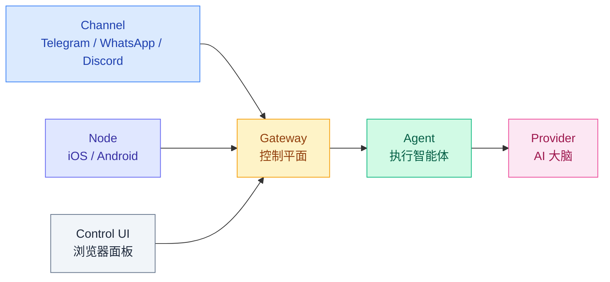
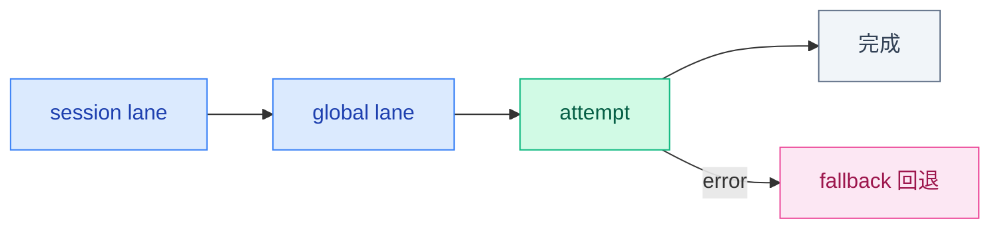
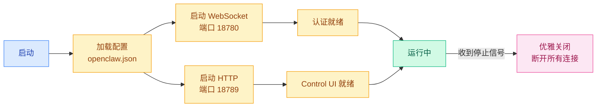

# 01 · Gateway 定位与职责

> **学习要点**
> - Gateway 在 OpenClaw 中扮演什么角色？为什么被称为"控制平面"？
> - 为什么说 Gateway 是"单一事实来源"？
> - Gateway 管理哪些核心资源？广播哪些事件？
> - 智能体 5 层状态机是如何在 Gateway 的协调下工作的？

---

## 1. 网关定位

Gateway（网关）是 OpenClaw 的**总服务台**，负责调度整个系统。所有连接——无论是聊天通道、设备节点、浏览器控制面板——都首先到达 Gateway。

### Gateway 在架构中的位置



### 组件职责对比

| 组件 | 职责 | Gateway 的关系 |
|------|------|----------------|
| **Channel** | 前台入口（消息收发） | Gateway 管理通道生命周期、消息路由 |
| **Node** | 外接设备（提供能力） | Gateway 管理节点配对、权限调用 |
| **Control UI** | 浏览器操作面板 | Gateway 提供 HTTP 管理接口 |
| **Agent** | 具体执行者（推理+工具） | Gateway 调度 Agent 运行、管理会话 |
| **Provider** | AI 大脑（模型调用） | Gateway 管理 Provider 配置、认证轮换 |

---

## 2. Gateway 核心职责

Gateway 是**控制平面** + **单一事实来源**。所有会话状态、连接状态、配置版本都由 Gateway 统一管理。

### 七大职责

| 职责 | 说明 | 机制 |
|------|------|------|
| **管理长连接** | WebSocket 全双工通信 | 10s 握手超时、自动重连、心跳保活 |
| **管理 Control UI** | 浏览器操作面板 | HTTP 服务 + Config 可视化标签页 |
| **管理通道连接** | 聊天软件入口 | 通道适配器注册、DM 策略、群组策略 |
| **管理节点连接** | 外接设备 | 设备配对、commands/caps 注册、权限调用 |
| **校验请求** | 格式和权限 | AJV 帧校验、role + scope 鉴权、速率限制 |
| **广播事件** | 系统事件通知 | agent / chat / presence / health / heartbeat / cron 六类事件 |
| **配置管理** | 热重载与版本管理 | hybrid/hot/restart/off 四种热重载模式 |

### 核心规则

> **所有会话状态由网关"主控"**。UI 客户端（macOS 应用、WebChat 等）必须查询网关获取会话列表和 Token 计数，不读本地文件。

### 为什么是"单一事实来源"？

```
                    ┌─────────────────┐
                    │   Control UI    │ ← 通过 API 查询状态
                    └────────┬────────┘
                             │
    ┌──────────────┐        │        ┌──────────────┐
    │  macOS 客户端 │─────── Gateway ───────│  WebChat   │
    └──────────────┘    (唯一真相源)        └──────────────┘
                             │
                    ┌────────┴────────┐
                    │  sessions.json  │
                    │  (本地存储)      │
                    └─────────────────┘
```

所有客户端**不直接读取本地文件**，而是通过 Gateway API 获取会话信息。这避免了多个客户端同时读写导致的竞态条件和状态不一致。

---

## 3. 执行协调 — 5 层状态机

Gateway 通过协调多层状态机来驱动 Agent 执行。详见 [01 - 分层架构全景](../01-architecture/01-layered-architecture.md) 第 3 节的完整展开。简言之：



> 每一层都有独立的容错和重试逻辑，确保单点故障不会导致整个 Agent 卡死。

---

## 4. 事件广播系统

Gateway 广播六类系统事件，各订阅者按需监听：

| 事件类型 | 触发时机 | 典型订阅者 |
|----------|----------|-----------|
| **agent** | Agent 运行状态变更 | Control UI、日志系统 |
| **chat** | 聊天消息收发 | 通道适配器、WebChat |
| **presence** | 节点上线/离线 | 节点管理器 |
| **health** | Gateway 健康状态 | 监控系统、心跳检查 |
| **heartbeat** | 周期性心跳 | agent heartbeat 机制 |
| **cron** | 定时任务触发 | Cron 调度器 |

### 事件处理机制

| 机制 | 说明 |
|------|------|
| **慢消费者丢弃** | 消费速度跟不上时自动丢弃，防止积压 |
| **幂等缓存** | 重复事件自动去重 |
| **广播路由** | 按事件类型路由到不同订阅组 |

---

## 5. 网关端口与默认配置

| 端口 | 用途 |
|:----:|------|
| **18789** | Gateway HTTP 端口（默认），提供 REST API + Control UI |
| **18780** | WebSocket 端口，长连接通信 |

### 默认地址

```
127.0.0.1:18789  （本机地址，外部默认不可访问）
```

> **安全警告**：远程部署时，不要直接暴露 18789 端口到公网。使用反向代理（Nginx/Caddy）配合 TLS + Token 认证。

---

## 6. Gateway 生命周期



---

## 7. Gateway 源码入口

| 文件 | 作用 |
|------|------|
| `src/gateway/server.impl.ts` | Gateway 主入口，HTTP + WebSocket 服务启动 |
| `src/gateway/server/ws-connection.ts` | WebSocket 连接管理 |
| `src/gateway/server/message-handler.ts` | 消息处理 + 握手超时 |
| `src/gateway/server-methods.ts` | 方法分发 + 鉴权 |
| `src/gateway/server-broadcast.ts` | 事件广播 |
| `src/gateway/server-channels.ts` | 通道管理 |
| `src/gateway/server-chat.ts` | 聊天事件处理 |

---

> **相关模块**：[02 - 配置系统与热重载](02-config-system.md) · [03 - WebSocket 协议层](03-websocket-protocol.md) · [04 - CLI 层与命令系统](04-cli-command-system.md) · [03 - 执行引擎](../03-execution-engine/01-agent-loop-workflow.md)
