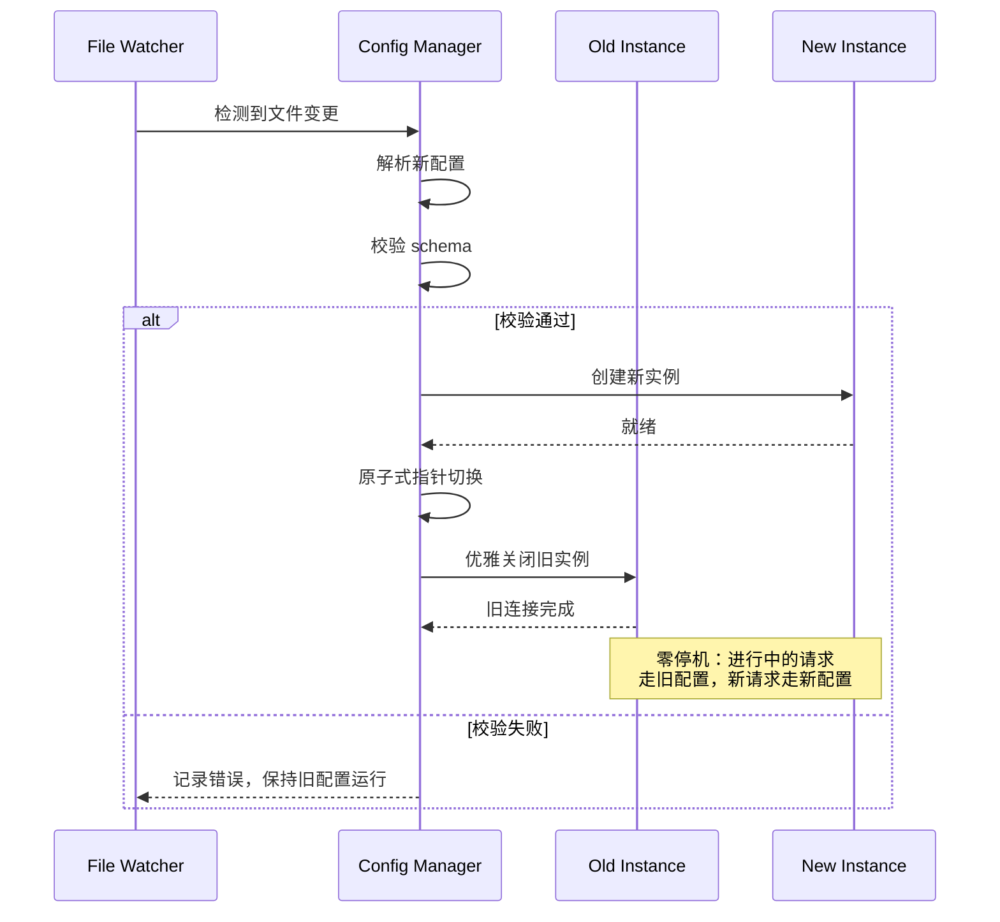

# 02 · 配置系统与热重载

> **学习要点**
> - OpenClaw 的配置文件在哪里？JSON5 格式有哪些优势？
> - 配置热重载支持哪四种模式？各自的行为差异是什么？
> - 安全更改和关键更改如何区分？热应用的工作原理是什么？
> - 如何通过环境变量注入配置？Docker 部署时如何配置？

---

## 1. 配置文件

OpenClaw 使用 `~/.openclaw/openclaw.json` 作为主配置文件，采用 **JSON5** 格式。

### JSON5 格式优势

JSON5 是 JSON 的超集，相比标准 JSON 多了以下便利：

| 特性 | 说明 | 示例 |
|------|------|------|
| **注释** | 单行 `//` 和多行 `/* */` | 配置说明、临时注释 |
| **Trailing comma** | 最后一个属性后加逗号 | 增删行时减少 diff 噪音 |
| **无引号键名** | 不含特殊字符的键无需引号 | `workspace: "~/.openclaw/workspace"` |
| **单引号字符串** | 支持单引号 | `model: 'claude-sonnet-4-5'` |
| **多行字符串** | 支持反斜杠换行 | 长配置值可换行书写 |

### 最小配置示例

```json5
// ~/.openclaw/openclaw.json — OpenClaw 配置文件
{
  agents: {
    defaults: {
      workspace: "~/.openclaw/workspace",  // Agent 工作区路径
      model: {
        primary: "anthropic/claude-sonnet-4-5",   // 主模型
        fallbacks: ["openai/gpt-5.2"],             // 回退模型
      },
    },
  },
  channels: {
    whatsapp: {
      allowFrom: ["+15555550123"],                 // 允许的用户
    },
  },
}
```

### 配置文件的严格验证

> OpenClaw **仅接受完全匹配 schema 的配置**。未知键、格式错误的类型或无效值会导致网关拒绝启动。这确保了配置的确定性和可预测性。

---

## 2. 配置编辑方式

OpenClaw 提供 5 种配置编辑方式：

| 方式 | 命令/路径 | 适用场景 |
|------|----------|----------|
| **交互式设置** | `openclaw onboard` | 新用户首次部署，引导完成基础配置 |
| **配置向导** | `openclaw configure` | 需要逐步引导修改配置 |
| **CLI 命令** | `openclaw config get/set` | 脚本化配置、快速单行修改 |
| **Control UI** | `http://127.0.0.1:18789` | 运维管理，可视化表单 + Raw JSON 编辑 |
| **直接编辑** | `~/.openclaw/openclaw.json` | 批量修改、高级配置（Gateway 自动热应用） |

### 常用 CLI 命令

```bash
# 设置 exec 权限模式
openclaw config set tools.exec.mode auto

# 查看当前生效配置
openclaw config get agents.defaults.model

# 重启 Gateway（热重载无法生效时）
openclaw gateway restart
```

---

## 3. 配置拆分（$include）

当配置变得复杂时，可以使用 `$include` 指令将配置拆分为多个文件：

```json5
{
  gateway: { port: 18789 },

  // 独立文件维护 Agent 配置
  agents: { $include: "./agents.json5" },

  // 数组合并多个文件（后者优先）
  broadcast: { $include: ["./clients/a.json5", "./clients/b.json5"] },
}
```

### $include 规则

| 规则 | 说明 |
|------|------|
| **单文件** | 替换包含对象，`agents: { $include: "./agents.json5" }` |
| **文件数组** | 深度合并，后者优先 |
| **相对路径** | 相对于包含文件所在目录解析 |
| **条件引用** | `$include:if-file-exists` 文件存在时引入、缺失时静默跳过 |
| **通配符** | `{ $include: "./conf.d/*.json" }` 按字母序合并 |
| **嵌套** | 被引用的文件也可以使用 $include |

---

## 4. 配置热重载

OpenClaw 的文件监视器（file watcher）持续监控配置文件及其 `$include` 引用文件的变更。检测到变更后，根据热重载模式执行不同行为。

### 四种重载模式

| 模式 | 行为 | 适用场景 |
|------|------|----------|
| **hybrid** 🏆（默认） | 安全更改即时热应用；关键更改自动重启 | 生产环境推荐 |
| **hot** | 仅热应用安全更改；关键更改时记录警告 | 不希望自动重启 |
| **restart** | 任何配置更改都重启网关 | 开发环境、快速验证 |
| **off** | 禁用文件监视，需手动重启 | 生产环境静默期 |

```json5
{
  gateway: {
    reload: {
      mode: "hybrid",    // hybrid | hot | restart | off
      debounceMs: 300,   // 防抖时间，避免频繁触发
    },
  },
}
```

### 安全更改 vs 关键更改

| 类别 | 示例 | 需要重启？ |
|------|------|:----------:|
| **通道配置** | 新增/删除 Channel，修改 DM Policy | ❌ |
| **Agent 配置** | 修改模型、工作区路径 | ❌ |
| **自动化配置** | Hooks、Cron、Heartbeat | ❌ |
| **会话配置** | dmScope、sendPolicy、重置策略 | ❌ |
| **工具配置** | 工具 allow/deny 列表 | ❌ |
| **路由绑定** | Bindings 增删改 | ❌ |
| **Gateway 服务器** | port、bind、TLS 证书 | ✅ |
| **基础设施** | discovery、canvasHost、plugins 目录 | ✅ |

### 热应用的工作原理（Atomic Swap）

当检测到安全更改时，OpenClaw 通过**原子式切换**实现零停机热加载：



### 自动重启通知

当配置变更需要重启时，日志输出：

```
[INFO] Configuration change detected: gateway.port changed from 18789 to 19000
[INFO] This change requires a restart to take effect.
[INFO] Run 'openclaw gateway restart' to apply.
```

---

## 5. 程序化配置更新

OpenClaw 提供 RPC 接口进行程序化配置更新：

### config.apply（完整替换）

```bash
openclaw gateway call config.apply --params '{
  "raw": "{ agents: { defaults: { model: { primary: \"anthropic/claude-opus-4-6\" } } } }",
  "baseHash": "<current-hash>",
  "sessionKey": "agent:main:whatsapp:dm:+15555550123"
}'
```

### config.patch（部分更新）

```bash
openclaw gateway call config.patch --params '{
  "raw": "{ channels: { telegram: { groups: { \"*\": { requireMention: false } } } } }",
  "baseHash": "<current-hash>"
}'
```

---

## 6. 环境变量配置

适用于容器化部署和 CI/CD 场景。

### .env 文件加载顺序

```
当前工作目录/.env                 ← 优先加载
~/.openclaw/.env                 ← 全局回退
```

### 配置中引用

```json5
{
  env: {
    OPENROUTER_API_KEY: "sk-or-...",
    vars: { GROQ_API_KEY: "gsk-..." },
  },
}
```

### 字符串替换

```json5
{
  gateway: { auth: { token: "${OPENCLAW_GATEWAY_TOKEN}" } },
  models: {
    providers: {
      custom: { apiKey: "${CUSTOM_API_KEY}" },
    },
  },
}
```

### 替换规则

| 语法 | 行为 |
|------|------|
| `${VAR}` | 替换为环境变量的值，未设置时报错 |
| `${VAR:-default}` | 未设置时使用默认值 |
| `${VAR:?msg}` | 未设置时抛出自定义错误信息 |
| `$${VAR}` | 转义为字面量 `$VAR`，不做替换 |
| 类型转换 | `.split(",")`, `Number()`, `Boolean()` 等 |

> 仅匹配大写名称：`[A-Z_][A-Z0-9_]*`

### 优先级（从高到低）

```
1. 环境变量                        ← 最高优先级
2. local-override.json ($include)  ← 环境特定覆盖
3. openclaw.json                   ← 主配置
4. 代码内置默认值                  ← 最低优先级
```

---

## 7. 通道管理配置

```json5
{
  channels: {
    telegram: {
      enabled: true,
      botToken: "123:abc",
      dmPolicy: "pairing",       // DM 策略
      allowFrom: ["tg:123"],
    },
  },
}
```

### DM 策略

| 策略 | 说明 |
|------|------|
| `pairing`（默认） | 未知发送者获得一次性配对码以供审批 |
| `allowlist` | 仅 `allowFrom` 中的发送者可通过 |
| `open` | 允许所有入站 DM（需 `allowFrom: ["*"]`） |
| `disabled` | 忽略所有 DM |

### 群组策略

```json5
{
  agents: {
    list: [{
      id: "main",
      groupChat: { mentionPatterns: ["@openclaw", "openclaw"] },
    }],
  },
  channels: {
    whatsapp: {
      groups: { "*": { requireMention: true } },
    },
  },
}
```

---

## 8. 模型配置

```json5
{
  agents: {
    defaults: {
      model: {
        primary: "anthropic/claude-sonnet-4-5",      // 主模型
        fallbacks: ["openai/gpt-5.2"],                // 回退模型
      },
      models: {
        "anthropic/claude-sonnet-4-5": { alias: "Sonnet" },
        "openai/gpt-5.2": { alias: "GPT" },
      },
    },
  },
}
```

### 心跳配置

```json5
{
  agents: {
    defaults: {
      heartbeat: {
        every: "30m",           // 间隔（0m 禁用）
        target: "last",         // last | whatsapp | telegram | none
      },
    },
  },
}
```

---

## 9. 沙箱配置

```json5
{
  agents: {
    defaults: {
      sandbox: {
        mode: "non-main",   // off | non-main | all
        scope: "agent",
      },
    },
  },
}
```

| 模式 | 说明 |
|------|------|
| `off` | 不使用沙箱 |
| `non-main` | 非主会话启用沙箱 |
| `all` | 所有会话启用沙箱 |

---

> **相关模块**：[01 - Gateway 定位与职责](01-gateway-positioning.md) · [03 - WebSocket 协议层](03-websocket-protocol.md) · [04 - CLI 层与命令系统](04-cli-command-system.md) · [06 - Provider 与模型管理](../08-provider-models/01-provider-adapters.md)
