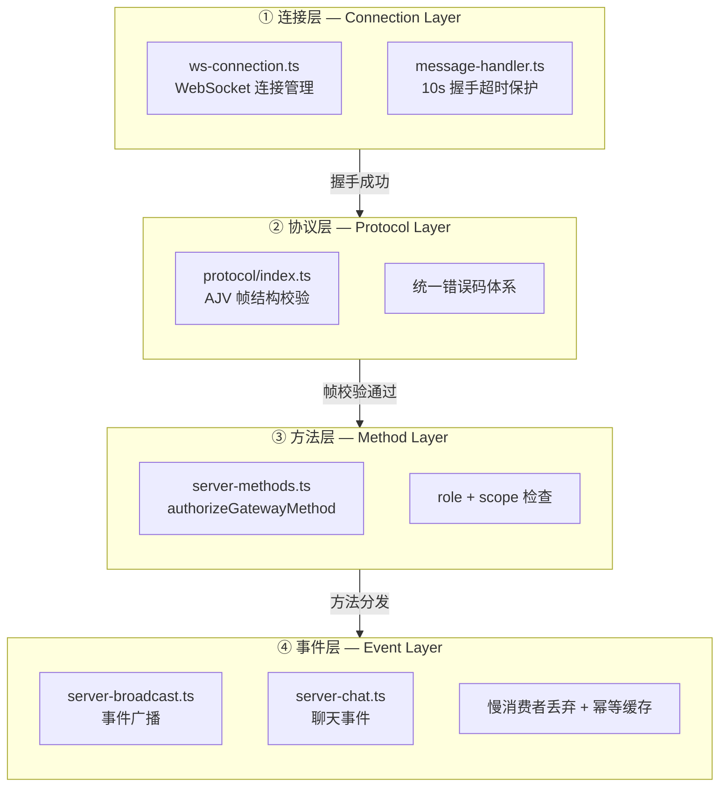
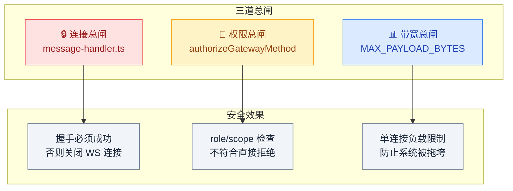
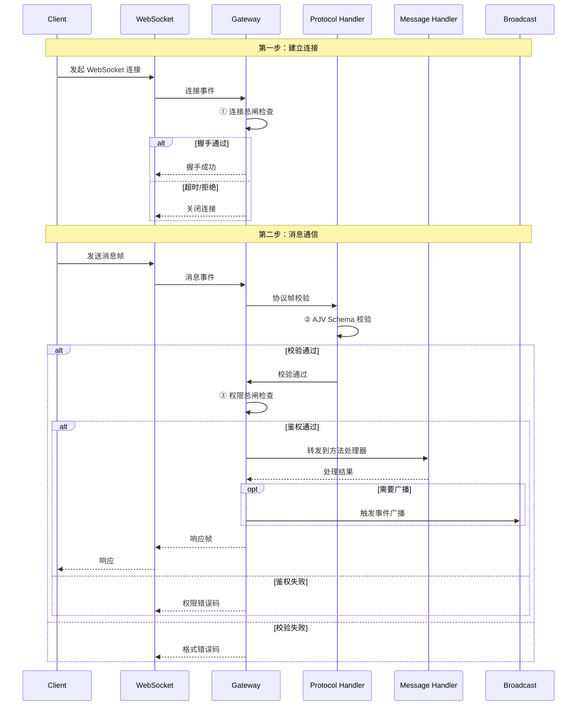

# 03 · WebSocket 协议层

> **学习要点**
> - WebSocket 协议层的 4 层结构如何划分？每层的源码文件在哪里？
> - "三层总闸"分别是什么？如何层层递进保障系统安全？
> - 一次完整的协议校验流程是怎样的？
> - 六类广播事件分别由谁触发、谁消费？

---

## 1. 四层结构

WebSocket 协议层是 Gateway 的**连接中枢**，所有与客户端的长连接通信都经过这四层处理：



### 各层职责

| 层级 | 源码文件 | 核心职责 | 关键机制 |
|:----:|----------|----------|----------|
| **① 连接层** | `ws-connection.ts` | WebSocket 连接建立与生命周期管理 | 10s 握手超时保护，超时自动断开 |
| **② 协议层** | `protocol/index.ts` | 帧结构格式校验与解析 | AJV JSON Schema 校验 + 统一错误码 |
| **③ 方法层** | `server-methods.ts` | 方法分发 + 权限鉴权 | role + scope 双维度检查 |
| **④ 事件层** | `server-broadcast.ts` | 事件广播与推送 | 慢消费者丢弃 + 幂等缓存去重 |

---

## 2. 三层总闸

在请求进入四层处理之前，OpenClaw 设置了**三道总闸**进行安全过滤：



| 总闸 | 源码位置 | 检查方式 | 失败后果 |
|------|----------|----------|----------|
| **连接总闸** | `message-handler.ts` | 握手必须在 10s 内完成 | 直接关闭 WS 连接 |
| **权限总闸** | `authorizeGatewayMethod` | 每次方法调用检查 role + scope | 拒绝并返回错误码 |
| **带宽总闸** | `MAX_PAYLOAD_BYTES` | 单连接负载上限检查 | 拒绝超限请求 |

> 三道闸门层层递进、互不绕过，任何一道未通过则请求直接被拒绝。

---

## 3. 协议校验流程

一次完整的 WebSocket 通信从建立连接到方法调用，经历以下校验流程：



### 校验流程要点

| 阶段 | 检查点 | 通过条件 | 失败处理 |
|------|--------|----------|----------|
| **连接建立** | 握手挑战 | 10s 内完成挑战响应 | 关闭连接 |
| **帧校验** | AJV Schema | JSON 结构完全匹配 | 返回统一格式错误码 |
| **权限检查** | role + scope | 角色有权限 + 作用域匹配 | 返回权限错误码 |
| **带宽检查** | 负载大小 | 不超过 MAX_PAYLOAD_BYTES | 拒绝超限请求 |

---

## 4. 帧协议格式

OpenClaw WebSocket 帧使用 JSON 格式，基本结构如下：

```json
{
  "type": "method_call" | "method_response" | "event" | "error",
  "method": "agent.run" | "agent.wait" | "sessions.list" | "...",
  "params": { },
  "id": "request-id-123"
}
```

| 帧类型 | 方向 | 说明 |
|--------|------|------|
| `method_call` | Client → Gateway | 调用一个 Gateway 方法 |
| `method_response` | Gateway → Client | 方法调用的返回结果 |
| `event` | Gateway → Client | 服务端主动推送的事件 |
| `error` | 双向 | 错误信息 |

---

## 5. 关键源码文件

| 文件 | 作用 |
|------|------|
| `src/gateway/server/ws-connection.ts` | WebSocket 连接管理：握手、心跳、重连 |
| `src/gateway/server/message-handler.ts` | 消息处理 + 握手超时保护 |
| `src/gateway/protocol/index.ts` | 帧结构定义 + AJV Schema 校验 |
| `src/gateway/server-methods.ts` | 方法分发 + authorizeGatewayMethod 鉴权 |
| `src/gateway/server-broadcast.ts` | 事件广播：慢消费者丢弃、幂等缓存 |
| `src/gateway/server-chat.ts` | 聊天事件处理 |
| `src/gateway/auth.ts` | 连接认证 Token 验证 |

---

> **相关模块**：[01 - Gateway 定位与职责](01-gateway-positioning.md) · [02 - 配置系统与热重载](02-config-system.md) · [04 - CLI 层与命令系统](04-cli-command-system.md) · [01 - 架构全景](../01-architecture/01-layered-architecture.md)
