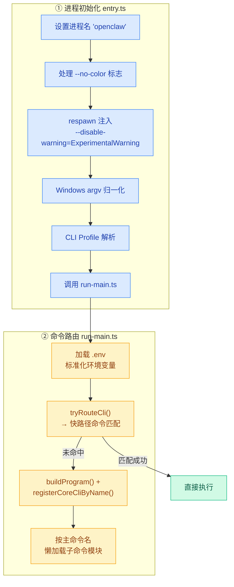
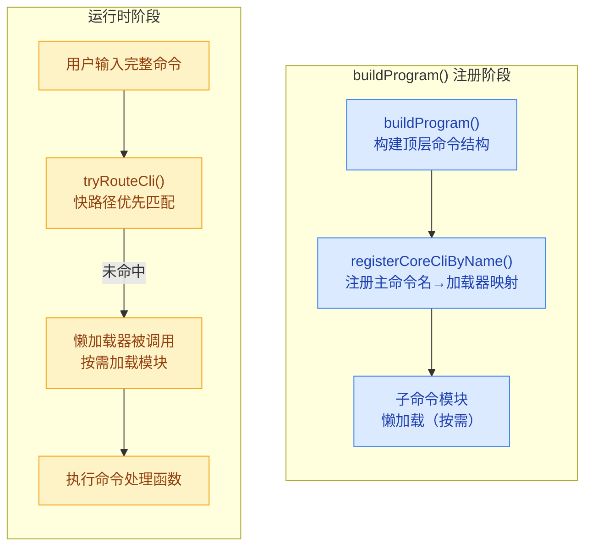
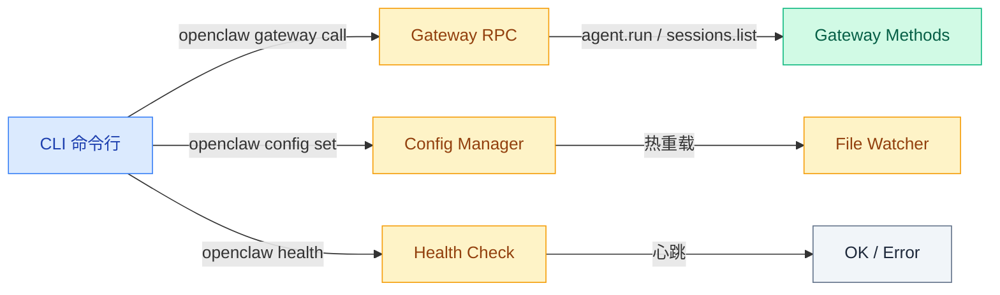

# 04 · CLI 层与命令系统

> **学习要点**
> - OpenClaw 的 CLI 入口流程是怎样的？从 entry.ts 到命令执行经历了哪些步骤？
> - 什么是"快路径命令"？它相比完整命令解析有什么优势？
> - 命令注册如何通过懒加载减少冷启动时间？
> - 有哪些实用的会话诊断 CLI 命令？

---

## 1. CLI 入口流程

OpenClaw 的 CLI 从 `src/entry.ts` 启动，经过一系列初始化后到达命令执行阶段：



### entry.ts 各步骤说明

| 步骤 | 说明 | 源码位置 |
|------|------|----------|
| **设置进程名** | 将进程名改为 `openclaw`，便于系统监控识别 | `process.title` |
| **处理 --no-color** | 禁用终端颜色输出，适用于 CI 环境 | 参数解析 |
| **respawn 注入** | 通过 Node.js `--disable-warning=ExperimentalWarning` 压制实验性功能警告 | `child_process.spawn` |
| **Windows argv** | 对 Windows 系统的命令行参数做归一化处理 | `process.argv` 处理 |
| **CLI Profile** | 解析当前使用的 CLI Profile，决定配置目录 | `OPENCLAW_PROFILE` 环境变量 |
| **调用主入口** | 将控制权交给 `run-main.ts` | `src/cli/run-main.ts` |

### run-main.ts 命令路由

```mermaid
flowchart LR
    subgraph 命令路由
        direction LR
        CMD[用户输入命令]:::cmd --> FAST["tryRouteCli()<br/>快路径匹配"]:::fast
        FAST -->|"✅ 命中"| EXEC[直接执行<br/>无需加载完整命令树]:::done
        FAST -->|"❌ 未命中"| FULL["buildProgram()<br/>构建完整命令树"]:::full
        FULL --> LAZY[懒加载子命令模块]:::full
        LAZY --> EXEC2[执行对应命令]:::done
    end

    classDef cmd fill:#f1f5f9,stroke:#64748b,color:#1e293b
    classDef fast fill="#dbeafe,stroke:#3b82f6,color:#1e40af"
    classDef done fill="#d1fae5,stroke:#10b981,color:#065f46"
    classDef full fill="#fef3c7,stroke:#f59e0b,color:#92400e"
```

---

## 2. 快路径命令

"快路径命令"是不需要加载完整命令树的常用命令，可以绕过 `buildProgram()`，直接执行逻辑。

### 优势

- **显著缩短冷启动时间**：省去了命令树的构建和注册过程
- **适用于高频命令**：`status`、`health` 等常用命令总是走快路径

### 快路径命令一览

| 命令 | 用途 | 示例 |
|------|------|------|
| **`openclaw status`** | 状态查询 | 显示存储路径和最近的会话 |
| **`openclaw health`** | 健康检查 | Gateway 运行状态 |
| **`openclaw sessions`** | 会话列表 | 列出所有会话 |
| **`openclaw config get`** | 配置读取 | 读取当前配置 |
| **`openclaw models list`** | 模型列表 | 列出可用模型 |

---

## 3. 会话诊断命令

除了快路径命令外，OpenClaw 还提供一套会话诊断命令，用于调试和运维排查：

### CLI 诊断命令

```bash
# 显示存储路径和最近会话
openclaw status

# 转储每个会话条目
openclaw sessions --json

# 仅查看活跃会话（N 分钟内更新的）
openclaw sessions --active

# 读取配置项
openclaw config get agents.defaults.model
```

### 会话内诊断命令

| 命令 | 用途 |
|------|------|
| **`/status`** | 查看窗口使用率和会话设置 |
| **`/context list`** | 查看注入的文件和大致大小 |
| **`/context detail`** | 详细上下文分解：按文件/工具/schema/技能 |
| **`/new`** | 开始新会话 ID + 问候轮次 |
| **`/reset`** | 重置当前会话 |
| **`/stop`** | 中止当前运行 + 清除排队 |
| **`/compact [说明]`** | 摘要化上下文，释放窗口空间 |
| **`/queue`** | 查看/设置队列模式 |
| **`/send on/off/inherit`** | 发送策略覆盖 |

---

## 4. 命令注册机制

OpenClaw 的命令系统采用**懒加载**模式，只有在命令实际需要时才加载对应的子命令模块：



### 关键设计原则

| 设计 | 说明 |
|------|------|
| **快路径优先** | 先尝试快路径命令匹配，匹配成功则直接执行 |
| **懒加载** | 子命令模块按需加载，显著减少冷启动时间 |
| **CLI Profile** | 支持多配置切换（通过 `OPENCLAW_PROFILE` 环境变量） |
| **Module 注册** | 主命令名 → 加载器函数的映射表 |

---

## 5. CLI ↔ Gateway 通信

CLI 通过以下方式与运行中的 Gateway 通信：



### 常用 Gateway RPC 调用

```bash
# 调用 Gateway 方法
openclaw gateway call sessions.list
openclaw gateway call config.apply --params '{...}'
openclaw gateway call config.patch --params '{...}'
```

---

## 6. 关键源码文件

| 文件 | 作用 | 执行时机 |
|------|------|----------|
| `src/entry.ts` | 程序入口，进程初始化 + CLI Profile 解析 | 每次 CLI 调用 |
| `src/cli/run-main.ts` | CLI 主入口，加载环境变量 + 命令路由 | entry.ts 之后 |
| `src/cli/program/build-program.ts` | 命令程序构建，注册懒加载器 | 快路径未命中时 |
| `src/cli/command-registry.ts` | 命令注册表，管理主命令名→加载器映射 | 构建时 |
| `src/gateway/server-methods.ts` | Gateway 可调用方法注册 | Gateway 启动时 |

---

> **相关模块**：[01 - Gateway 定位与职责](01-gateway-positioning.md) · [02 - 配置系统与热重载](02-config-system.md) · [03 - WebSocket 协议层](03-websocket-protocol.md) · [03 - 执行引擎](../03-execution-engine/01-agent-loop-workflow.md)
