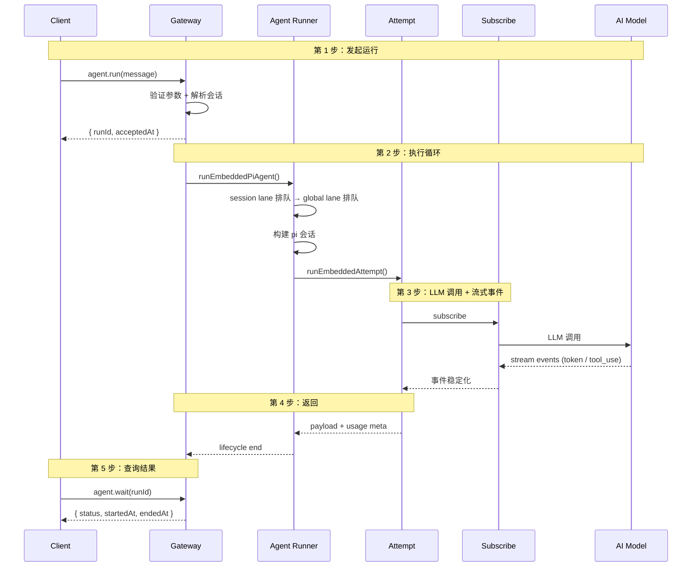
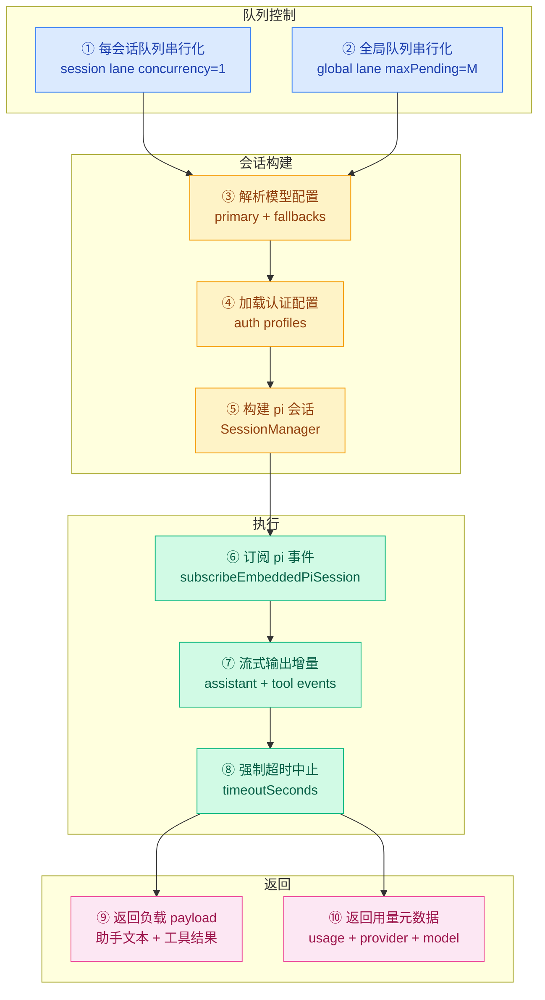
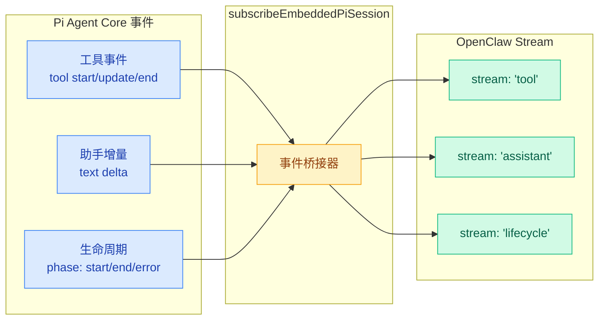
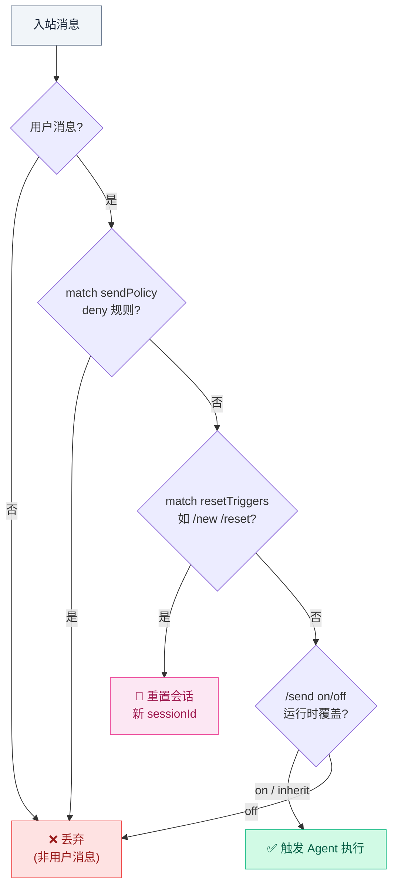

# 01 · Agent Loop 完整工作流

> **学习要点**
> - Agent Loop 从用户消息到最终回复经历了哪些阶段？
> - 调度层、执行层、事件层各负责什么？5 层状态机如何协作？
> - runEmbeddedPiAgent 的内部流程是怎样的？
> - Auto-Reply 的决策流程如何决定消息是丢弃、重置还是执行？
> - 流式输出如何通过事件分离（lifecycle/assistant/tool）工作？

---

## 1. Agent Loop 概述

智能体循环（Agent Loop）是将一条消息转化为操作和最终回复的**权威路径**。一次循环是每个会话的**单次串行运行**。

> Agent Loop 的核心思想：不是一次 `model.generate()` 就结束，而是**多层状态机**协同工作——队列控制（session lane → global lane）→ 执行（attempt）→ 事件稳定化（subscribe）→ 压缩等待（wait compaction）→ 收尾（finalize）→ 出错时自动恢复（profile 轮换 → compact → fallback）。

---

## 2. 入口点

Agent Loop 可以通过以下两种方式触发：

| 入口 | 用途 | 说明 |
|------|------|------|
| **Gateway RPC** | `agent` + `agent.wait` | 远程调用，异步模式：`agent` 返回 runId，`agent.wait` 轮询结果 |
| **CLI** | `agent` 命令 | 本地命令行执行，适合调试 |

---

## 3. 完整调用流程

一次完整的 Agent 调用从客户端发起请求到收到最终回复：

### 各阶段说明

| 阶段 | 步骤 | 核心组件 | 关键操作 |
|:----:|------|----------|----------|
| **① 发起** | 验证参数 + 解析 session | Gateway | `agent.run()` 返回 `runId + acceptedAt` |
| **② 排队** | session lane → global lane | Agent Runner | 双层排队保证会话内串行 |
| **③ 构建** | 加载技能、注入提示词 | Agent Runner | 系统提示词 = 基础 + 技能 + 引导 + 覆盖 |
| **④ 执行** | LLM 调用 + 工具循环 | Attempt | 真实 model.generate() + 工具解析执行 |
| **⑤ 流式** | 事件分离收集 | Subscribe | lifecycle/assistant/tool 三流 |
| **⑥ 返回** | payload + usage meta | Agent Runner | 回复负载 + Token 用量 |
| **⑦ 查询** | 轮询运行状态 | Gateway | `agent.wait({ status, startedAt, endedAt })` |

---

## 4. runEmbeddedPiAgent 内部流程

`runEmbeddedPiAgent(...)` 是 Agent Loop 的**核心调度函数**，内部依次经历以下阶段：

### 各步骤详解

| 步骤 | 说明 | 关键参数 |
|:----:|------|----------|
| **① session lane** | 每会话一个队列，concurrency=1，保证消息顺序 | 按 session key 隔离 |
| **② global lane** | 全局队列，限制最大并发运行数 | `maxPending` 兜底 |
| **③ 模型配置** | 解析 agents.defaults.model.primary + fallbacks | `model-fallback.ts` |
| **④ 认证配置** | 加载 auth profiles，按优先级轮换 | `auth-profiles.json` |
| **⑤ 构建会话** | 创建 SessionManager，准备写锁 | `SessionManager` |
| **⑥ 事件订阅** | 订阅 pi 事件流，分离三路事件 | `subscribeEmbeddedPiSession` |
| **⑦ 流式输出** | assistant 增量 + tool start/update/end | 实时推送 |
| **⑧ 超时中止** | 超过 timeoutSeconds 强制中止 | `agents.defaults.timeoutSeconds` 默认 600s |
| **⑨ 返回负载** | 助手文本 + 工具摘要 + 错误文本 → routeReply | `payload` |
| **⑩ 用量元数据** | provider、model、usage tokens | `meta` |

---

## 5. 事件桥接（Event Bridge）

Pi 事件通过桥接机制映射为 OpenClaw 的三类流式事件：

| Pi 事件 | OpenClaw 流 | 说明 |
|---------|-------------|------|
| **工具 start/update/end** | `stream: "tool"` | 工具调用触发、进度更新、执行结束 |
| **文本 delta（增量）** | `stream: "assistant"` | LLM 回复的实时 Token 流 |
| **phase: start/end/error** | `stream: "lifecycle"` | 生命周期的开始、结束、错误信号 |

---

## 6. Auto-Reply 决策流程

Auto-Reply 是消息到达 Agent Runner 之前的**第一道决策闸门**，决定消息是丢弃、重置还是继续执行：

| 决策点 | 判断依据 | 通过则 | 不通过则 |
|--------|----------|--------|----------|
| **用户消息?** | 消息来源类型 | 进入下一步 | 丢弃 |
| **sendPolicy deny?** | `sessions.sendPolicy.rules` 匹配 | 丢弃 | 进入下一步 |
| **resetTriggers?** | 匹配 `/new` `/reset` 等 | 重置会话 | 进入下一步 |
| **/send on/off?** | 会话级运行时覆盖 | on → 执行 / off → 丢弃 | 执行 |

---

> **相关模块**：[02 - 队列与并发控制](02-concurrency-control.md) · [03 - 流式输出与事件机制](03-streaming-events.md) · [04 - 超时与生命周期](04-timeout-lifecycle.md) · [01 - Gateway 定位与职责](../02-gateway-control/01-gateway-positioning.md) · [02 - 配置系统与热重载](../02-gateway-control/02-config-system.md)
