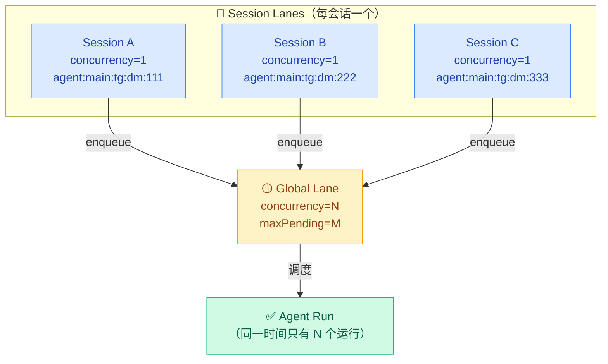
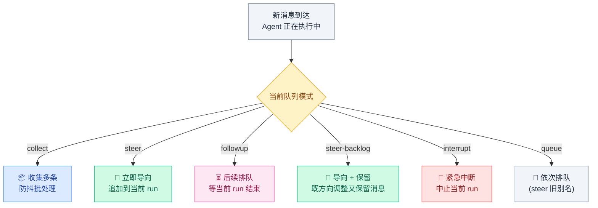
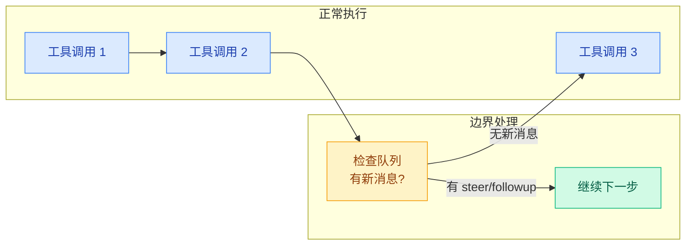

# 02 · 队列与并发控制

> **学习要点**
> - Session Lane 和 Global Lane 如何协同实现并发隔离？
> - 六种队列模式分别适用什么场景？如何选择？
> - 队列引导（Queue Steering）在运行时边界如何处理新消息？
> - 重试策略如何配置？通道间的重试行为有何差异？

---

## 1. Lane 并发模型

当多个入站消息几乎同时到达时，Lane 模型确保会话安全、资源可控：



### 为什么需要 Lane？

| 问题 | 解决方案 |
|------|----------|
| **消息乱序**：Alice 发了两条消息，后发的可能先被处理 | Session Lane concurrency=1，同一会话串行 |
| **资源竞争**：多个 Agent 同时 LLM 调用，超出 API 速率限制 | Global Lane 控制全局并发数 |
| **会话间干扰**：Alice 的慢查询拖慢 Bob 的快速回复 | Lane 间独立排队，互不阻塞 |

### Lane 参数

| 组件 | 约束 | 说明 |
|------|------|------|
| **Session Lane** | concurrency=1 | 每会话最多一个运行，保证会话内消息顺序 |
| **Global Lane** | concurrency=N, maxPending=M | 全局同时运行数上限 + 排队上限 |
| **并发模型** | per-session=1, global=N | 会话内串行，会话间并行 |

---

## 2. 队列模式

当用户在当前 Agent 运行过程中发送新消息时，队列模式决定如何处理：



### 模式选择指南

| 模式 | 行为 | 适用场景 | 示例 |
|------|------|----------|------|
| **collect** 🏆（默认） | 收集多条消息，防抖后一起处理 | 正常聊天 | 用户快速连续发多条消息 |
| **steer** | 立即注入当前 run，追加到上下文中 | 实时方向调整 | "等一下，换个思路" |
| **followup** | 等当前 run 结束后自动排入下一轮 | 复杂任务 | "处理完这个，再看看 XX" |
| **steer-backlog** | 立即导向 + 保留消息用于后续轮次 | 既要又要 | "先看这个，稍后还有问题" |
| **interrupt** | 中止当前 run，立即处理新消息 | 紧急中止 | "停！不要继续了" |
| **queue** | 等同于 steer（旧版别名） | 兼容旧配置 | 迁移场景 |

---

## 3. 队列配置

```json5
{
  messages: {
    queue: {
      mode: "collect",          // 默认队列模式
      debounceMs: 1000,         // 防抖窗口（毫秒）
      cap: 20,                  // 每会话最大排队数
      drop: "summarize",        // 溢出策略
      byChannel: {
        discord: "collect",     // 按通道覆盖
      },
    },
  },
}
```

### 参数说明

| 参数 | 默认值 | 说明 |
|------|--------|------|
| `debounceMs` | 1000 | 开始处理前等待的安静时间（防抖） |
| `cap` | 20 | 每会话最大排队消息数，超过触发溢出策略 |
| `drop` | `summarize` | 溢出策略，可选 `old`（丢弃最早）/ `new`（丢弃最新）/ `summarize` |

### 溢出策略（drop）

| 策略 | 行为 | 推荐场景 |
|------|------|----------|
| **old** | 丢弃最早排队的消息 | 关注最新消息 |
| **new** | 丢弃最新到达的消息 | 关注历史完整度 |
| **summarize** 🏆 | 丢弃消息但保留要点列表，注入为合成后续提示 | 兼顾信息量和新鲜度 |

### 每会话覆盖

```bash
/queue collect debounce:2s cap:25 drop:summarize   # 临时切换模式
/queue default                                      # 清除会话级覆盖
/queue reset                                        # 重置为全局默认
```

---

## 4. 队列引导（Queue Steering）

当 Agent 正在执行工具调用时，OpenClaw 在**运行时边界**处理新消息：



### 安全边界说明

> 如果 Agent 正在执行工具调用，OpenClaw **不会在最危险的中间点硬切**。每次工具调用完成后，在进入下一轮之前检查队列：

```
当前工具调用完成
    ↓
检查有没有新消息
    ↓
决定引导（steer）、排队（followup）或中断（interrupt）
    ↓
继续下一步
```

### 场景判断

| 消息类型 | 推荐队列模式 | 说明 |
|----------|-------------|------|
| **"停，不要继续了"** | `interrupt` | 紧急中止，立即处理 |
| **"刚才那个命令错了"** | `steer` | 方向调整，影响当前任务 |
| **"顺便看看这个链接"** | `followup` | 补充信息，不打断当前执行 |
| **"然后帮我做 XX"** | `collect` | 后续任务，等当前完成后处理 |
| **普通补充信息** | `steer` / `followup` | 取决于紧急程度 |

---

## 5. 重试策略

### 设计原则

- **按 HTTP 请求重试**，而非按多步流程重试
- **仅重试当前步骤**以保持顺序，避免重复非幂等操作
- Markdown 解析错误**不重试**，回退到纯文本

### 默认值

| 参数 | 默认值 | 说明 |
|------|--------|------|
| attempts | 3 | 最大尝试次数 |
| maxDelayMs | 30000 | 最大延迟上限（30s） |
| jitter | 0.1 | 抖动系数（10%），避免惊群 |
| Telegram minDelay | 400ms | Telegram 最小重试间隔 |
| Discord minDelay | 500ms | Discord 最小重试间隔 |

### 通道行为差异

| 通道 | 触发条件 | 不重试场景 |
|------|----------|-----------|
| **Discord** | 仅 HTTP 429（速率限制） | 所有其他错误 |
| **Telegram** | 429、超时、连接重置/关闭、临时不可用 | 语法错误、权限错误 |

### 配置示例

```json5
{
  channels: {
    telegram: {
      retry: {
        attempts: 3,         // 最多重试 3 次
        minDelayMs: 400,     // 首次延迟 400ms
        maxDelayMs: 30000,   // 最长等待 30s
        jitter: 0.1,         // 10% 随机抖动
      },
    },
    discord: {
      retry: {
        attempts: 3,
        minDelayMs: 500,
        maxDelayMs: 30000,
        jitter: 0.1,
      },
    },
  },
}
```

### 队列保证

| 保证 | 说明 |
|------|------|
| **会话内串行** | 同一会话同一时间只有一个 Agent 运行 |
| **无外部依赖** | 纯 TypeScript + Promise 实现 |
| **默认通道隔离** | 主通道（main）对入站 + 心跳使用进程级隔离 |

---

> **相关模块**：[01 - Agent Loop 工作流](01-agent-loop-workflow.md) · [03 - 流式输出与事件机制](03-streaming-events.md) · [04 - 超时与生命周期](04-timeout-lifecycle.md) · [02 - 配置系统与热重载](../02-gateway-control/02-config-system.md)
