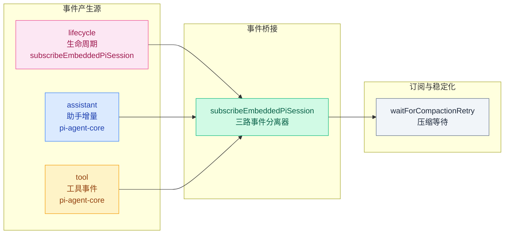
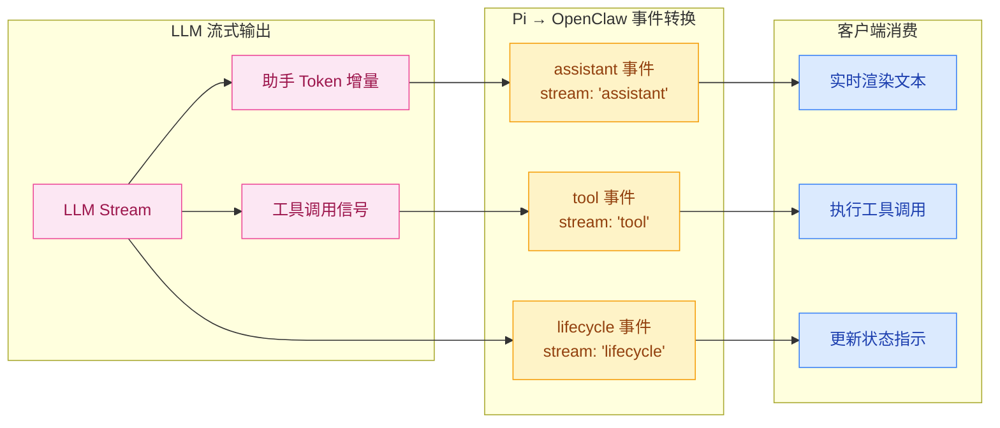
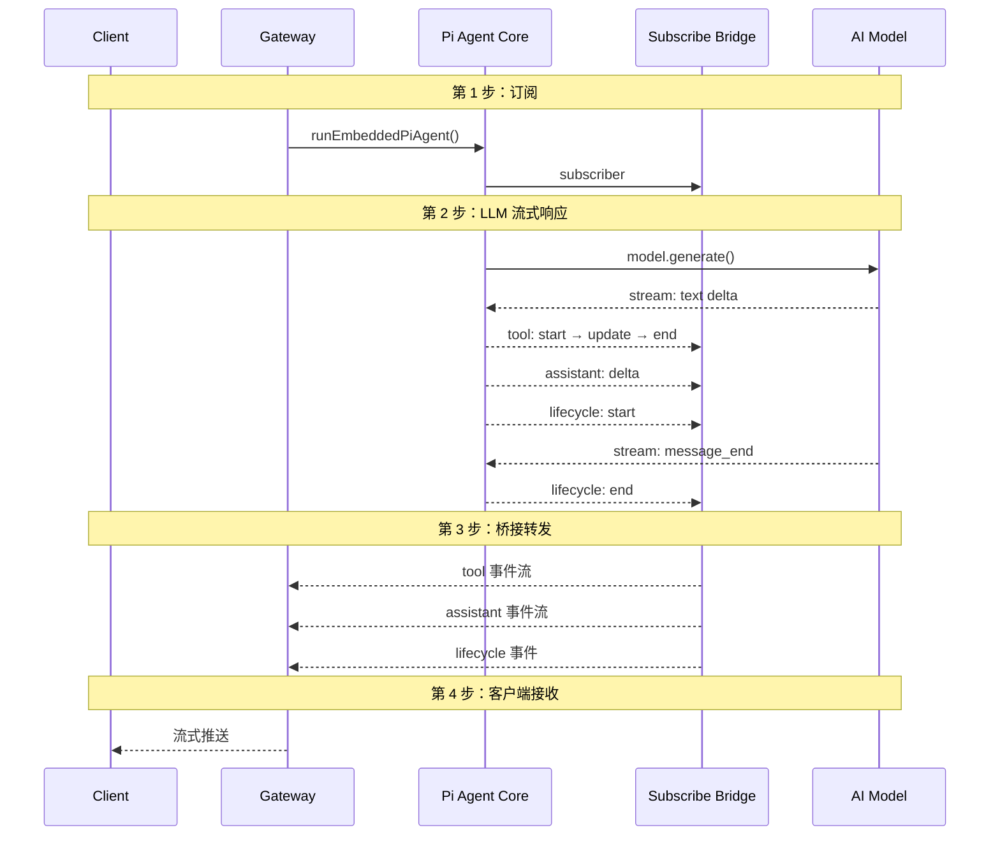
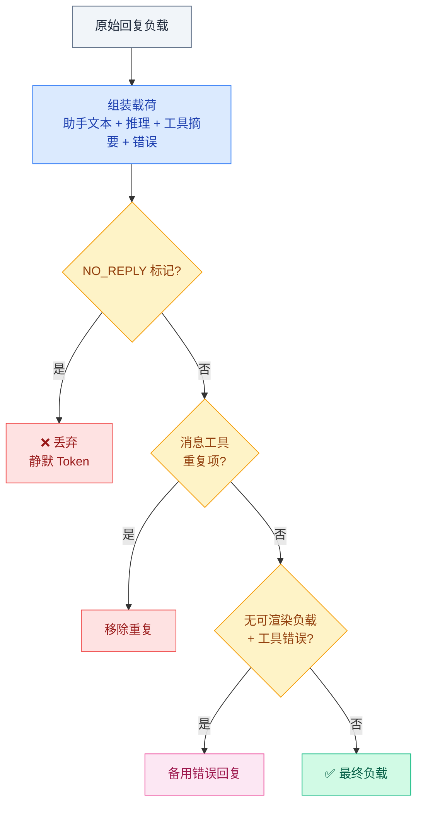
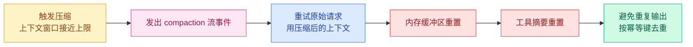

# 03 · 流式输出与事件机制

> **学习要点**
> - 三类事件（lifecycle / assistant / tool）各自由谁产生、流向何处？
> - 流式输出的增量机制如何实现实时推送？
> - 事件桥接如何将 Pi 事件映射为 OpenClaw 的三路流？
> - 回复整形规则如何过滤 NO_REPLY 和重复项？

---

## 1. 事件类型（3 类）

OpenClaw 将 Agent 执行过程中的所有输出抽象为**三类事件流**：

| 流 | 来源 | 说明 | 客户端响应 |
|----|------|------|-----------|
| **lifecycle** | subscribeEmbeddedPiSession | 生命周期信号：start / end / error | 状态更新 |
| **assistant** | pi-agent-core | 助手增量文本流，LLM 回复 Token | 实时渲染 |
| **tool** | pi-agent-core | 工具调用事件：start / update / end | 执行工具 |

---

## 2. 流式输出机制

从 LLM 流式 Token 到客户端实时渲染的完整链路：

### 输出类型详解

| 输出类型 | 触发时机 | 事件格式 | 客户端行为 |
|----------|----------|----------|-----------|
| **助手增量** | LLM 持续生成 Token 时 | `assistant` 流，每次 delta | 逐步渲染到回复框 |
| **块流式** | `text_end` / `message_end` | 完整的文本块 | 确认段落完成 |
| **推理流式** | LLM 在思考时 | `reasoning` 流 | 显示"思考中..." |
| **工具调用** | LLM 请求执行工具 | `tool` 流：start → update → end | UI 显示工具执行状态 |

---

## 3. 事件桥接（Event Bridge）

Pi Agent Core 产生的事件通过 `subscribeEmbeddedPiSession` 桥接到 OpenClaw 的事件系统：

### 映射关系

| Pi 事件 | OpenClaw 流 | 桥接行为 |
|---------|-------------|----------|
| **工具事件** | `stream: "tool"` | 按 start → update → end 序列透传，合并连续 update |
| **助手增量** | `stream: "assistant"` | 每个文本 delta 转为独立事件，保持顺序 |
| **生命周期** | `stream: "lifecycle"` | phase 字段区分 start/end/error |

---

## 4. 回复整形规则

在最终回复发出之前，OpenClaw 应用以下整形规则：

| 规则 | 行为 | 触发条件 |
|------|------|----------|
| **NO_REPLY 过滤** | 视为静默 Token，从出站负载中完全移除 | Agent 返回 NO_REPLY 标记 |
| **消息工具重复** | 从最终负载列表中移除重复的助手确认消息 | 模型多次返回相同工具确认 |
| **无可渲染负载 + 错误** | 返回备用错误回复，而不是空回复 | 无有效文本 + 存在工具错误 |

---

## 5. 聊天通道处理

| 阶段 | 说明 |
|------|------|
| **增量缓冲** | 助手增量被缓冲为聊天 delta 消息 |
| **Final 发出** | 在 `lifecycle end/error` 时发出完整的聊天 final |

### 压缩（Compaction）事件流

压缩过程中的事件处理：

---

## 6. 工具执行事件

工具事件流包含三个阶段：

| 阶段 | 事件 | 说明 | 示例 |
|:----:|------|------|------|
| **① start** | `tool: start` | 工具开始执行 | `read("file.txt")` 开始 |
| **② update** | `tool: update` | 进度更新（可选） | 已读取 50% |
| **③ end** | `tool: end` | 执行完成，携带结果 | `file.txt` 内容返回 |

### 工具结果清理

| 清理项 | 说明 |
|--------|------|
| **大小限制** | 大型工具结果自动截断 |
| **图像负载** | 图像类型结果按 token 限制清理 |
| **消息工具追踪** | 抑制重复的助手确认，避免冗余输出 |

---

> **相关模块**：[01 - Agent Loop 工作流](01-agent-loop-workflow.md) · [02 - 队列与并发控制](02-concurrency-control.md) · [04 - 超时与生命周期](04-timeout-lifecycle.md) · [01 - 上下文工程](../05-context-engineering/01-context-window.md)
