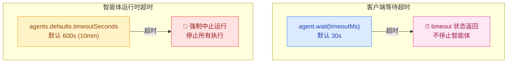
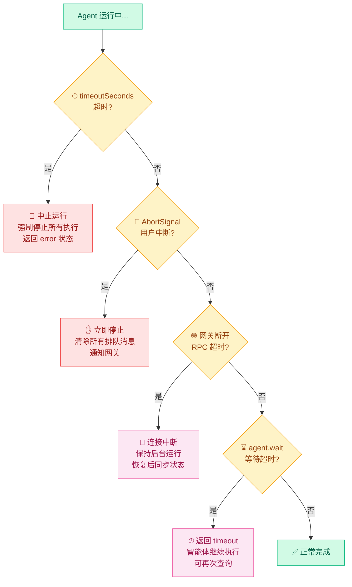
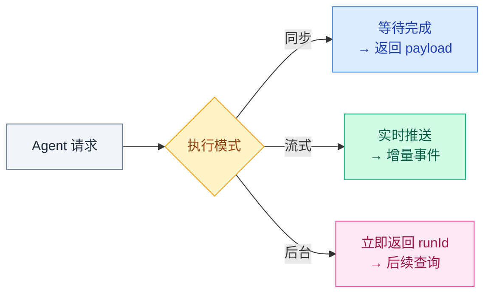
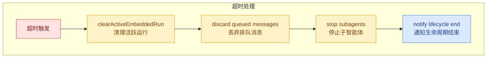

# 04 · 超时与生命周期

> **学习要点**
> - Agent 有哪些超时机制？`agent.wait` 超时和智能体运行时超时有什么区别？
> - 提前结束的四种场景分别如何处理？
> - Agent 三种执行模式（同步/流式/后台）各适用什么场景？
> - 超时发生后，智能体内部的状态机如何处理？

---

## 1. 超时模型

OpenClaw 在**两个层级**设置超时：



### 超时配置

| 层级 | 默认值 | 配置路径 | 超时后果 |
|:----:|--------|----------|----------|
| **agent.wait** | 30s | RPC 参数 `timeoutMs` | 返回 timeout 状态，智能体继续运行 |
| **智能体运行时** | 600s (10min) | `agents.defaults.timeoutSeconds` | 强制中止整个运行 |

```json5
{
  agents: {
    defaults: {
      timeoutSeconds: 600,          // 智能体最长运行时间
      // 按 Agent 覆盖
    },
  },
}
```

> **核心区别**：`agent.wait` 超时**不停止智能体**，只是客户端不再等待；智能体超时**强制中止整个 Agent 运行**。

---

## 2. 提前结束场景

智能体可能在以下四种场景提前结束：



### 四种场景对比

| 场景 | 触发条件 | 智能体状态 | 客户端反应 | 配置 |
|------|----------|-----------|-----------|------|
| **智能体超时** | 超过 `timeoutSeconds` | 强制中止 | 收到 error | `agents.defaults.timeoutSeconds` |
| **用户中断** | AbortSignal（/stop 命令） | 立即停止 | 收到 error | 用户主动触发 |
| **网关断开** | 网络问题/RPC 超时 | 连接中断 | 收到错误 | 网络重连策略 |
| **agent.wait 超时** | 等待超过 `timeoutMs` | **继续运行** | 收到 timeout | RPC 参数 `timeoutMs` |

---

## 3. Agent 三种执行模式

| 模式 | 说明 | 返回方式 | 适用场景 |
|:----:|------|----------|----------|
| **同步模式** 🏆（默认） | 等待执行完成后再返回 | 完整 payload | 需要立即结果的交互 |
| **流式模式** | 流式输出增量结果 | 实时 stream | 长回复、逐步展示 |
| **后台模式** | 立即返回 runId，不等待 | 仅 runId | 耗时任务、无需即时响应 |

### 模式选择对比



| 模式 | 超时处理 | 适合任务 |
|:----:|----------|----------|
| **同步** | 客户端等待，超时返回 error | 短查询（<30s）、快速回复 |
| **流式** | 持续推送，连接断开即止 | 长回复、代码生成、分析报告 |
| **后台** | 全由智能体超时控制 | 批处理、定时任务、长时间工具调用 |

---

## 4. 超时后的状态机处理

当超时发生时，OpenClaw 的内部状态机执行以下收尾流程：



### 清理操作

| 步骤 | 操作 | 说明 |
|:----:|------|------|
| ① | `clearActiveEmbeddedRun` | 按 handle 匹配清理，防止残留运行继续消耗资源 |
| ② | 丢弃排队消息 | 清除当前会话的待处理消息队列 |
| ③ | 停止子智能体 | 递归停止所有通过 `sessions_spawn` 派生的子智能体 |
| ④ | 通知生命周期 | 发出 `lifecycle: error` 事件，通知各订阅者 |

---

## 5. 超时配置最佳实践

```json5
{
  agents: {
    defaults: {
      timeoutSeconds: 600,          // 生产环境：10 分钟足够大多数任务
      // 按 Agent ID 覆盖示例：
    },
    list: [
      {
        id: "quick-chat",
        timeoutSeconds: 120,        // 聊天 Agent：2 分钟
      },
      {
        id: "deep-research",
        timeoutSeconds: 1800,       // 研究 Agent：30 分钟
      },
    ],
  },
}
```

### 推荐配置

| 场景 | 推荐 timeout | 理由 |
|------|-------------|------|
| **日常聊天** | 120s (2min) | 大多数对话在 1 分钟内完成 |
| **编码辅助** | 300s (5min) | 代码生成可能涉及多轮工具调用 |
| **研究分析** | 600s (10min) | 可能需要多次搜索 + 分析循环 |
| **批处理任务** | 1800s (30min) | 长时间运行，使用后台模式 |

---

> **相关模块**：[01 - Agent Loop 工作流](01-agent-loop-workflow.md) · [02 - 队列与并发控制](02-concurrency-control.md) · [03 - 流式输出与事件机制](03-streaming-events.md) · [02 - 配置系统与热重载](../02-gateway-control/02-config-system.md)
