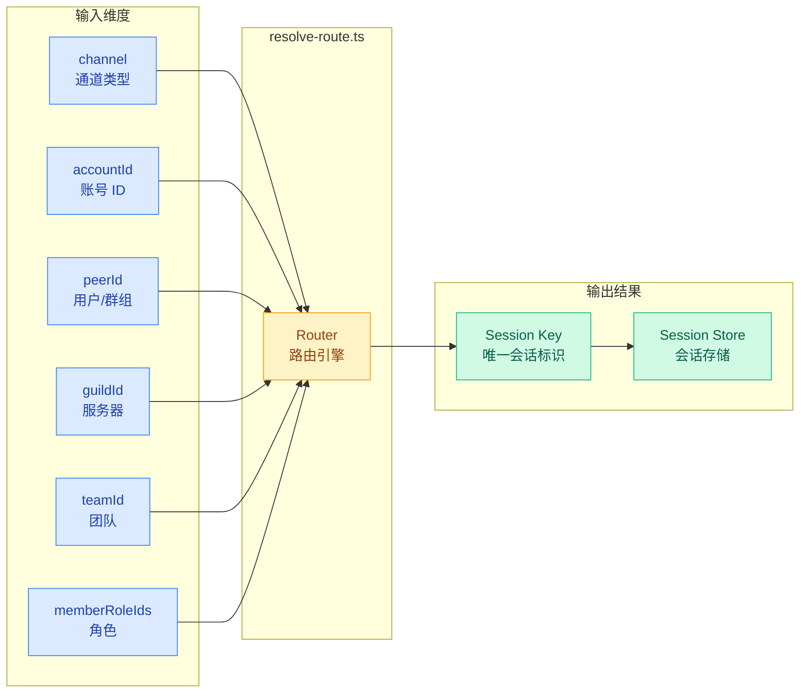
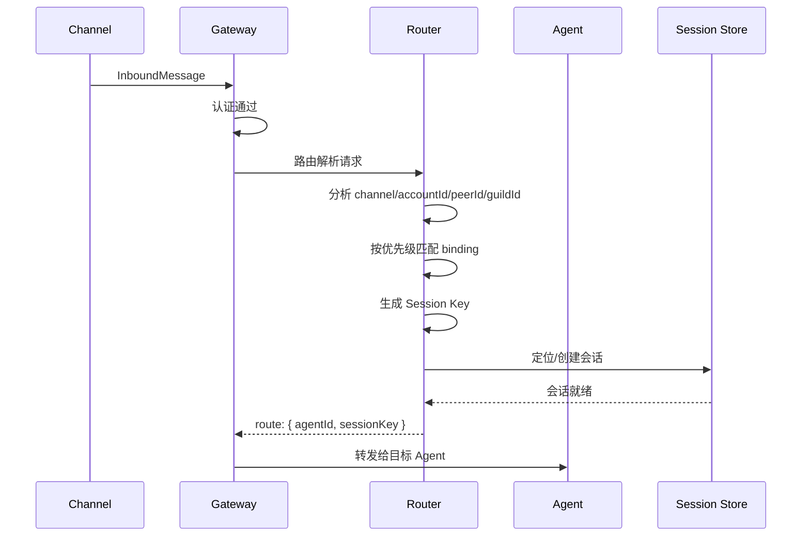
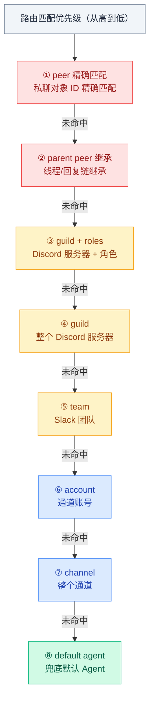
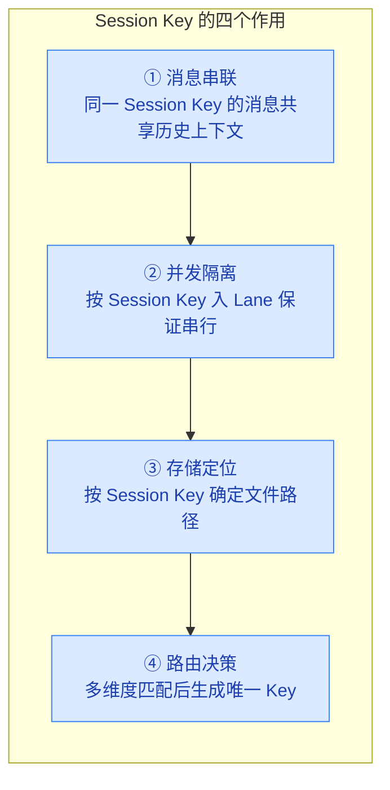

# 01 · 路由层与 Session Key

> **学习要点**
> - 路由层如何根据消息的多维属性决定目标 Agent 和会话？
> - Session Key 的格式设计原则是什么？它的四层作用分别是什么？
> - 8 级路由匹配优先级是如何从精确匹配逐级降级到兜底的？
> - dmScope 如何影响多租户场景下的会话隔离？

---

## 1. 路由层定位

路由层是 Gateway 的**决策中枢**，负责将消息路由到正确的会话和处理逻辑。所有入站消息都必须经过路由解析。



### 路由发生的时机



---

## 2. 路由匹配优先级

路由按**最具体优先**原则执行，从精确匹配逐级降级到兜底 Agent：



### 优先级详解

| 优先级 | 匹配条件 | 示例 | 说明 |
|:------:|----------|------|------|
| **① peer** | `peer.id` 精确匹配 | 特定用户的 DM | 最精确，一对一私聊 |
| **② parent** | 回复链的 parent peer | 线程中的回复 | 同一对话线程继承路由 |
| **③ guild+roles** | `guildId` + `memberRoleIds` | Admin 角色专属通道 | Discord 角色路由 |
| **④ guild** | `guildId` 匹配 | 整个 Discord 服务器 | 服务器级默认 |
| **⑤ team** | `teamId` 匹配 | Slack 团队 | 团队级路由 |
| **⑥ account** | `accountId` 匹配 | 某个 WhatsApp 账号 | 账号级路由 |
| **⑦ channel** | 仅 `channel` 类型匹配 | 所有 Telegram 消息 | 通道级兜底 |
| **⑧ default** | 无任何匹配 | 回退到 `default: true` 的 Agent | 最终兜底 |

---

## 3. Session Key 设计

Session Key 是路由的**核心输出**，唯一标识一个会话。其格式为：

```
agent:{agentId}:{channel}:{accountId}:{scope}:{peerId}
```

### 会话键类型

| 类型 | 格式 | 说明 |
|------|------|------|
| **main 主键** | `agent:{agentId}:{mainKey}` | 单用户模式的主会话 |
| **per-peer** | `agent:{agentId}:dm:{peerId}` | 按发送者 ID 隔离，跨通道共享 |
| **per-channel-peer** | `agent:{agentId}:{channel}:dm:{peerId}` | 按通道 + 发送者隔离（推荐多用户） |
| **per-account-channel-peer** | `agent:{agentId}:{channel}:{accountId}:dm:{peerId}` | 按账户 + 通道 + 发送者隔离 |
| **群聊** | `agent:{agentId}:{channel}:{accountId}:group:{peerId}` | 群组会话 |
| **频道** | `agent:{agentId}:{channel}:{accountId}:channel:{peerId}` | 频道会话 |
| **Telegram 论坛** | `agent:{agentId}:{channel}:{accountId}:group:{peerId}:topic:{topicId}` | 论坛主题隔离 |
| **Cron** | `cron:...` | 定时任务 |
| **Webhook** | `hook:...` | Webhook 触发 |
| **Node** | `node-{id}` | 节点调用 |

### Session Key 的四层作用



| 作用 | 说明 | 实现 |
|:----:|------|------|
| **消息串联** | 同一 Key 的消息归入同一历史窗口 | `{sessionKey}.jsonl` 记录文件 |
| **并发隔离** | 每 Key 独立 Lane，保证串行 | `resolveSessionLane()` |
| **存储定位** | 按 Key 确定存储路径 | `~/.openclaw/agents/{id}/sessions/` |
| **路由决策** | 输入维度最终生成唯一 Key | `session-key.ts` |

---

## 4. dmScope 隔离策略

dmScope 决定了**哪些消息共享同一会话**，是多租户安全的关键配置：

| dmScope | Key 格式 | 隔离粒度 | 推荐场景 |
|---------|----------|----------|----------|
| `main` | `agent:{agentId}:` | 所有 DM 共享一个主会话 | 单用户个人使用 |
| `per-peer` | `agent:{agentId}:dm:{peerId}` | 按发送者隔离，跨通道共享 | 多用户，同人不同端 |
| `per-channel-peer` 🏆 | `agent:{agentId}:{channel}:dm:{peerId}` | 通道+发送者隔离 | **多用户收件箱（推荐）** |
| `per-account-channel-peer` | `agent:{agentId}:{channel}:{accountId}:dm:{peerId}` | 最强隔离 | 多账户多用户 |

> **安全警告**：多用户 DM 场景下，必须启用 `per-channel-peer` 或更强隔离级别，否则用户 A 的私人信息可能泄露给用户 B。

### Identity Links

如果同一人通过多个通道联系你，使用 `identityLinks` 合并会话：

```json5
{
  session: {
    identityLinks: {
      alice: ["telegram:123456789", "discord:987654321012345678"],
    },
  },
}
```

---

## 5. 路由决策维度详解

| 维度 | 来源 | 作用 | 示例值 |
|------|------|------|--------|
| **channel** | 消息元数据 | 区分消息来源通道 | `telegram` / `discord` / `whatsapp` |
| **accountId** | 通道配置 | 支持多账号隔离 | `personal` / `work` / `bot1` |
| **peerId** | 消息发送者 | 标识发送者/群组 | `123456`（用户 ID）|
| **guildId** | Discord/Slack | 服务器/工作空间 | Discord server ID |
| **teamId** | Slack | 团队标识 | Slack team ID |
| **memberRoleIds** | Discord | 角色判断 | `["admin", "moderator"]` |

---

## 6. 关键源码文件

| 文件 | 作用 | 核心函数 |
|------|------|----------|
| `src/routing/resolve-route.ts` | 路由解析引擎 | `resolveRoute()` |
| `src/routing/session-key.ts` | 会话键生成与管理 | `formatSessionKey()`, `parseSessionKey()` |
| `src/config/sessions/store.ts` | 会话存储 | `getSession()`, `createSession()` |
| `src/gateway/server-channels.ts` | 通道管理 | `handleInbound()` |

---

> **相关模块**：[02 - 会话生命周期与重置](02-session-lifecycle.md) · [03 - 会话工具与子智能体](03-session-tools.md) · [04 - 通道与节点架构](04-channels-nodes.md) · [02 - 配置系统与热重载](../02-gateway-control/02-config-system.md) · [09 - 多智能体路由](../09-extensions/03-multi-agent-routing.md)
