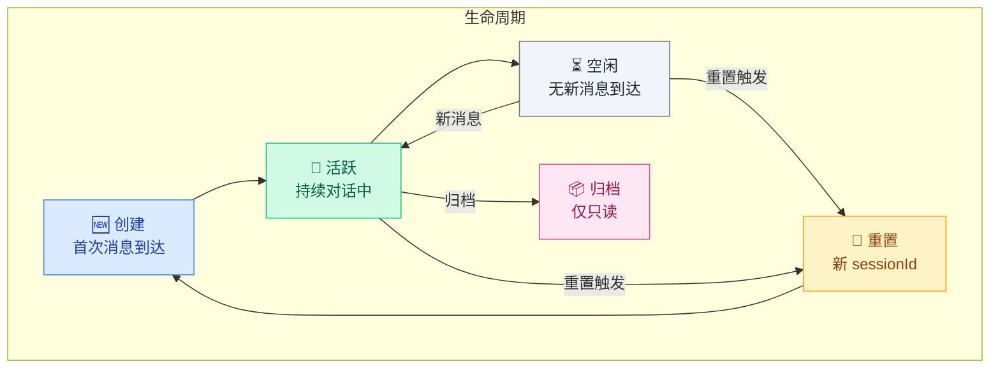
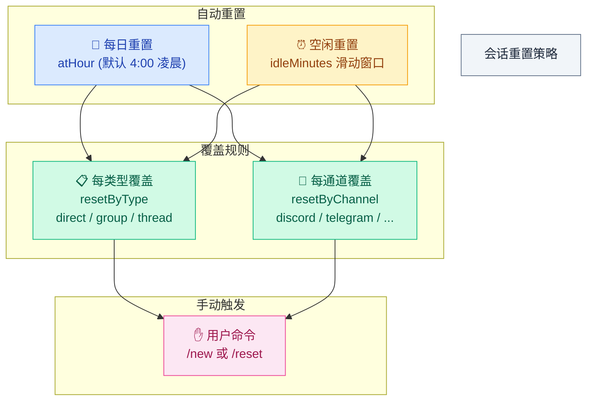
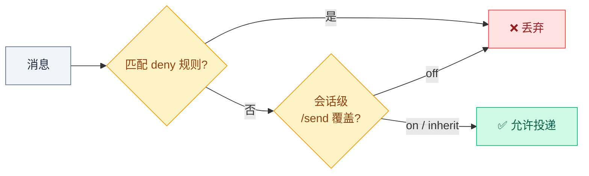

# 02 · 会话生命周期与重置

> **学习要点**
> - 会话（Session）是如何被创建、活跃、重置和归档的？
> - 五种重置策略分别如何工作？同时配置时谁先到期谁生效？
> - 发送策略（Send Policy）如何在通道级和会话级控制消息投递？
> - 有哪些实用的会话诊断命令？

---

## 1. 会话概述

会话（Session）是 OpenClaw 跟踪每段对话历史的方式。每当你通过聊天软件和 AI 说话，这段对话就保存在一个会话里。

### 生活类比

```
手机聊天 App 里的"单个聊天窗口"
         ↓
你在 Telegram 给 AI 发消息    → 一个会话
朋友通过同一个 Bot 发消息      → 另一个独立会话
AI 记得同一会话里说过的话      → 不同会话之间互不干扰
```

### 保存位置

```
~/.openclaw/agents/<agentId>/sessions/
```

每个会话是一个 `.jsonl` 文件，记录所有对话轮次（用户消息 + AI 回复）。

### 会话状态模型



---

## 2. 存储结构

| 文件 | 说明 | 可删除？ |
|------|------|:--------:|
| `sessions.json` | 每智能体的会话映射（sessionKey → metadata） | ✅ 安全，会按需重建 |
| `{sessionKey}.jsonl` | 实际对话记录 | ❌ 丢失历史 |
| `.../-topic-{topicId}.jsonl` | Telegram 论坛主题隔离 | ❌ 丢失主题历史 |

### 会话元数据（sessions.json）

```json5
{
  "agent:main:telegram:dm:123456": {
    sessionId: "uuid-xxx",
    updatedAt: 1736160000000,
    // 运行时也会读取 origin 元数据
    origin: {
      label: "Alice",                    // 人类可读标签
      provider: "telegram",              // 通道类型
      from: "123456",                    // 发送者 ID
      accountId: "personal",             // 所属账号
    },
  },
}
```

> 删除 sessions.json 条目是安全的，因为 Gateway 会按需重建。但删除 `.jsonl` 文件会丢失对话历史。

### 网关是事实来源

所有会话状态由**网关拥有**。UI 客户端必须查询网关获取会话列表和 Token 计数，而不是读取本地文件。

---

## 3. 重置策略

OpenClaw 提供 5 种会话重置机制，决定何时创建一个新的会话 ID：



### 重置策略详解

| 策略 | 触发条件 | 行为 | 默认值 |
|------|----------|------|--------|
| **每日重置** ⏰ | 网关主机本地时间到达 `atHour` | 强制创建新会话 | 凌晨 4:00 |
| **空闲重置** | 超过 `idleMinutes` 无新消息 | 滑动窗口到期后自动重置 | 未设置 |
| **每类型覆盖** | direct / group / thread 分别配置 | 覆盖该类型的所有会话 | 无 |
| **每通道覆盖** | 特定通道的所有会话 | 覆盖该通道的所有会话 | 无 |
| **手动触发** | 用户输入 `/new` 或 `/reset` 命令 | 立即创建新会话 | 始终可用 |

> 当同时配置了每日和空闲重置时，**先到期的那个**强制创建新会话。

### 配置示例

```json5
{
  session: {
    dmScope: "main",
    identityLinks: {
      alice: ["telegram:123456789"],
    },
    reset: {
      mode: "daily",       // 每日重置
      atHour: 4,           // 凌晨 4:00
      idleMinutes: 120,    // 2 小时空闲也重置
    },
    // 按会话类型覆盖
    resetByType: {
      thread: { mode: "daily", atHour: 4 },
      direct: { mode: "idle", idleMinutes: 240 },
      group: { mode: "idle", idleMinutes: 120 },
    },
    // 按通道覆盖
    resetByChannel: {
      discord: { mode: "idle", idleMinutes: 10080 },  // 7 天
    },
    resetTriggers: ["/new", "/reset"],
  },
}
```

---

## 4. 发送策略（Send Policy）

发送策略控制哪些消息可以投递到哪些通道。可以配置全局规则和会话级覆盖。

### 全局规则

```json5
{
  session: {
    sendPolicy: {
      rules: [
        // 禁止 Discord 群组消息
        { action: "deny", match: { channel: "discord", chatType: "group" } },
        // 禁止 Cron 通知
        { action: "deny", match: { keyPrefix: "cron:" } },
      ],
      default: "allow",     // 未匹配规则的消息默认允许
    },
  },
}
```

### 会话内覆盖

```bash
/send on        # 允许此会话投递
/send off       # 拒绝此会话投递
/send inherit   # 清除覆盖，使用全局规则
```

### 运行时处理流程



---

## 5. 会话来源元数据（origin）

每个会话可以携带来源元数据，用于标识会话的发起上下文：

| 字段 | 说明 | 示例 |
|------|------|------|
| `label` | 人类可读标签 | `"Alice from Telegram"` |
| `provider` | 标准化通道 ID | `"telegram"`, `"discord"` |
| `from` / `to` | 原始路由 ID | `"123456"` |
| `accountId` | 多账户时的账号 ID | `"personal"` |
| `threadId` | 线程/主题 ID | `"topic:789"` |

---

## 6. 会话诊断命令

### CLI 诊断

```bash
openclaw status              # 显示存储路径和最近会话
openclaw sessions --json     # 转储每个会话条目
openclaw sessions --active   # 仅活跃会话
```

### 会话内诊断

| 命令 | 用途 |
|------|------|
| **`/status`** | 查看会话上下文使用量和配置 |
| **`/context list`** | 查看注入的文件和大小 |
| **`/context detail`** | 详细上下文分解 |
| **`/new`** | 开始新会话 |
| **`/reset`** | 重置当前会话 |
| **`/stop`** | 中止当前运行 + 清除排队 |
| **`/compact`** | 强制压缩 |
| **`/send on/off/inherit`** | 发送策略覆盖 |
| **`/queue`** | 查看/设置队列模式 |

---

> **相关模块**：[01 - 路由层与 Session Key](01-routing-engine.md) · [03 - 会话工具与子智能体](03-session-tools.md) · [04 - 通道与节点架构](04-channels-nodes.md) · [05 - 上下文窗口管理](../05-context-engineering/01-context-window.md)
