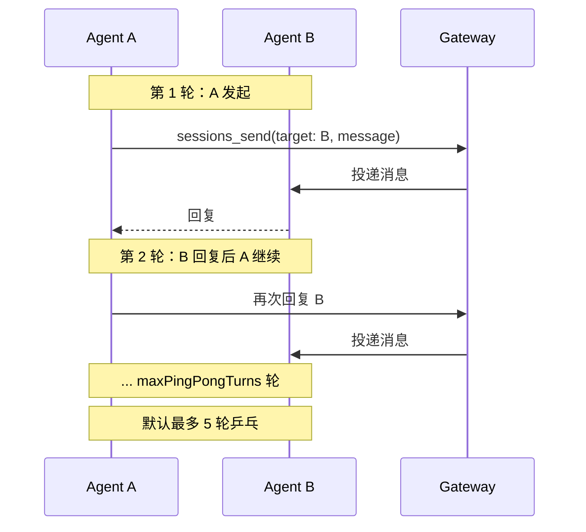
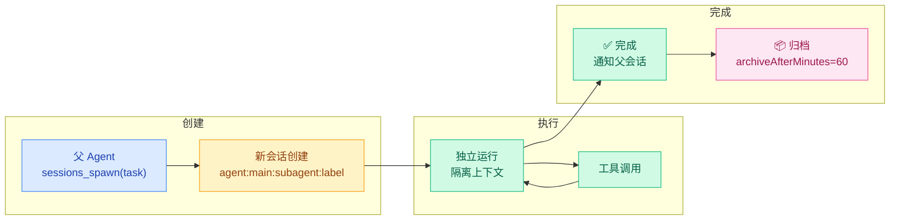

# 03 · 会话工具与子智能体

> **学习要点**
> - 四个会话工具分别提供什么能力？各自的适用场景是什么？
> - sessions_spawn 如何派生子智能体？子智能体的生命周期是怎样的？
> - 智能体间通信的乒乓循环如何工作？
> - 沙箱环境下会话工具的可视范围如何控制？

---

## 1. 四个会话工具

OpenClaw 提供四个会话工具，让 Agent 可以自主管理会话和与其他 Agent 通信：

| 工具 | 功能 | 适用场景 |
|:----:|------|----------|
| **`sessions_list`** | 列出所有活跃会话 | 查看当前有哪些对话、监控活跃度 |
| **`sessions_history`** | 获取特定会话的历史记录 | 回顾之前对话、跨会话信息聚合 |
| **`sessions_send`** | 向另一个会话发送消息 | Agent 间通信、通知其他会话 |
| **`sessions_spawn`** | 在隔离会话中派生子智能体 | 并行任务、专业化分工 |

### 会话键模型

| 会话类型 | Key 格式 |
|----------|----------|
| 主直接聊天 | `agent:{agentId}:`（字面 "main"）|
| DM（per-peer） | `agent:{agentId}:dm:{peerId}` |
| DM（per-channel-peer） | `agent:{agentId}:{channel}:dm:{peerId}` |
| 群聊 | `agent:{agentId}:{channel}:group:` |
| Cron 作业 | `cron:` |
| 子智能体 | `agent:{agentId}:subagent:{label}` |

---

## 2. sessions_list — 列出会话

列出所有会话，返回会话摘要数组：

| 参数 | 说明 |
|------|------|
| `kinds` | 过滤器：main / group / cron / hook / node / other |
| `limit` | 最大行数（默认 200） |
| `activeMinutes` | 仅返回 N 分钟内更新的会话 |
| `messageLimit` | 0=不含消息；>0=包含最后 N 条消息 |

**返回字段**：

```
key, kind, channel, displayName, updatedAt, sessionId
model, contextTokens, totalTokens
thinkingLevel, verboseLevel, systemSent, abortedLastRun
sendPolicy, lastChannel, lastTo, deliveryContext
transcriptPath, messages?
```

---

## 3. sessions_history — 查看历史

| 参数 | 说明 |
|------|------|
| `sessionKey` | 必需（会话键或 sessionId） |
| `limit` | 最大消息数 |
| `includeTools` | 默认 false（过滤工具结果，减少冗余） |

---

## 4. sessions_send — 跨会话通信

向另一个会话发送消息，支持同一 Agent 或跨 Agent：

| 参数 | 说明 |
|------|------|
| `sessionKey` | 必需，目标会话标识 |
| `message` | 必需，消息内容 |
| `timeoutSeconds` | >0 等待完成；0=即发即忘 |

### 返回状态

| 状态 | 说明 |
|:----:|------|
| `accepted` | ✅ 已入队，等待处理 |
| `ok` | ✅ 成功完成，reply 有返回 |
| `timeout` | ⏱ 超时，目标运行继续 |
| `error` | ❌ 运行失败 |

### 通信流程（乒乓循环）



| 配置项 | 默认值 | 说明 |
|--------|--------|------|
| `session.agentToAgent.maxPingPongTurns` | 5 | 最大乒乓轮数 |
| `ANNOUNCE_SKIP` | — | 精确回复此标记保持沉默 |

---

## 5. sessions_spawn — 子智能体

子智能体（Subagent）是 OpenClaw 的**任务并行机制**：在隔离会话中派生出执行特定任务的独立 Agent。

### 参数

| 参数 | 说明 | 默认值 |
|------|------|--------|
| `task` | **必需**，任务描述 | — |
| `label` | 日志/UI 标签，用于标识子智能体 | 可选 |
| `agentId` | 使用的智能体 ID，可指向不同 Agent | 当前 Agent |
| `model` | 覆盖子智能体的模型 | 继承父 Agent |
| `runTimeoutSeconds` | 运行超时 | 0（无超时）|
| `cleanup` | 完成后处理方式 | `keep`（保留） |

### 子智能体生命周期



### 行为规则

| 规则 | 说明 |
|------|------|
| **新会话** | 启动 `agent:{agentId}:subagent:{label}` 的独立会话 |
| **工具受限** | 默认使用完整工具集**减去**会话工具（不可派生子子智能体）|
| **无嵌套** | **子智能体不允许再派生子智能体** |
| **非阻塞** | 始终非阻塞，立即返回，父 Agent 继续执行 |
| **完成通知** | 完成后自动通知请求者的聊天通道 |
| **自动归档** | 子会话在 `archiveAfterMinutes`（默认 60）后自动归档 |

---

## 6. 沙箱会话可见性

沙箱化会话的工具可见范围可通过配置控制：

```json5
{
  agents: {
    defaults: {
      sandbox: {
        sessionToolsVisibility: "spawned",   // 默认：只能看到派生的会话
        // 或 "all"  // 可以看到所有会话
      },
    },
  },
}
```

| 模式 | 说明 | 安全等级 |
|:----:|------|:--------:|
| `spawned` 🏆 | 仅能看到自己派生的子会话 | 🔒 高 |
| `all` | 可看到所有会话 | ⚠️ 低 |

---

> **相关模块**：[01 - 路由层与 Session Key](01-routing-engine.md) · [02 - 会话生命周期与重置](02-session-lifecycle.md) · [04 - 通道与节点架构](04-channels-nodes.md) · [09 - 多智能体路由](../09-extensions/03-multi-agent-routing.md) · [09 - 并行专家通道](../09-extensions/04-parallel-lanes.md)
