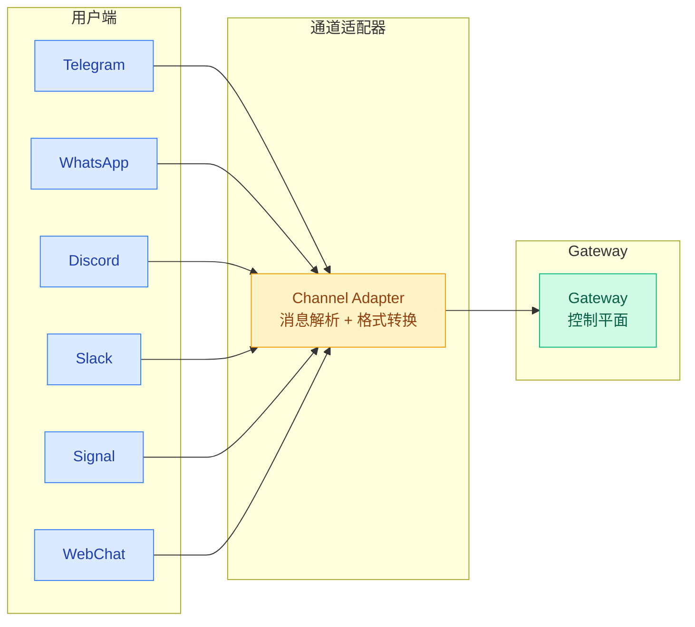
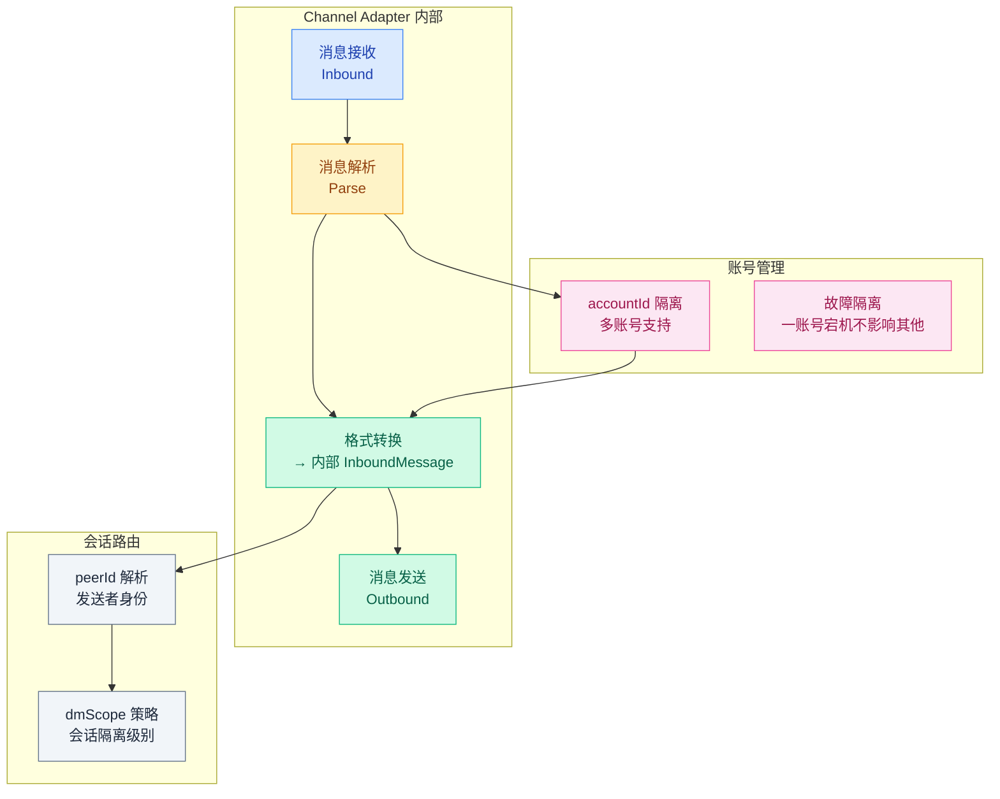
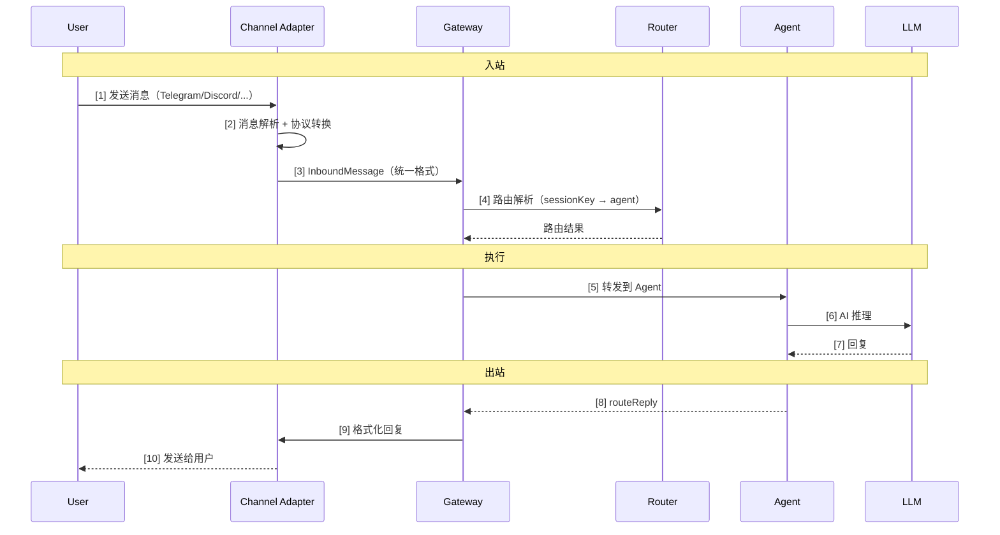
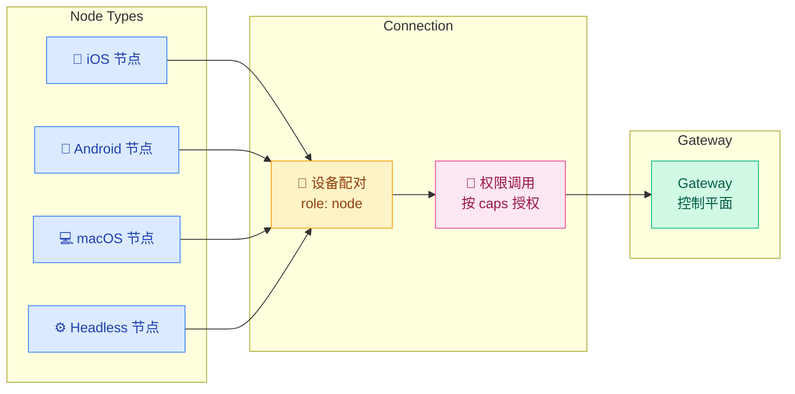

# 04 · 通道与节点架构

> **学习要点**
> - 通道（Channel）和节点（Node）在架构中的定位有何本质区别？
> - 通道适配器的内部工作流程是怎样的？accountId 和 peerId 如何协作？
> - 节点提供哪些设备能力？连接流程是怎样的？
> - 多账号场景下如何通过 dmScope 和 accountId 实现隔离？

---

## 1. 通道架构

通道是消息的**"入口"与"出口"**，连接用户与 Gateway 的桥梁。



### 通道适配器内部结构



### 通道消息流转



---

## 2. 通道类型

| 类型 | 通道 | 接入方式 |
|:----:|------|----------|
| **核心通道** 🏆 | Telegram, WhatsApp, Discord, Slack, Signal, iMessage, Google Chat, WebChat | Gateway 原生支持，统一管理 |
| **插件通道** | Matrix, Mattermost, Teams, LINE, Nostr, Twitch, Zalo, QQ, WeChat | 通过插件能力扩展 |

### 核心概念

| 概念 | 说明 | 作用 |
|------|------|------|
| **accountId** | 通道账号标识，支持多账号 | 同一通道可运行多个独立账号，故障隔离 |
| **peerId** | 用户/群组标识 | 区分不同发送者，路由到对应会话 |
| **dmScope** | 会话隔离策略 | 控制 DM 会话的隔离粒度 |

> **账号是一级实体**：同一 Channel 可运行多个 `accountId`，单个账号故障不影响其他账号。

### 配置参考

详见 [02 - 配置系统与热重载](../02-gateway-control/02-config-system.md) 中的通道管理配置：

```json5
{
  channels: {
    telegram: {
      enabled: true,
      botToken: "123:abc",
      dmPolicy: "pairing",     // pairing | allowlist | open | disabled
      allowFrom: ["tg:123"],
    },
  },
}
```

---

## 3. 节点系统

节点是连到 Gateway 的**设备**，不是另一个 Gateway。节点通过提供设备能力扩展 Gateway 的边界。



### 节点类型与能力

| 节点类型 | 提供能力 | 典型场景 |
|----------|----------|----------|
| **iOS 节点** | Canvas 可视化、相机、语音、位置 | 手机端交互、拍照上传 |
| **Android 节点** | 聊天、语音、Canvas、相机 | 移动端自动化 |
| **macOS 节点** | 菜单栏应用、Canvas、桌面能力 | 桌面端操作、截图 |
| **Headless 节点** | 远程命令执行、自动化宿主 | CI/CD、远程服务器管理 |

### 连接流程

```
节点连接 → 声明 role: "node" → 上报 commands/caps
    → Gateway 配对批准 → 按权限调用能力
```

| 步骤 | 说明 | 验证 |
|:----:|------|------|
| ① 节点连接 | 通过 WebSocket 连接到 Gateway | 连接层握手 |
| ② 声明 role | 节点标识自身身份为 `role: "node"` | role 检查 |
| ③ 上报 caps | 上报支持的命令列表和能力集 | 能力注册 |
| ④ 配对批准 | Gateway 端审核并批准连接 | 管理员审批 |
| ⑤ 权限调用 | 按权限调用节点能力 | `authorizeGatewayMethod` |

### 核心概念

| 概念 | 说明 |
|------|------|
| **role: "node"** | 节点连接时声明的身份标识 |
| **commands** | 节点支持的命令列表 |
| **caps** | 节点提供的能力（capabilities） |
| **配对批准** | Gateway 端审核并批准设备连接 |
| **权限调用** | 按授权粒度调用节点能力 |

---

## 4. 通道 vs 节点

| 维度 | 通道（Channel） | 节点（Node） |
|:----:|-----------------|--------------|
| **定位** | 消息的入口/出口 | 设备能力的提供者 |
| **连接方向** | 用户 → 通道 → Gateway | 节点 → Gateway |
| **数据流向** | 用户 ↔ Gateway（双向通信） | 节点 → Gateway（能力注册 + 调用）|
| **角色** | 消息路由、协议适配 | 能力扩展、外设管理 |
| **代表** | Telegram、Discord、WhatsApp | iOS 手机、Android 平板、macOS 电脑 |
| **故障影响** | 单通道故障仅影响该入口 | 单节点故障不影响其他节点 |

---

> **相关模块**：[01 - 路由层与 Session Key](01-routing-engine.md) · [02 - 会话生命周期与重置](02-session-lifecycle.md) · [03 - 会话工具与子智能体](03-session-tools.md) · [02 - 配置系统与热重载](../02-gateway-control/02-config-system.md) · [09 - 并行专家通道](../09-extensions/04-parallel-lanes.md)
