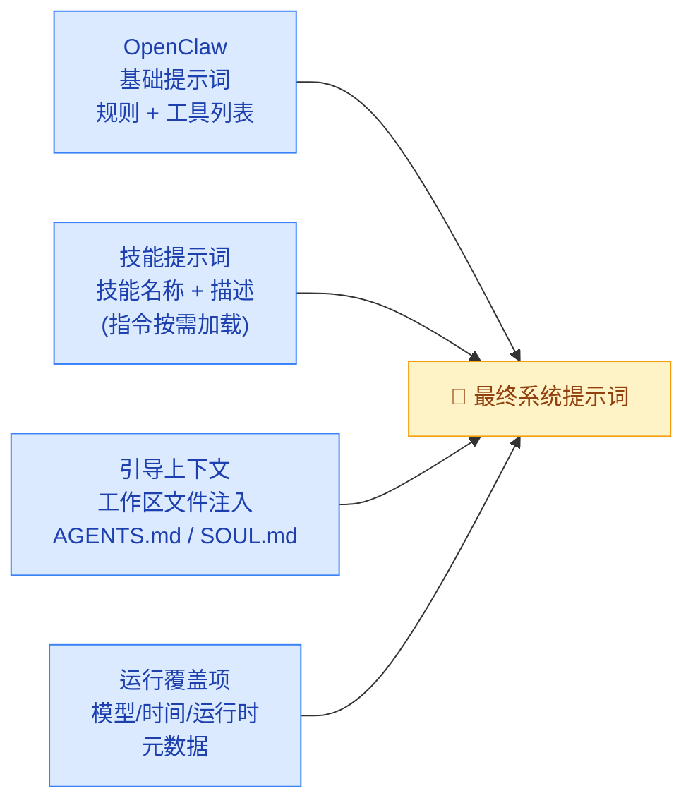

# 01 · 上下文窗口管理

> **学习要点**
> - 上下文窗口是什么？哪些内容会占用上下文 Token？
> - 上下文和记忆的核心区别是什么？
> - 系统提示词由哪些部分组成？工作区文件如何注入？
> - 如何通过诊断命令检查上下文使用情况？

---

## 1. 什么是上下文

"上下文"（Context）是 OpenClaw 在一次运行中发送给模型的所有内容。它受模型的上下文窗口（Token 限制）约束。

```
🧠 上下文窗口
┌─────────────────────────────────────────────────────┐
│                 上下文（Context）                      │
│  ┌──────────────┐  ┌──────────────┐                │
│  │  系统提示词   │  │   对话历史   │                │
│  │  规则/工具   │  │  你+助手消息  │                │
│  └──────────────┘  └──────────────┘                │
│  ┌──────────────┐  ┌──────────────┐                │
│  │ 工具调用/结果  │  │ 附件/转录    │                │
│  │ 命令输出/图像  │  │ 图像/音频/文件 │                │
│  └──────────────┘  └──────────────┘                │
│  ┌──────────────────────────────────┐              │
│  │      压缩摘要 + 修剪产物          │              │
│  └──────────────────────────────────┘              │
├─────────────────────────────────────────────────────┤
│  ~~~~ 上下文窗口上限 (如 32K / 100K / 200K) ~~~~    │
└─────────────────────────────────────────────────────┘
```

### 上下文 ≠ 记忆

| 维度 | 上下文（Context） | 记忆（Memory） |
|:----:|-------------------|----------------|
| **位置** | 当前模型窗口内 | 磁盘上的 Markdown 文件 |
| **持久性** | 临时，每次运行重新构建 | 持久，跨会话保留 |
| **速度** | 即时读写 | 需要 I/O 操作 |
| **成本** | 占用 Token | 不消耗 Token（检索时除外） |
| **类比** | 桌面上摊开的材料 | 文件柜里的资料 |

> **核心原则**：只在聊天里说过、但没有写进文件的内容，将来可能会忘。记忆需要主动写入磁盘。

---

## 2. 上下文组成

### 什么计入上下文窗口

| 组成部分 | 说明 | 影响 |
|----------|------|------|
| **系统提示词** | 规则、工具列表、技能列表、时间/运行时、工作区文件 | 每次运行固定开销 |
| **对话历史** | 用户消息 + 助手回复 | 随时间线性增长 |
| **工具调用/结果** | 命令输出、文件读取、图像/音频 base64 | 大型工具结果可能很大 |
| **附件/转录** | 图像、音频、文件的内容 | 图像 token 消耗高 |
| **压缩摘要** | 旧对话被摘要化后的内容 | 替代原始对话，节省空间 |
| **Provider 包装器** | 隐藏的系统头、格式包装 | 不可见，但计入 token |

### 会话、压缩和修剪的持久化关系

| 机制 | 持久化位置 | 说明 |
|------|-----------|------|
| **普通历史** | `.jsonl` 会话记录 | 直到被压缩/修剪处理 |
| **压缩** | `.jsonl` 记录中 | 摘要化旧对话，保留最近消息完整 |
| **修剪** | 内存中 | 移除旧工具结果，不重写 `.jsonl` |

---

## 3. 系统提示词组成

OpenClaw 每次运行时重新构建系统提示词，包括：



### 注入的工作区文件

默认注入以下文件（如存在）：

| 文件 | 说明 | 加载策略 |
|------|------|----------|
| **AGENTS.md** | 智能体操作指令、记忆使用规则 | ✅ 全量注入 |
| **SOUL.md** | 人设/语调/边界 | ✅ 全量注入 |
| **TOOLS.md** | 工具使用备注 | ✅ 全量注入 |
| **IDENTITY.md** | 名称/风格/表情符号 | ✅ 全量注入 |
| **USER.md** | 用户信息 | ✅ 全量注入 |
| **HEARTBEAT.md** | 心跳清单 | ✅ 全量注入 |
| **BOOTSTRAP.md** | 首次运行仪式 | 仅首次运行 |

> 大型文件使用 `bootstrapMaxChars`（默认 20000 字符）截断，总引导注入使用 `bootstrapTotalMaxChars`（默认 24000 字符）上限控制。

### 技能：注入的 vs 按需加载

- 系统提示词包含紧凑的**技能列表**（名称 + 描述 + 位置）
- 技能指令默认**不包含**在系统提示词中
- 模型仅在需要时通过 `read` 工具读取技能的 `SKILL.md`

### 工具的两种成本

| 成本类型 | 说明 | Token 占比 |
|----------|------|:----------:|
| **工具列表文本** | 系统提示词中对工具的简短描述 | 🔵 小 |
| **工具 schema（JSON）** | 发送给模型用于调用的完整函数定义 | 🔴 大（可能数千 Token） |

---

## 4. /context list 示例输出

通过 `/context list` 可以查看当前上下文的详细构成：

```
🧠 Context breakdown
Workspace: <workspaceDir>
Bootstrap max/file: 20,000 chars
Sandbox: mode=non-main sandboxed=false
System prompt (run): 38,412 chars (~9,603 tok)

Injected workspace files:
- AGENTS.md:     OK       | raw 1,742 chars  | injected 1,742 chars
- SOUL.md:       OK       | raw 912 chars    | injected 912 chars
- TOOLS.md:      TRUNCATED | raw 54,210 chars | injected 20,962 chars
- IDENTITY.md:   OK       | raw 211 chars    | injected 211 chars
- USER.md:       OK       | raw 388 chars    | injected 388 chars
- HEARTBEAT.md:  MISSING  | raw 0            | injected 0

Skills list: 2,184 chars (~546 tok) (12 skills)
Tool list: 1,032 chars (~258 tok)
Tool schemas: 31,988 chars (~7,997 tok)

Session tokens (cached): 14,250 total / ctx=32,000
```

---

## 5. 快速检查命令

| 命令 | 说明 | 用途 |
|:----:|------|------|
| **`/status`** | 查看窗口使用率和会话设置 | 快速概览 |
| **`/context list`** | 注入的文件 + 大致大小 | 查看哪些文件占用了上下文 |
| **`/context detail`** | 详细分解：按文件/工具/schema/技能 | 精确分析 Token 分布 |
| **`/usage tokens`** | 每次回复的用量信息 | 监控每次调用的成本 |
| **`/compact [说明]`** | 压缩旧历史记录释放空间 | 主动管理上下文 |

---

> **相关模块**：[02 - 上下文引擎](02-context-engine.md) · [03 - 压缩与修剪](03-compaction-pruning.md) · [06 - 记忆存储层](../06-memory-systems/01-memory-storage-layer.md) · [09 - 工作区配置](../09-extensions/05-workspace-config.md)
