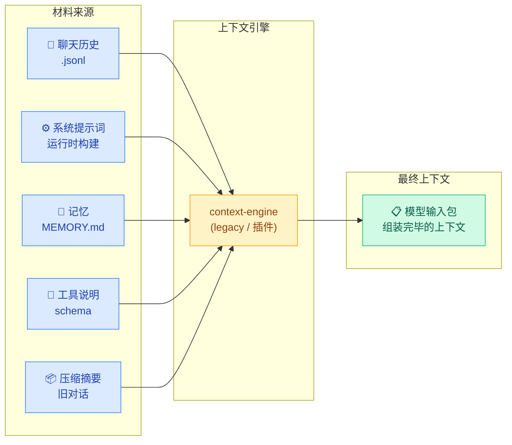
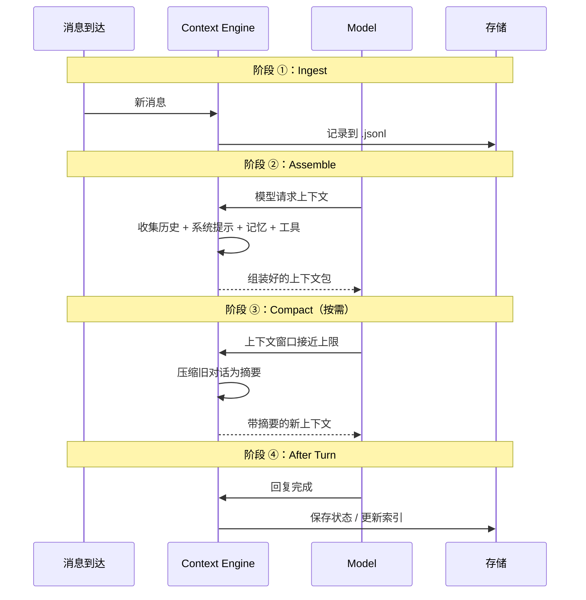

# 02 · 上下文引擎

> **学习要点**
> - 上下文引擎的四个阶段分别做什么？在 Agent 执行周期的哪个时机调用？
> - 默认引擎（legacy）和插件引擎有什么区别？
> - 什么时候需要关注或定制上下文引擎？

---

## 1. 核心问题

> **模型这次回复前，应该看到哪些内容？**

上下文引擎负责从各个来源收集、整理、组合出模型在这次运行中需要的所有材料——聊天历史、系统提示词、记忆、工具说明、压缩摘要等。



### 可以把它想成...

> 开会前的秘书：把历史记录、重点摘要、相关材料都整理成一份会议包。

---

## 2. 四个阶段

上下文引擎在 Agent 执行的时序中以四个阶段介入：



### 各阶段详解

| 阶段 | 时机 | 人话解释 | 核心操作 |
|:----:|------|----------|----------|
| **① Ingest** | 新消息到达时 | 先记录下来 | 写入 `.jsonl`、更新 Token 计数 |
| **② Assemble** | 模型运行前 | 把该看的内容整理好 | 收集历史、注入系统提示、加载记忆、组装工具 schema |
| **③ Compact** | 上下文窗口接近上限时 | 把旧内容压缩成摘要 | 摘要化旧对话 → `waitForCompactionRetry` |
| **④ After Turn** | 回复完成后 | 保存状态或更新索引 | 持久化对话记录、更新记忆索引 |

---

## 3. 默认引擎（legacy）

OpenClaw 默认使用内置的 `legacy` 引擎，已经能处理大多数场景：

| 能力 | 说明 |
|------|------|
| **保存新消息** | 自动将新消息写入 `.jsonl` 记录 |
| **组装模型输入** | 收集系统提示 + 对话历史 + 工具定义 |
| **自动压缩** | 上下文窗口接近上限时自动触发 |
| **保留最近消息** | 压缩时保留最近 N 条消息完整 |
| **手动压缩** | 支持 `/compact` 手动触发 |
| **静默记忆刷新** | 压缩前可触发记忆写入提醒 |

> **新手通常不需要改它。** 已经有能力处理绝大多数场景。

### 默认引擎的工作效果

```
/status 输出示例：
Session tokens (cached): 14,250 total / ctx=32,000
🧹 Compactions: 3

→ 默认引擎自动管理上下文，无需手动干预
```

---

## 4. 插件引擎

当默认引擎不满足需求时，可以安装自定义上下文引擎插件：

```bash
openclaw plugins install <context-engine-plugin>
```

### 配置

```json5
{
  plugins: {
    slots: {
      contextEngine: "my-engine",   // 使用自定义引擎替换 legacy
    },
  },
}
```

### 重启生效

```bash
openclaw gateway restart
```

---

## 5. 什么时候该关注它

| 场景 | 说明 | 推荐动作 |
|------|------|----------|
| **模型经常忘事** | 对话长了之后表现下降 | 调优压缩策略或考虑插件引擎 |
| **调试记忆和压缩** | 需要理解上下文管理细节 | 使用 `/context list` 和 `/context detail` |
| **子智能体上下文继承** | 希望子智能体继承父会话上下文 | 研究上下文引擎的 scope 机制 |
| **开发上下文插件** | 想要完全自定义上下文策略 | 使用插件引擎接口 |
| **长文档场景** | 需要长期稳定的资料引用 | 调大 `bootstrapMaxChars` 或定制引擎 |

---

> **相关模块**：[01 - 上下文窗口管理](01-context-window.md) · [03 - 压缩与修剪](03-compaction-pruning.md) · [06 - 记忆存储层](../06-memory-systems/01-memory-storage-layer.md) · [09 - 插件系统](../09-extensions/01-plugin-system.md)
