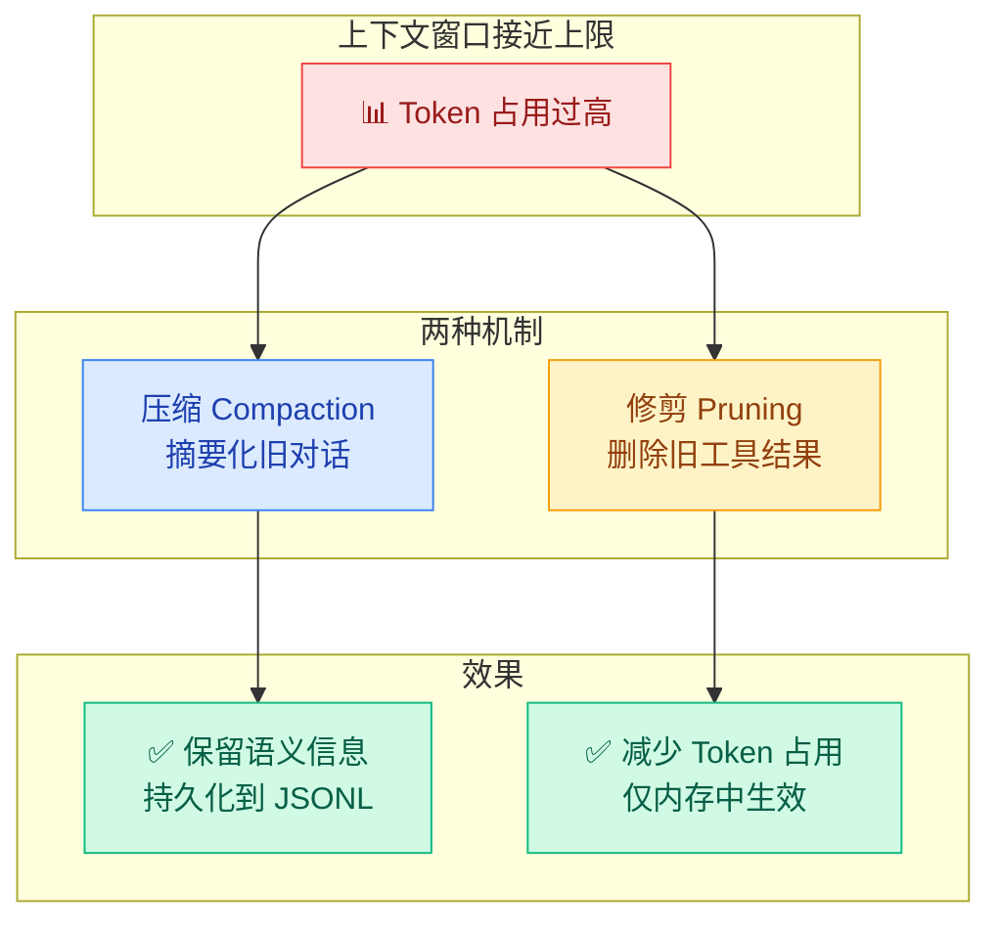
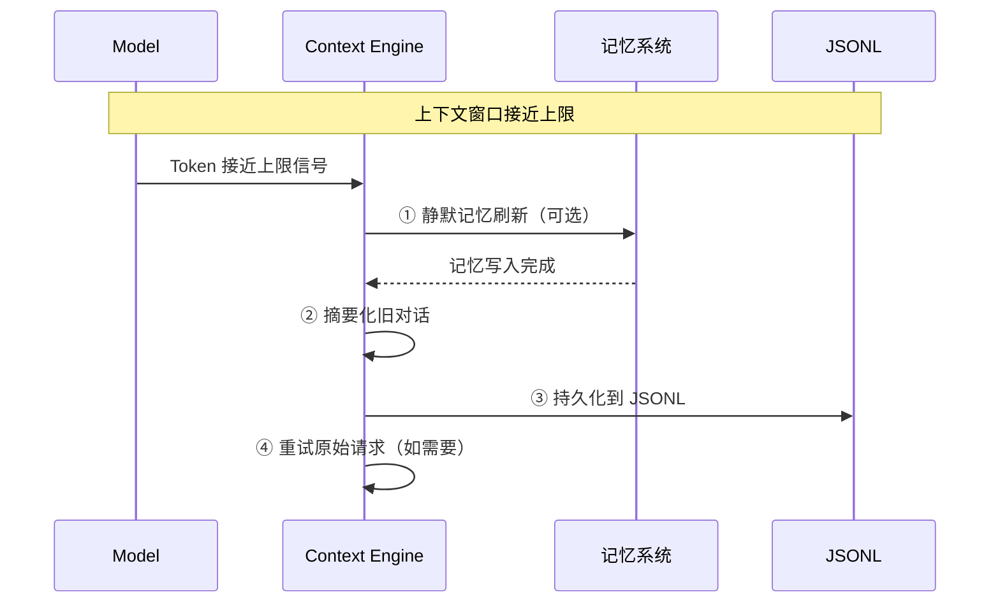
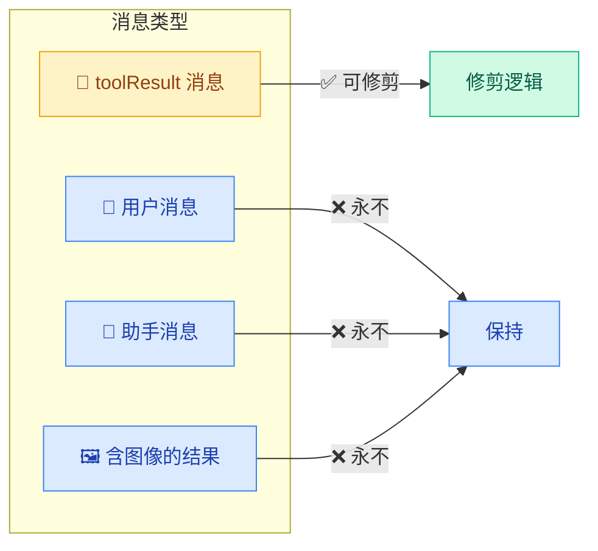

# 03 · 压缩与修剪

> **学习要点**
> - 压缩（Compaction）和修剪（Pruning）在操作、持久化、时机上有什么区别？
> - 自动压缩如何触发？手动压缩如何使用？
> - 软修剪和硬清除分别如何处理工具结果？
> - 如何配置压缩和修剪参数以适应不同场景？

---

## 1. 压缩 vs 修剪 — 总览



### 核心区别

| 特性 | 压缩（Compaction） | 修剪（Pruning） |
|:----:|-------------------|----------------|
| **操作** | 摘要化旧对话内容 | 仅删除旧的工具结果 |
| **持久化** | ✅ 持久化到 JSONL | ❌ 仅在内存中 |
| **时机** | 按需触发（自动或手动） | 每次 LLM 调用前 |
| **范围** | 整个对话历史 | 仅工具结果 |
| **效果** | 保留语义，节省长期空间 | 减少每次调用的 Token |

---

## 2. 压缩（Compaction）

### 工作原理

```
较旧对话 → 摘要化为紧凑条目
最近消息 → 保持完整
存储位置 → 会话历史的 JSONL 文件
后续请求使用 → 压缩摘要 + 压缩点之后的最近消息
```

### 自动压缩流程



| 阶段 | 说明 | 触发方式 |
|:----:|------|----------|
| **静默记忆刷新** | 压缩前提醒模型将持久信息写入磁盘 | `memoryFlush.enabled = true` |
| **摘要化** | 将旧对话压缩为紧凑摘要 | 自动 |
| **持久化** | 摘要和保留的最近消息写入 JSONL | 自动 |
| **重试** | 压缩后自动重试原始请求 | 自动 |

### 手动压缩

```bash
/compact Focus on decisions and open questions
```

手动压缩可以指定压缩焦点，让 Agent 在摘要时关注特定内容（如决策、待定问题）。

---

## 3. 压缩配置

```json5
{
  agents: {
    defaults: {
      compaction: {
        reserveTokensFloor: 20000,     // 保留 Token 下限
        memoryFlush: {
          enabled: true,                // 压缩前触发记忆刷新
          softThresholdTokens: 4000,    // 触发的 Token 余量
          systemPrompt: "Session nearing compaction. Store durable memories now.",
          prompt: "Write any lasting notes to memory/YYYY-MM-DD.md; reply with NO_REPLY if nothing to store.",
        },
      },
    },
  },
}
```

| 参数 | 默认值 | 说明 |
|------|--------|------|
| `reserveTokensFloor` | 20000 | 压缩后保留的 Token 数下限 |
| `memoryFlush.enabled` | true | 压缩前是否触发静默记忆刷新 |
| `memoryFlush.softThresholdTokens` | 4000 | 距离上限还有多少 Token 时触发刷新 |

---

## 4. 修剪（Session Pruning）

修剪在每次 LLM 调用前从**内存上下文**中删除旧的工具结果，但**不会重写磁盘上的 JSONL 历史**。

### 什么是可修剪的



| 内容 | 是否可修剪 | 理由 |
|------|:----------:|------|
| **toolResult 消息** | ✅ 是 | 大型命令输出可以精简 |
| **用户消息** | ❌ 否 | 用户输入必须保留 |
| **助手消息** | ❌ 否 | 助手的回复必须保留 |
| **含图像块的结果** | ❌ 否 | 图像上下文不应截断 |
| **最后 keepLastAssistants 个助手消息** | ❌ 否 | 保护最近的交互 |


### 软修剪 vs 硬清除

| 类型 | 行为 | 效果 |
|:----:|------|------|
| **软修剪** 🏆 | 保留头尾，插入 `...`，附加原始大小注释 | 保留部分上下文线索 |
| **硬清除** | 用 placeholder 替换整个工具结果 | 最大程度释放 Token |

### 修剪配置

```json5
{
  agents: {
    defaults: {
      contextPruning: {
        mode: "cache-ttl",            // 修剪模式
        ttl: "5m",                    // 缓存 TTL
        keepLastAssistants: 3,        // 保留倒数 N 个助手消息
        softTrimRatio: 0.3,           // 软修剪触发比例
        hardClearRatio: 0.5,          // 硬清除触发比例
        minPrunableToolChars: 50000,  // 最小可修剪字符数
        softTrim: {
          maxChars: 4000,
          headChars: 1500,
          tailChars: 1500,
        },
        hardClear: {
          enabled: true,
          placeholder: "[Old tool result content cleared]",
        },
        tools: {
          allow: ["exec", "read"],
          deny: ["*image*"],
        },
      },
    },
  },
}
```

---

## 5. 决策指南

| 场景 | 推荐操作 | 理由 |
|------|----------|------|
| **上下文臃肿，模型忘事** | `/compact` | 压缩摘要化旧内容，保留语义 |
| **大型工具输出过多** | 修剪（自动触发） | 自动清理旧的工具结果 |
| **需要全新开始** | `/new` 或 `/reset` | 创建全新的会话 ID |
| **只想释放一点空间** | `/compact` + 修剪 | 两者结合效果最佳 |

---

> **相关模块**：[01 - 上下文窗口管理](01-context-window.md) · [02 - 上下文引擎](02-context-engine.md) · [06 - 记忆存储层](../06-memory-systems/01-memory-storage-layer.md) · [06 - 主动检索层](../06-memory-systems/02-active-retrieval.md)
