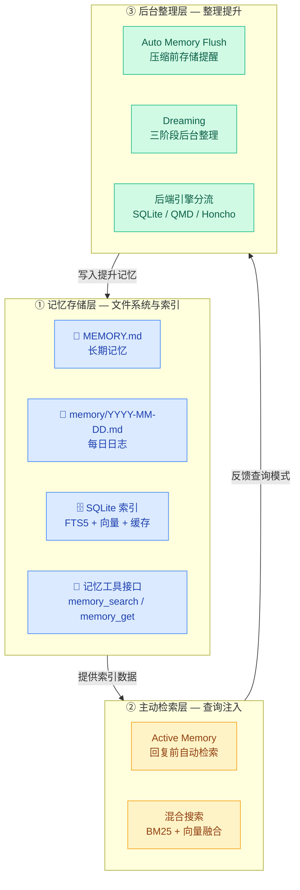
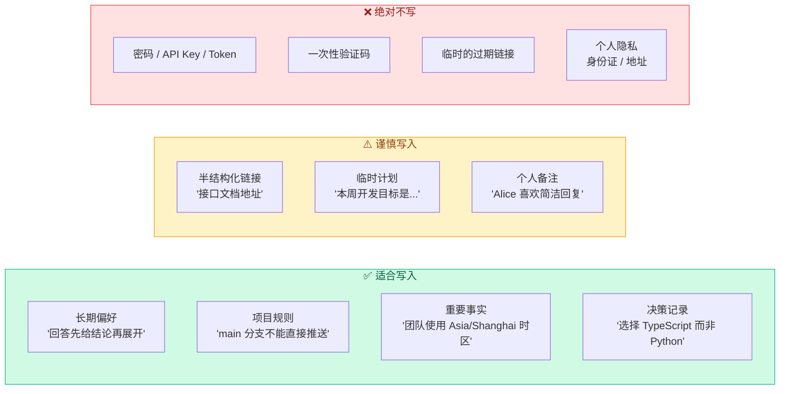

# 01 · 记忆存储层

> **学习要点**
> - OpenClaw 的三层记忆体系分别是什么？存储层在其中的基础定位是什么？
> - MEMORY.md 和 memory/YYYY-MM-DD.md 的用途、加载时机、作用域有何区别？
> - 索引系统索引哪些文件？索引触发的四种时机分别是什么？
> - 什么内容适合写入记忆？什么绝对不写？
> - 嵌入缓存和 SQLite 向量加速如何提升检索性能？

---

## 1. 三层记忆体系

OpenClaw 将记忆抽象为**三层架构**，存储层是最底层的基础设施：



### 各层职责

| 层级 | 名称 | 核心载体 | 职责 |
|:----:|------|----------|------|
| **①** | **记忆存储层** | MEMORY.md / 每日日志 / SQLite 索引 | 持久化记忆数据，提供搜索索引，暴露工具接口 |
| **②** | **主动检索层** | Active Memory / 混合搜索 | 在回复前自动检索相关记忆注入上下文 |
| **③** | **后台整理层** | Auto Flush / Dreaming / 后端引擎 | 在系统空闲时整理、提升记忆质量 |

> **存储层是三层中最基础的一层。** 没有存储层，主动检索无数据可查，后台整理无文件可写。

---

## 2. 两个记忆文件


| 文件 | 用途 | 加载时机 | 作用域 | 写入方式 |
|------|------|----------|--------|----------|
| **`MEMORY.md`** | 精选的长期记忆：决策、偏好、持久性事实 | 仅主要私人会话 | ❌ 不在群组中使用 | 主动写入 + Deep 阶段写入 |
| **`memory/YYYY-MM-DD.md`** | 每日日志（仅追加）：日常笔记、运行上下文 | 会话开始时读取今天 + 昨天 | ✅ 所有会话 | 仅追加，自动按日期分隔 |

### 写入策略

| 写入时机 | 写入位置 | 内容类型 |
|----------|----------|----------|
| Agent 主动决策 | `MEMORY.md` | "这个偏好应该记住" |
| Agent 主动决策 | `memory/YYYY-MM-DD.md` | "今天做的这个决策记一下" |
| Auto Memory Flush | `memory/YYYY-MM-DD.md` | 压缩前持久化提醒 |
| Dreaming Deep 阶段 | `MEMORY.md` | 从短期提升到长期 |

---

## 3. 记忆工具接口

存储层暴露两个工具供上层使用：

| 工具 | 功能 | 返回内容 | 启用条件 |
|:----:|------|----------|:--------:|
| **`memory_search`** | 语义搜索，按意思找笔记 | 片段文本 + 文件路径 + 行范围 + 相似度分数 | `memorySearch.enabled = true` |
| **`memory_get`** | 读取特定文件的完整内容 | 文件全文（可按行数限制） | 同上 |

> 两个工具仅在 `memorySearch.enabled = true` 时启用。默认启用。

---

## 4. 索引管理

### 索引内容

| 文件类型 | 是否索引 | 说明 |
|----------|:--------:|------|
| `MEMORY.md` | ✅ | 长期记忆文件 |
| `memory/**/*.md` | ✅ | 所有记忆目录下的 Markdown |
| 工作区其他 `.md` | ❌ | 仅 `extraPaths` 中显式指定的 |
| 符号链接目标 | ❌ | 被忽略 |

### 四种索引触发时机

| 触发时机 | 执行方式 | 说明 |
|:--------:|----------|------|
| **会话开始** | 🔴 同步 | Agent 启动时立即执行索引 |
| **搜索时** | 🟡 异步 | 如有必要，搜索时异步触发 |
| **间隔计划** | 🟢 定时 | 按配置的 interval 定时执行 |
| **文件变化** | 🟢 防抖 1.5s | 文件变更后等待 1.5s 再索引，避免频繁触发 |

### 索引存储

```
~/.openclaw/memory/<agentId>/.sqlite
```

可通过配置自定义：

```json5
{
  agents: {
    defaults: {
      memorySearch: {
        store: { path: "~/.openclaw/memory/{agentId}/.sqlite" },
      },
    },
  },
}
```

### 重新索引触发

当以下任一配置变化时，自动重置并重新索引：

- 嵌入 provider 变更
- 嵌入模型变更
- 端点指纹变更
- 分块参数变更

---

## 5. 嵌入缓存

重复嵌入相同的文本会浪费 API 调用和 Token。嵌入缓存确保**未更改的文本不会重新嵌入**：

```json5
{
  agents: {
    defaults: {
      memorySearch: {
        cache: {
          enabled: true,       // 启用缓存
          maxEntries: 50000,   // 最大缓存条目
        },
      },
    },
  },
}
```

| 效果 | 说明 |
|:----:|------|
| **减少 API 调用** | 未更改文本直接使用缓存向量 |
| **加速重新索引** | 重新索引时跳过已缓存的文本 |
| **降低 Token 消耗** | 避免重复发送相同文本给 embedding provider |

---

## 6. SQLite 向量加速

当 sqlite-vec 扩展可用时，嵌入存储在本机 SQLite 虚拟表中，向量距离查询在数据库内执行：

| 状态 | 查询方式 | 性能 |
|:----:|----------|:----:|
| ✅ sqlite-vec 可用 | 数据库内虚拟表查询 | 🚀 最快 |
| ❌ sqlite-vec 不可用 | 进程内余弦相似度计算 | 🐢 较慢 |

```json5
{
  agents: {
    defaults: {
      memorySearch: {
        store: {
          vector: {
            enabled: true,
            extensionPath: "/path/to/sqlite-vec",
          },
        },
      },
    },
  },
}
```

---

## 7. 额外记忆路径

可以将工作区外的目录也纳入记忆索引：

```json5
{
  agents: {
    defaults: {
      memorySearch: {
        extraPaths: ["../team-docs", "/srv/shared-notes/overview.md"],
      },
    },
  },
}
```

| 规则 | 说明 |
|:----:|------|
| **路径类型** | 绝对路径或相对于工作区 |
| **目录扫描** | 递归扫描 `.md` 文件 |
| **符号链接** | ❌ 被忽略 |

---

## 8. 适合 vs 不适合



---

## 9. 快速检查命令

| 命令 | 用途 | 属于哪层 |
|:----:|------|:--------:|
| **`/status`** | 查看窗口使用率和会话设置 | 全局 |
| **`/context list`** | 注入的文件 + 大致大小 | 存储层 |
| **`/memory status`** | 查看记忆系统状态（后端类型、索引数） | 存储层 |
| **`/memory search <query>`** | 手动搜索记忆 | 检索层 |

---

> **相关模块**：[02 - 主动检索层](02-active-retrieval.md) · [03 - 后台整理层](03-consolidation-backends.md) · [09 - 工作区配置](../09-extensions/05-workspace-config.md) · [05 - 压缩与修剪](../05-context-engineering/03-compaction-pruning.md)
