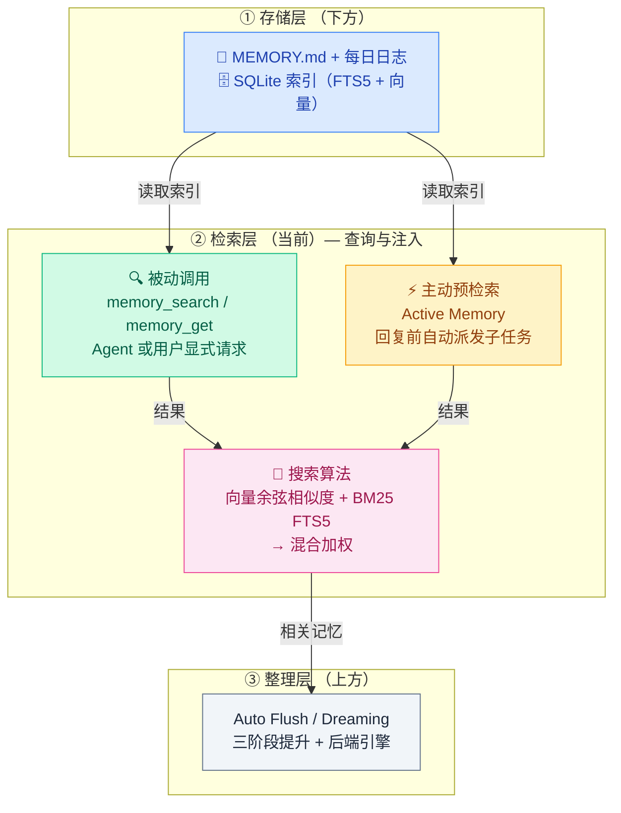
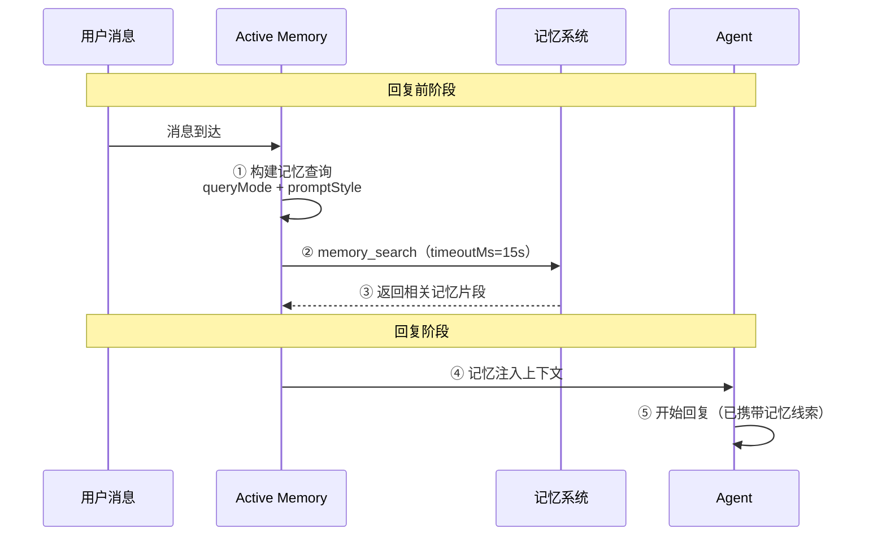
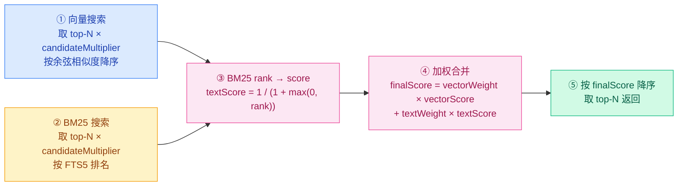
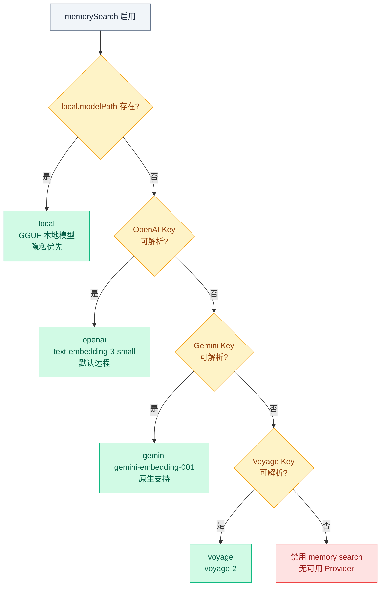
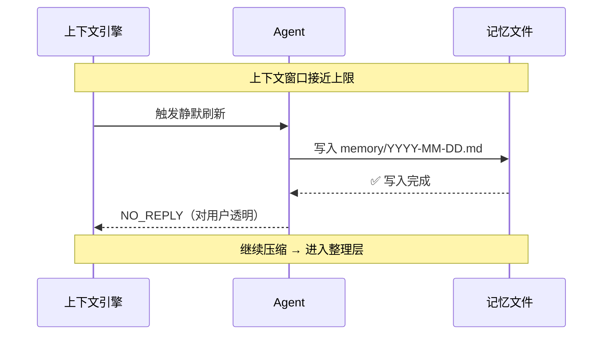

# 02 · 主动检索层

> **学习要点**
> - 检索层的两种触发机制——被动工具调用和主动预检索——各自的调用时序和适用场景？
> - Active Memory 为什么默认谨慎开启？延迟、费用和安全的权衡是什么？
> - 混合搜索（BM25 + 向量）的合并算法如何计算结果权重？
> - Embedding Provider 的自动选择顺序是怎样的？如何配置本地或远程 Provider？

---

## 1. 检索层在记忆体系中的位置

检索层是三层记忆体系中的**中间层**，承上启下：



### 被动 vs 主动对比

| 维度 | 被动调用（memory_search） | 主动预检索（Active Memory） |
|:----:|--------------------------|----------------------------|
| **触发方式** | Agent 或用户显式调用 | 每次主回复生成前自动触发 |
| **时机** | Agent 决定需要记忆时 | 每次消息处理，回复之前 |
| **可见性** | Agent 可控制调用与否 | 对 Agent 透明，无法干预 |
| **延迟影响** | 无额外延迟（按需调用） | 每次回复增加约 15s 延迟（可配置）|
| **费用影响** | 仅 Tool 调用费用 | 额外的模型子任务调用 |

---

## 2. 被动检索：记忆工具

| 工具 | 功能 | 返回内容 | 启用条件 |
|:----:|------|----------|:--------:|
| **`memory_search`** | 语义搜索，按意思找笔记 | 片段文本 + 文件路径 + 行范围 + 相似度分数 | `memorySearch.enabled = true` |
| **`memory_get`** | 读取特定文件的完整内容 | 文件全文（可按行数限制） | 同上 |

> 两个工具仅在 `memorySearch.enabled = true` 时可用。默认启用。

---

## 3. 主动预检索：Active Memory

普通记忆像一本笔记本，模型要想起来通常得自己决定去翻。Active Memory 更主动：**在主回复生成前，先派一个小的记忆子任务，看看有没有相关记忆值得带进来。**

### 调用时序



### 适合场景

| 场景 | 说明 | 效果 |
|:----:|------|------|
| **长期偏好** | Agent 记得你的风格偏好 | 回复更贴合个人习惯 |
| **长期聊天** | 经常和同一个 Agent 聊天 | 对话连续性更好 |
| **主动关联** | 不想每次都手动说"去查记忆" | 自动关联相关信息 |

### 为什么默认谨慎

| 影响 | 说明 | 缓解措施 |
|:----:|------|----------|
| **⏱ 增加延迟** | 回复前多跑一步记忆子任务 | 设置 `timeoutMs`（默认 15s），超时跳过 |
| **💰 增加费用** | 额外的模型调用 | 限定 `allowedChatTypes` 和 `agents` 白名单 |
| **🔒 权限控制** | 需要控制哪些 Agent 可启用 | `agents: ["main"]` 白名单 |
| **👥 群聊风险** | 避免把 A 的记忆用到 B 的回复 | `allowedChatTypes: ["direct"]` 禁止群聊 |

> **新手建议**：先只在私聊、主 Agent 上启用。确认影响不大后可逐步扩大范围。

### 配置

```json5
{
  plugins: {
    entries: {
      "active-memory": {
        enabled: true,
        config: {
          enabled: true,              // 总开关
          agents: ["main"],           // 生效的 Agent 白名单
          allowedChatTypes: ["direct"], // direct | group | thread
          queryMode: "recent",        // recent | semantic
          promptStyle: "balanced",    // concise | balanced | detailed
          timeoutMs: 15000,           // 超时后跳过记忆继续回复
        },
      },
    },
  },
}
```

| 参数 | 可选值 | 默认值 | 说明 |
|------|--------|:------:|------|
| `queryMode` | `recent` / `semantic` | `recent` | `recent`: 最近记忆优先; `semantic`: 语义相关性优先 |
| `promptStyle` | `concise` / `balanced` / `detailed` | `balanced` | 记忆注入提示词的详细程度 |
| `timeoutMs` | 毫秒 | 15000 | 记忆查询超时，超时后跳过记忆直接回复 |

### 会话内开关

```bash
# 查看状态
/active-memory status

# 当前会话开关
/active-memory on           # 启用
/active-memory off          # 关闭

# 全局开关
/active-memory on --global   # 全局启用
/active-memory off --global  # 全局关闭
```

---

## 4. 混合搜索（BM25 + 向量）

### 为什么需要混合搜索

| 搜索类型 | 优势 | 劣势 | Token 要求 |
|:--------:|------|------|:----------:|
| **向量搜索** 🔵 | 语义匹配（"Mac Studio" → "gateway host"） | 精确 Token 匹配弱 | 需要嵌入模型 |
| **BM25 搜索** 🟡 | 精确 Token（ID、环境变量、代码符号） | 改述能力弱 | 无需嵌入模型 |

### 合并算法



### 配置

```json5
{
  agents: {
    defaults: {
      memorySearch: {
        query: {
          hybrid: {
            enabled: true,            // 启用混合搜索
            vectorWeight: 0.7,        // 向量权重（0~1）
            textWeight: 0.3,          // BM25 权重（0~1）
            candidateMultiplier: 4,   // 候选集倍数
          },
        },
      },
    },
  },
}
```

| 参数 | 说明 | 默认值 | 效果 |
|------|------|:------:|------|
| `vectorWeight` | 向量分数权重 | 0.7 | 越高 → 语义匹配越重要 |
| `textWeight` | BM25 分数权重 | 0.3 | 越高 → 关键词匹配越重要 |
| `candidateMultiplier` | 候选集倍数 | 4 | 越高 → 召回越全，但计算越多 |

---

## 5. Embedding Provider



### Provider 一览

| Provider | 模型 | 说明 |
|----------|------|------|
| **OpenAI** | `text-embedding-3-small`, `text-embedding-3-large` | 默认远程 |
| **Gemini** | `gemini-embedding-001` | 原生支持 |
| **Voyage** | voyage 系列 | 可用 |
| **Mistral** | Mistral 嵌入 | 可用 |
| **Ollama** | 本地 Ollama | 本地部署 |
| **Local** | GGUF 模型（hf: URI） | 完全离线 |

### 配置示例

**OpenAI（默认）**：

```json5
{
  agents: { defaults: { memorySearch: { provider: "openai", model: "text-embedding-3-small" } } },
}
```

**Gemini（原生）**：

```json5
{
  agents: { defaults: { memorySearch: { provider: "gemini", model: "gemini-embedding-001", remote: { apiKey: "YOUR_KEY" } } } },
}
```

**本地模式（隐私优先）**：

```json5
{
  agents: {
    defaults: {
      memorySearch: {
        provider: "local",
        local: {
          modelPath: "hf:ggml-org/.../embeddinggemma-300m-qat-Q8_0.gguf",
          modelCacheDir: "~/.openclaw/model-cache",
        },
      },
    },
  },
}
```

---

## 6. Auto Memory Flush — 检索层与整理层的衔接

当上下文窗口接近上限、即将触发压缩时，检索层会执行一次**静默记忆刷新**，这是检索层与整理层的衔接点：



```json5
{
  agents: {
    defaults: {
      compaction: {
        reserveTokensFloor: 20000,
        memoryFlush: {
          enabled: true,
          softThresholdTokens: 4000,
          prompt: "Write any lasting notes to memory/YYYY-MM-DD.md; reply with NO_REPLY if nothing to store.",
        },
      },
    },
  },
}
```

---

## 7. 会话记忆搜索（实验性）

还可以索引历史会话记录并通过 `memory_search` 搜索：

```json5
{
  agents: {
    defaults: {
      memorySearch: {
        experimental: { sessionMemory: true },
        sources: ["memory", "sessions"],
      },
    },
  },
}
```

| 参数 | 默认值 | 说明 |
|------|:------:|------|
| `deltaBytes` | 100000 | ~100 KB 触发索引 |
| `deltaMessages` | 50 | JSONL 行数阈值 |

> 会话索引是选择加入的，按智能体隔离。需要先显式启用。

---

> **相关模块**：[01 - 记忆存储层](01-memory-storage-layer.md) · [03 - 后台整理层](03-consolidation-backends.md) · [05 - 压缩与修剪](../05-context-engineering/03-compaction-pruning.md) · [09 - 工作区配置](../09-extensions/05-workspace-config.md)
