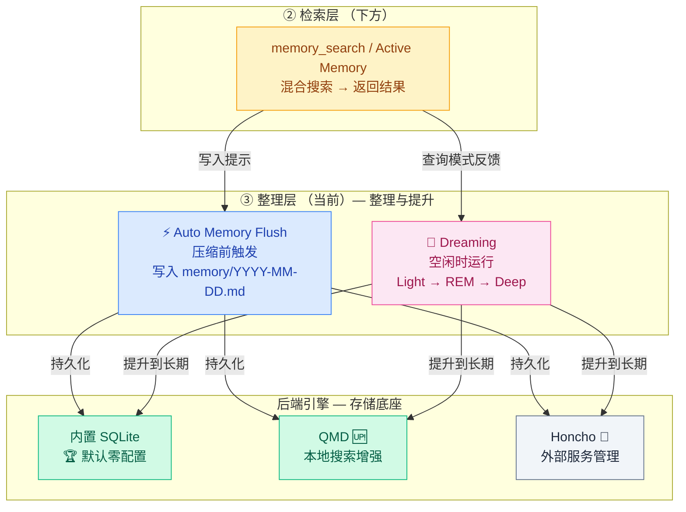
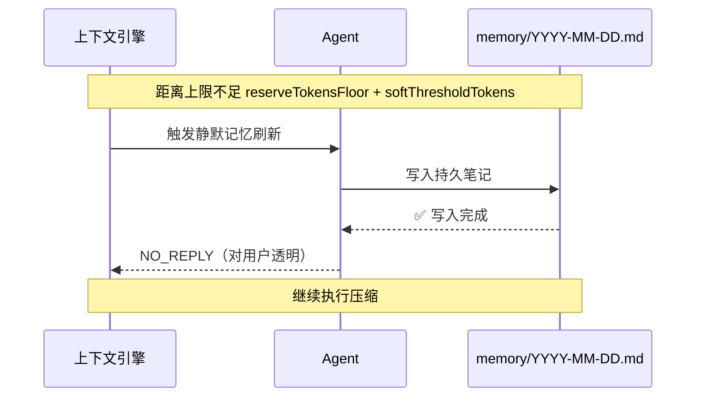
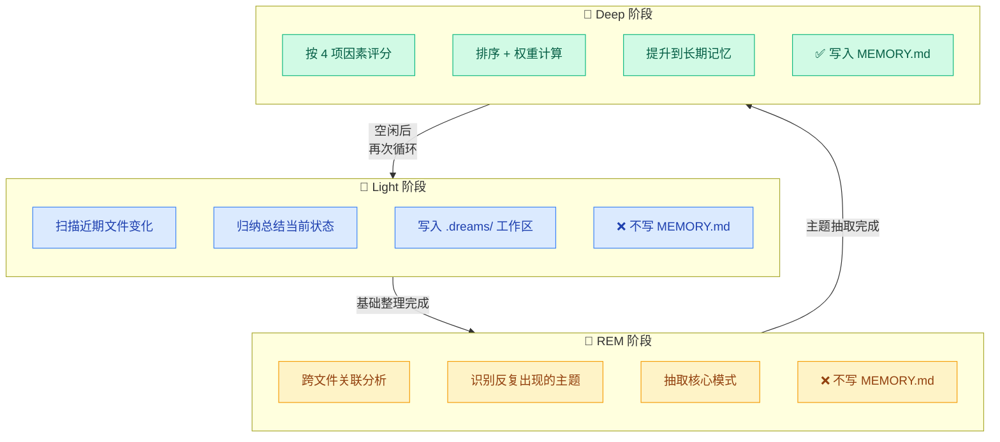
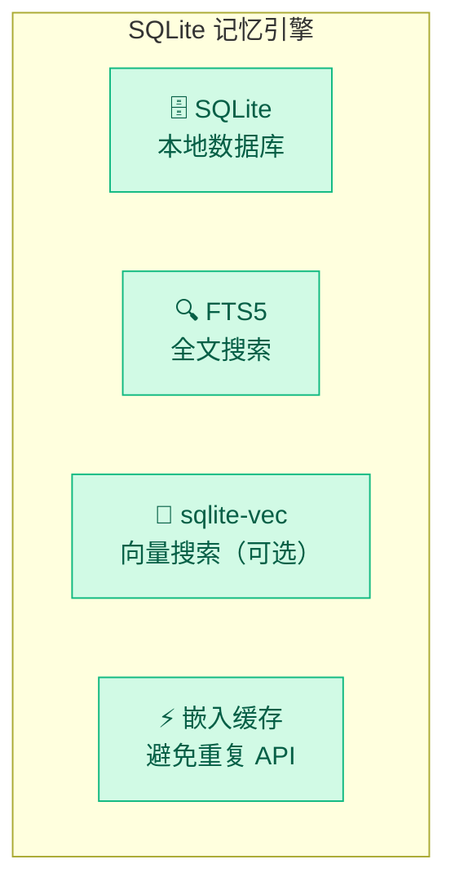
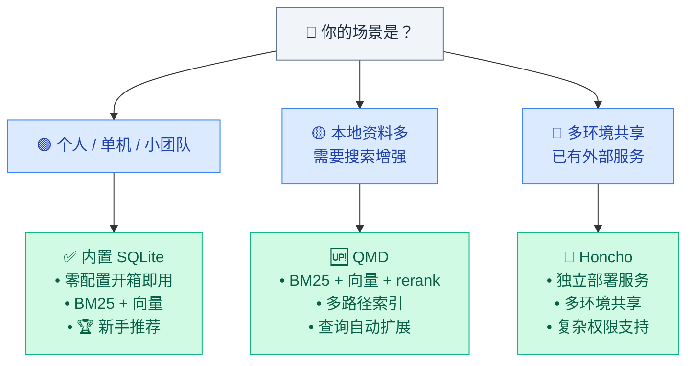

# 03 · 后台整理层

> **学习要点**
> - 整理层的两种整理机制——Auto Memory Flush 和 Dreaming——在触发时机和写入目标上有什么区别？
> - Dreaming 的三阶段（Light/REM/Deep）各自做什么？长期记忆最终由哪个阶段写入？
> - 三种记忆后端（内置 SQLite / QMD / Honcho）的定位、安装要求和适用场景？
> - "为什么搜不到记忆"的 6 种常见原因和排查步骤？

---

## 1. 整理层在记忆体系中的位置

整理层是三层记忆体系的**最上层**，负责在后台整理、提升记忆质量：



### 两种整理机制对比

| 维度 | Auto Memory Flush ⚡ | Dreaming 🌙 |
|:----:|---------------------|-------------|
| **触发时机** | 上下文窗口接近上限时 | 系统空闲时后台运行 |
| **频率** | 每次压缩周期前 | 持续运行，分阶段递进 |
| **写入目标** | `memory/YYYY-MM-DD.md` | `MEMORY.md`（仅 Deep 阶段）|
| **对用户可见** | ❌ 完全透明 | ❌ 静默运行 |
| **复杂度** | 🟢 默认启用 | 🔴 默认关闭，进阶功能 |

---

## 2. Auto Memory Flush（压缩前刷新）

当上下文窗口接近上限时，OpenClaw 在执行压缩**之前**触发一次静默智能体轮次，提醒模型将重要信息写入持久记忆：



### 触发条件

```
触发阈值 = contextWindow - reserveTokensFloor - softThresholdTokens
当已用 Token 超过此阈值 → 执行刷新
```

| 参数 | 默认值 | 说明 |
|------|:------:|------|
| `reserveTokensFloor` | 20000 | 压缩后保留 Token 下限 |
| `softThresholdTokens` | 4000 | 距离上限还有多少 Token 时触发刷新 |
| `enabled` | true | 是否启用自动刷新 |

### 配置

```json5
{
  agents: {
    defaults: {
      compaction: {
        reserveTokensFloor: 20000,
        memoryFlush: {
          enabled: true,
          softThresholdTokens: 4000,
          prompt: "Write any lasting notes to memory/YYYY-MM-DD.md; reply with NO_REPLY if nothing to store.",
        },
      },
    },
  },
}
```

---

## 3. Dreaming（后台记忆整理）

Dreaming 是 OpenClaw 的**后台记忆整理系统**，会在系统空闲时运行，把短期信号慢慢整理，将真正重要的内容提升到长期记忆。

> 默认关闭，属于进阶功能。先理解记忆搜索和主动记忆后，再考虑开启。

### 三阶段逐步递进



| 阶段 | 类比 | 做什么 | 频率 | 输出 | 写 MEMORY.md？ |
|:----:|------|--------|:----:|------|:--------------:|
| **Light** 🟦 | 先收拾桌面 | 扫描变更、归纳当前状态 | 高 | `.dreams/` 工作区 | ❌ |
| **REM** 🟨 | 再看出规律 | 关联分析、识别反复出现的想法 | 中 | `.dreams/` 主题 | ❌ |
| **Deep** 🟩 | 纸条入文件夹 | 评分排序、提升到长期 | 低 | **`MEMORY.md`** | ✅ |

### 提升决策因素

| 因素 | 权重影响 | 说明 |
|:----:|:--------:|------|
| **分数** | 🔴 高 | 记忆自身的质量评分（相关性、完整性）|
| **出现次数** | 🔴 高 | 同一主题反复出现 → 越重要 |
| **查询多样性** | 🟡 中 | 被多种不同方式查询到 → 越相关 |
| **时间因素** | 🟢 低 | 新近出现的记忆短期权重更高 |

### 输出文件

| 输出 | 用途 |
|------|------|
| `memory/.dreams/` | 机器状态、阶段信号、锁、检查点 |
| `DREAMS.md` | 给人看的梦境日记 |
| `MEMORY.md` | 真正长期记忆，仅由 Deep 阶段写入 |

---

## 4. 三种后端引擎

### 全面对比

| 维度 | 内置 SQLite 🏆 | QMD 🆙 | Honcho 🔗 |
|:----:|----------------|--------|-----------|
| **定位** | 零配置默认引擎 | 本地搜索增强 | 外部服务管理 |
| **安装** | 无需额外步骤 | Bun + QMD CLI | 独立服务部署 |
| **搜索方式** | BM25 + 向量（sqlite-vec）| BM25 + 向量 + rerank | 依赖服务实现 |
| **独有能力** | — | query expansion, extra paths, 会话索引 | 多环境共享、复杂权限 |
| **模型要求** | 可选本地或远程 embedding | 本地 GGUF 模型 | 依赖服务配置 |
| **维护成本** | 🟢 零维护 | 🟡 需关注版本更新 | 🔴 需运维服务 |
| **适用场景** | 单机 / 小团队 | 本地资料增强 | 企业级多环境 |
| **推荐时机** | 🏆 **新手首选** | 需要搜索增强时升级 | 已有基础设施时 |

### 内置 SQLite — 默认推荐

**不需要额外部署数据库**：



| 组件 | 说明 | 是否需要安装 |
|:----:|------|:------------:|
| **SQLite** | 本地数据库文件 | ❌ 内置支持 |
| **FTS5** | 全文搜索，关键词匹配 | ❌ SQLite 自带 |
| **sqlite-vec** | 向量搜索扩展 | ❌ 可选，有则加速 |
| **嵌入缓存** | 避免重复嵌入相同文本 | ❌ 默认启用 |

### QMD 后端 — 本地搜索增强

QMD = 结合了 BM25 + 向量 + 重排序的本地优先搜索辅助程序。

> 类比：内置 SQLite 是随身小本子，QMD 是带目录的资料柜。

```json5
{
  memory: {
    backend: "qmd",             // 切换到 QMD
    citations: "auto",
    qmd: {
      includeDefaultMemory: true,
      update: {
        interval: "5m",          // 索引更新间隔
        debounceMs: 15000,
        onBoot: true,
        embedInterval: "5m",
      },
      limits: {
        maxResults: 6,           // 最大返回数
        maxSnippetChars: 700,
        maxInjectedChars: 4000,
        timeoutMs: 4000,         // 搜索超时
      },
      paths: [
        { name: "docs", path: "~/notes", pattern: "**/*.md" },
      ],
    },
  },
}
```

**前提条件**：
- `memory.backend = "qmd"` 选择启用
- 安装 QMD CLI：`bun install -g https://github.com/tobi/qmd`
- 需要 Bun + SQLite（macOS: `brew install sqlite`）
- 首次使用时从 HuggingFace 自动下载 GGUF 模型

### Honcho 后端 — 外部服务

外部记忆服务路线，适合已有 Honcho 基础设施的场景。

| 适合 | 不适合 |
|:----:|:------:|
| 已有 Honcho 基础设施 | 新手第一次安装 |
| 多个环境共享记忆后端 | 单机家庭网关 |
| 记忆作为独立服务管理 | 只是想记住几条偏好 |
| 复杂查询和权限需求 | 简单使用场景 |

> **迁移提醒**：从 Hermes 或其他系统迁移时，外部记忆配置应先归档、再手动审查，不要盲目自动启用。

---

## 5. 后端选择路径



### 推荐升级路径

```
新手 → 内置 SQLite（零配置入手）
        ↓
需要更好搜索 → 启用混合搜索（BM25 + 向量）
        ↓
本地资料增多 → 升级到 QMD（rerank + 多路径）
        ↓
企业级需求 → Honcho（多环境共享 + 复杂权限）
```

---

## 6. 为什么有时搜不到？

| 原因 | 排查步骤 | 所属层 |
|:----:|----------|:------:|
| **💡 信息根本没保存** | 检查 `MEMORY.md` 或 `memory/` 目录是否存在该内容 | 存储层 |
| **🔤 关键词太模糊** | 尝试更具体的词，BM25 对精确匹配更敏感 | 检索层 |
| **🔌 provider 没配置** | 检查 embedding provider 是否能被自动解析 | 检索层 |
| **⏳ 索引未完成** | 首次使用需要建索引，尤其是首次启用 memory search | 存储层 |
| **📊 阈值太高** | 降低相似度阈值或增大 `candidateMultiplier` | 检索层 |
| **🔄 需要重新索引** | 更换 provider 后自动触发，确认索引已完成 | 存储层 |

---

> **相关模块**：[01 - 记忆存储层](01-memory-storage-layer.md) · [02 - 主动检索层](02-active-retrieval.md) · [05 - 压缩与修剪](../05-context-engineering/03-compaction-pruning.md) · [09 - 插件系统](../09-extensions/01-plugin-system.md) · [02 - 配置系统与热重载](../02-gateway-control/02-config-system.md)
