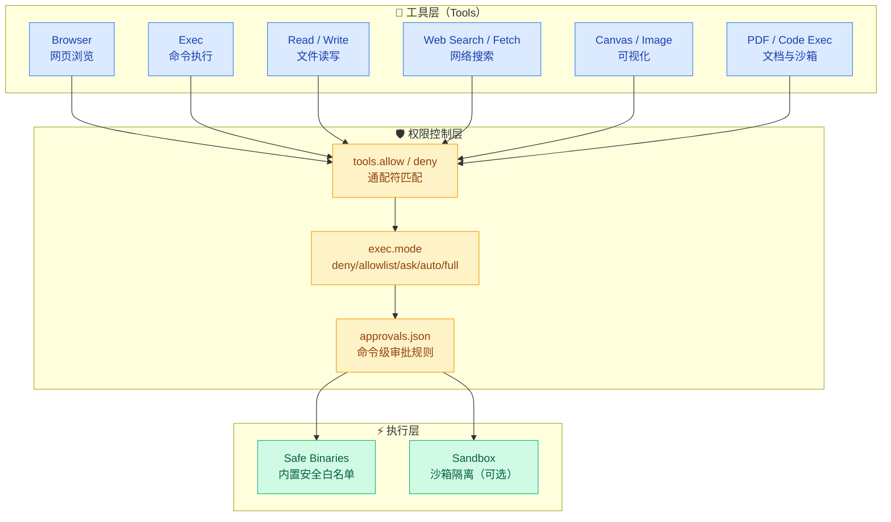

# 01 · 工具系统架构

> **学习要点**
> - OpenClaw 提供哪些内置工具？各自的功能和适用场景是什么？
> - 工具和插件在概念上有什么本质区别？插件如何扩展工具？
> - 工具策略如何通过 allow/deny 列表配置？通配符和优先级规则是什么？
> - Agent 工具调用从发起到执行经过哪些权限校验层？

---

## 1. 工具系统概述

模型负责"想"，工具负责"做"。如果没有工具，AI 只能在聊天框里回答；有了工具，它就可以查网页、读写文件、运行命令、生成图片。

### 工具系统架构



---

## 2. 内置工具一览

| 工具 | 功能 | 适合场景 |
|:----:|------|----------|
| **Browser** 🏆 | 打开网页、点击按钮、读取页面 | 登录后台、网页自动化 |
| **Web Search** | 搜索网页、抓取内容 | 查资料、读文档 |
| **Web Fetch** | 读取一个网页正文 | 已知 URL 的内容提取 |
| **Exec** | 在允许范围内运行命令 | 构建项目、跑测试 |
| **Code Execution** | 远程 Python 沙盒 | 分析计算、统计分析 |
| **Read** | 读取文件内容 | 查看源码、查阅文档 |
| **Write** | 写入文件内容 | 修改配置、创建文件 |
| **Edit** | 编辑已有文件 | 修改代码、更新内容 |
| **PDF** | 阅读 PDF 文件 | 合同、论文、说明书 |
| **Canvas** | 在节点上展示可视化界面 | 手机/桌面交互 |
| **Image Generate** | 生成图片 | 配图、草图、视觉素材 |
| **Loop Detection** | 发现无意义重复 | 防止 Agent 卡住 |
| **Goal** | 固定当前会话目标 | 长任务、PR 收尾 |

### 工具按来源分类

| 来源 | 说明 | 示例 |
|:----:|------|------|
| **内置工具** | Gateway 原生提供，始终可用 | Read, Write, Exec, Browser |
| **技能工具** | 由技能（Skill）提供 | 自定义脚本、专用工具 |
| **插件工具** | 由插件注册提供 | 第三方 API 集成、专业工具 |

---

## 3. 工具 vs 插件

| 维度 | 工具（Tool） | 插件（Plugin） |
|:----:|-------------|---------------|
| **定位** | 真正执行具体操作的功能单元 | 像"安装包"，提供新能力的载体 |
| **粒度** | 单一功能（读文件、执行命令） | 可包含多个工具、通道、命令 |
| **来源** | 内置或由插件注册 | 第三方或自研扩展包 |
| **示例** | `read`, `exec`, `browser` | Telegram 通道插件、自定义工具集 |

> 一个插件可以提供：新频道、新工具、新命令、新的配置页面或元数据。工具是插件的"功能单元"。

### 技能加载顺序

当一个工具被调用时，OpenClaw 按以下优先级查找：

```
1. 捆绑的（随安装包附带的系统工具）
2. 托管/本地：~/.openclaw/skills
3. 工作区：workspace/skills（名称冲突时优先）
```

---

## 4. 工具策略配置

### 工具 allow/deny 列表

```json5
{
  agents: {
    defaults: {
      tools: {
        allow: ["exec", "read", "write", "edit"],
        deny: ["browser", "nodes"],
      },
    },
  },
}
```

### 匹配规则

| 规则 | 说明 |
|:----:|------|
| **通配符 `*`** | `allow: ["*"]` 允许所有工具 |
| **deny 优先** | 同时匹配 allow 和 deny 时，deny 生效 |
| **大小写不敏感** | `Exec` 和 `exec` 视为相同 |
| **空 allow** | 空列表 = 所有工具被允许 |
| **空 deny** | 无拒绝项 = 仅 allow 列表中的可用 |

### 每 Agent 工具配置

可以为不同 Agent 设置独立的工具策略：

```json5
{
  agents: {
    list: [
      {
        id: "main",
        tools: {
          allow: ["exec", "read", "write", "edit", "browser"],
        },
      },
      {
        id: "family",
        tools: {
          allow: ["read", "sessions_list", "sessions_history"],
          deny: ["exec", "write", "edit", "apply_patch", "browser"],
        },
      },
    ],
  },
}
```

---

## 5. 扩展能力

除内置工具外，OpenClaw 还提供以下 Agent 扩展方式：

| 能力 | 说明 | 适用场景 |
|:----:|------|----------|
| **Skills** | 给 Agent 加一份专门说明书 | 特定领域的操作指南 |
| **子智能体 Subagents** | 把一个大任务拆给多个 Agent 并行处理 | 复杂任务分解 |
| **斜杠命令** | 用短命令触发固定动作 | 快速操作、常用功能 |
| **BTW 临时问题** | 问旁支问题，不污染主会话上下文 | 临时查询 |
| **Steer 引导** | Agent 正忙时轻轻纠偏 | 实时方向调整 |
| **ACP Agents** | 把外部编码 harness 接进 OpenClaw | 专业编码环境 |
| **ClawHub** | 搜索、安装、更新和发布技能/插件 | 生态扩展 |

---

## 6. 架构总览

```
┌─────────────────────────────────────────────────────────────────────────┐
│                          工具系统架构                                    │
│                                                                         │
│  ┌─────────────────────────────────────────────────────────────────┐   │
│  │                    工具层（Tools）                               │   │
│  │  ┌────────┐ ┌────────┐ ┌────────┐ ┌────────┐ ┌────────┐        │   │
│  │  │Browser │ │  Exec  │ │  Read  │ │ Write  │ │ Canvas │        │   │
│  │  └────────┘ └────────┘ └────────┘ └────────┘ └────────┘        │   │
│  │  ┌────────┐ ┌────────┐ ┌────────┐ ┌────────┐ ┌──────────┐     │   │
│  │  │  Web   │ │  PDF   │ │  Image │ │  Goal  │ │ Loop Det │     │   │
│  │  └────────┘ └────────┘ └────────┘ └────────┘ └──────────┘     │   │
│  └─────────────────────────────────────────────────────────────────┘   │
│                                    │                                    │
│                                    ▼                                    │
│  ┌─────────────────────────────────────────────────────────────────┐   │
│  │                      权限控制层                                   │   │
│  │  tools.allow / deny ─── 工具级黑白名单                           │   │
│  │  tools.exec.mode ────── deny │ allowlist │ ask │ auto │ full    │   │
│  │  approvals.json ─────── 命令级审批规则                            │   │
│  └─────────────────────────────────────────────────────────────────┘   │
│                                    │                                    │
│                                    ▼                                    │
│  ┌─────────────────────────────────────────────────────────────────┐   │
│  │                    安全 Binaries + 沙箱                         │   │
│  │  ls / cat / git status / grep / find / pwd / echo / which ...  │   │
│  └─────────────────────────────────────────────────────────────────┘   │
└─────────────────────────────────────────────────────────────────────────┘
```

---

> **相关模块**：[02 - 权限模式与审批](02-permission-approval.md) · [03 - 安全策略配置](03-safety-strategy.md) · [09 - 插件系统](../09-extensions/01-plugin-system.md) · [09 - 工作区配置](../09-extensions/05-workspace-config.md)
