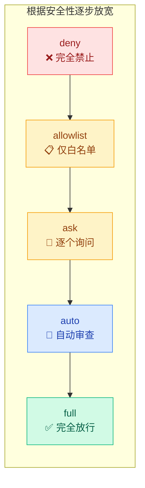
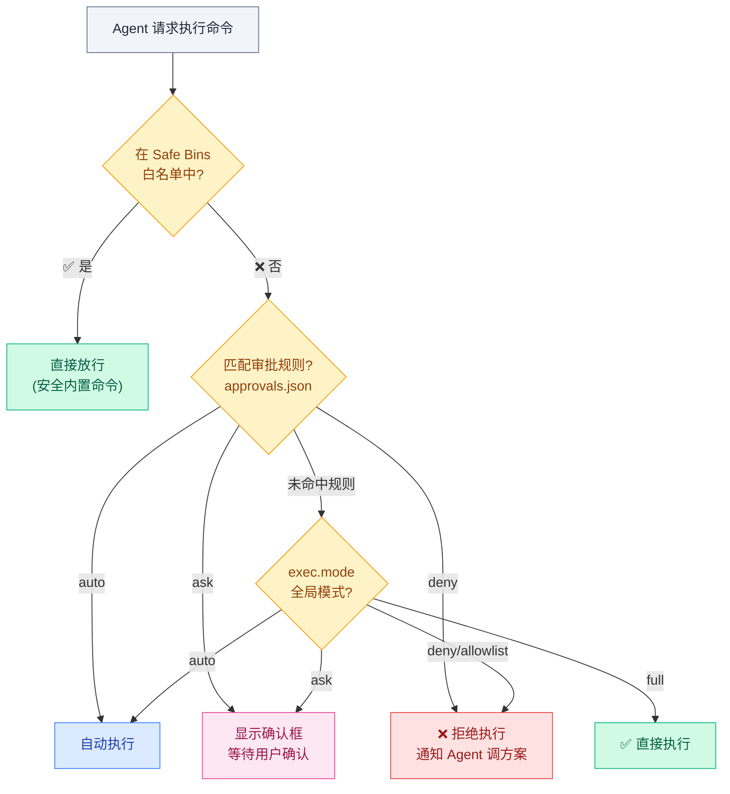

# 02 · 权限模式与审批

> **学习要点**
> - Host Exec 的五种权限模式（deny/allowlist/ask/auto/full）分别怎样工作？
> - 执行审批的完整流程是怎样的？Safe Bins、审批规则、权限模式如何协同？
> - 运行列表（Run List）和限制参数（argPattern）如何实现精细化控制？
> - OpenClaw 内置的安全 Binaries 包含哪些类别的命令？

---

## 1. 权限模式

权限模式决定 Agent 在运行主机命令、写文件或向后端请求更高权限时，需要经过什么审批。

### 五种模式



| 模式 | 行为 | 安全等级 | 适合场景 |
|:----:|------|:--------:|----------|
| **deny** | 完全禁止 host exec | 🔴 最高 | 不允许任何主机命令 |
| **allowlist** | 只运行 allowlist 中的命令 | 🟡 高 | 命令集合明确且固定 |
| **ask** | allowlist 直接运行，其他弹框询问 | 🟡 中 | 每个新命令都要人工确认 |
| **auto** 🏆 | allowlist 直接运行，其他自动审查 | 🟢 中 | 编码会话，实用且受控的访问 |
| **full** | 不提示，直接运行 | ⚪ 低 | 完全可信的主机和会话 |

### 推荐默认值

```bash
openclaw config set tools.exec.mode auto
openclaw approvals get
openclaw gateway restart
openclaw exec-policy show
```

> 建议从 `auto` 开始：先放行 allowlist 中确定安全的命令；没命中的走自动审查，必要时回退到人工审批。

---

## 2. 执行审批流程

一次完整的命令执行审批经过以下步骤：



### 审批规则存储

```
~/.openclaw/approvals.json
```

> 主机命令最终会取 OpenClaw 配置和本机 `approvals.json` 中**更严格**的结果。

---

## 3. 规则配置

### 策略类型

| 策略 | 说明 | 执行方式 |
|:----:|------|----------|
| **auto** | 命令自动执行，无需确认 | 静默放行 |
| **ask** | 每次执行前弹出确认框，由你决定 | 等待用户交互 |
| **deny** | 命令直接拒绝，Agent 收到通知并调整方案 | 返回拒绝 |

### 规则示例

```json5
{
  rules: [
    { pattern: "git *", policy: "auto" },
    { pattern: "npm install *", policy: "ask" },
    { pattern: "rm -rf *", policy: "deny" },
    { pattern: "sudo *", policy: "deny" },
  ],
}
```

### 运行列表（Run List）

运行列表是预批准的命令模式集合，匹配的命令自动执行：

```json5
{
  runList: [
    "git add *",
    "git commit *",
    "npm run build",
    "npm run test",
  ],
}
```

### 限制参数：argPattern

允许命令但限制参数范围：

```json5
{
  version: 1,
  agents: {
    main: {
      allowlist: [
        { pattern: "python3", argPattern: "^safe\\.py$" },
        { pattern: "cat", argPattern: "^/workspace/.*\\.(md\|txt)$" },
      ],
    },
  },
}
```

---

## 4. 安全 Binaries（Safe Bins）

OpenClaw 内置的安全命令白名单，这些命令**自动放行**，无需审批：

| 类别 | 命令 | 说明 |
|:----:|------|------|
| **文件查看** 🟦 | `ls`, `cat`, `head`, `tail`, `grep`, `find`, `wc`, `sort`, `uniq` | 读取文件内容 |
| **版本控制** 🟩 | `git status`, `git log`, `git diff`, `git branch` | 只读 git 操作 |
| **系统信息** 🟨 | `pwd`, `whoami`, `date`, `echo`, `env`, `which` | 环境查询 |
| **包管理** 🟧 | `npm list`, `pip list`, `pip show` | 只读包查询 |

> 不在白名单中的命令会进入审批流程（取决于 `approvals.json` 和 `exec.mode` 配置）。

---

## 5. 快速参考

| 命令 | 用途 |
|:----:|------|
| `openclaw config set tools.exec.mode auto` | 启用自动审批模式 |
| `openclaw approvals list` | 查看审批规则 |
| `openclaw approvals add "npm run *" --policy auto` | 添加自动批准规则 |
| `openclaw exec-policy show` | 查看最终生效策略 |
| `openclaw control` | 打开管理界面 |

---

> **相关模块**：[01 - 工具系统架构](01-tool-system.md) · [03 - 安全策略配置](03-safety-strategy.md) · [02 - 配置系统与热重载](../02-gateway-control/02-config-system.md)
