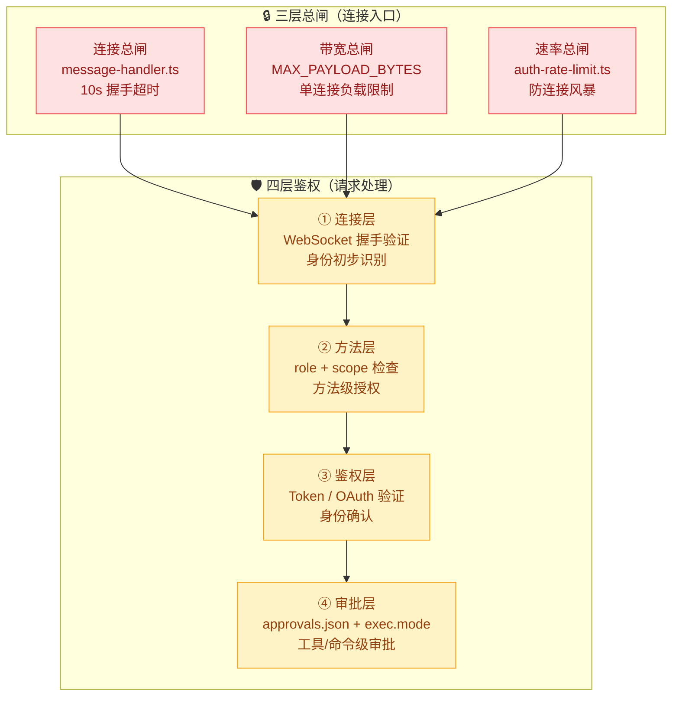
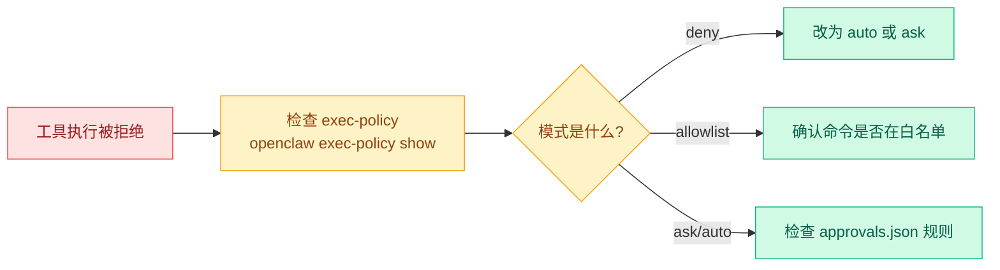

# 03 · 安全策略配置

> **学习要点**
> - OpenClaw 的 4 层鉴权架构分别检查什么？三层总闸和四层鉴权如何协同？
> - ACPX Harness 的权限模式有哪些？非交互式场景下如何处理权限弹窗？
> - 核心安全原则有哪些？危险命令如何配置？
> - 如何排查工具执行权限问题？

---

## 1. 安全架构总览

OpenClaw 的安全体系由**三层总闸**（请求入口）和**四层鉴权**（请求处理）构成：



### 4 层鉴权

| 层级 | 检查内容 | 通过条件 | 失败后果 |
|:----:|----------|----------|----------|
| **① 连接层** | WebSocket 握手挑战 | 10s 内完成握手 | 关闭连接 |
| **② 方法层** | role + scope 匹配 | 角色有权限 + 作用域匹配 | 返回权限错误 |
| **③ 鉴权层** | Token / OAuth 身份验证 | 身份合法且未过期 | 返回认证错误 |
| **④ 审批层** | 工具/命令执行审批 | 命中 auto 规则或用户批准 | 拒绝执行 |

---

## 2. ACPX Harness 权限

ACPX 会话通常是非交互式的（如 CI/CD 环境），不能点 TTY 权限弹窗，因此需要预先配置处理策略。

### 权限模式

| 参数 | 值 | 含义 | 适用场景 |
|------|----|------|----------|
| `permissionMode` | `approve-reads` 🏆 | 只自动批准读取操作 | 代码审查、静态分析 |
| `permissionMode` | `approve-all` | 自动批准写入和 shell 命令 | 完全信任的自动化环境 |
| `permissionMode` | `deny-all` | 拒绝所有权限请求 | 高安全环境 |
| `nonInteractivePermissions` | `fail` 🏆 | 遇到需要用户交互时直接失败 | 及早发现问题 |
| `nonInteractivePermissions` | `deny` | 拒绝提示并尽量继续执行 | 容忍部分失败 |

### 配置示例

```bash
openclaw config set plugins.entries.acpx.config.permissionMode approve-reads
openclaw config set plugins.entries.acpx.config.nonInteractivePermissions fail
openclaw gateway restart
```

> **重要**：ACPX 权限不会放宽 host exec 审批；host exec 审批也不会放宽 ACPX Harness 提示。两者独立检查。

---

## 3. 核心安全原则

| 原则 | 说明 | 建议 |
|:----:|------|------|
| **最小权限** | 不知道开关含义时，不要放大权限 | 从 `auto` 或 `deny` 开始 |
| **工具隔离** | 不熟悉的工具先不要开启大权限 | exec 类命令特别谨慎 |
| **审批先行** | 需要运行命令时，优先配置 `approvals.json` | 不要靠"每次都点允许" |
| **网络安全** | 远程网关不要暴露在公网裸奔 | 使用 TLS + Token 认证 + 反向代理 |
| **审计追踪** | 团队环境要记录谁触发了什么工具 | 启用详细日志 |

### 危险命令配置

```json5
{
  rules: [
    { pattern: "sudo *", policy: "deny" },          // 禁止提权
    { pattern: "rm -rf /", policy: "deny" },         // 禁止根目录删除
    { pattern: "chmod 777 *", policy: "deny" },      // 禁止全局写权限
    { pattern: ":(){ :\\|:& };:", policy: "deny" },  // 禁止 fork 炸弹
    { pattern: "dd if=/dev/zero of=/dev/sda", policy: "deny" }, // 禁止磁盘覆写
  ],
}
```

### 审批的安全影响

| 操作 | 影响 | 建议 |
|:----:|------|------|
| **"总是允许"** | 永久添加到运行列表，后续不再询问 | 仅对确定安全的命令使用 |
| **通配符范围** | 范围越广，风险越大 | 尽量精确匹配，如 `npm run build` 而非 `npm *` |
| **生产环境** | 所有命令都走 `ask` 策略 | 不使用 `auto` 或 `full` |

---

## 4. 排查工具问题

检查两层审批：

```bash
# 查看审批规则
openclaw approvals get

# 查看最终生效策略（取 OpenClaw 配置和 approvals.json 中更严格的）
openclaw exec-policy show

# 查看当前权限模式
openclaw config get tools.exec.mode
```

### 排查流程



---

> **相关模块**：[01 - 工具系统架构](01-tool-system.md) · [02 - 权限模式与审批](02-permission-approval.md) · [02 - WebSocket 协议层](../02-gateway-control/03-websocket-protocol.md) · [02 - 配置系统与热重载](../02-gateway-control/02-config-system.md)
