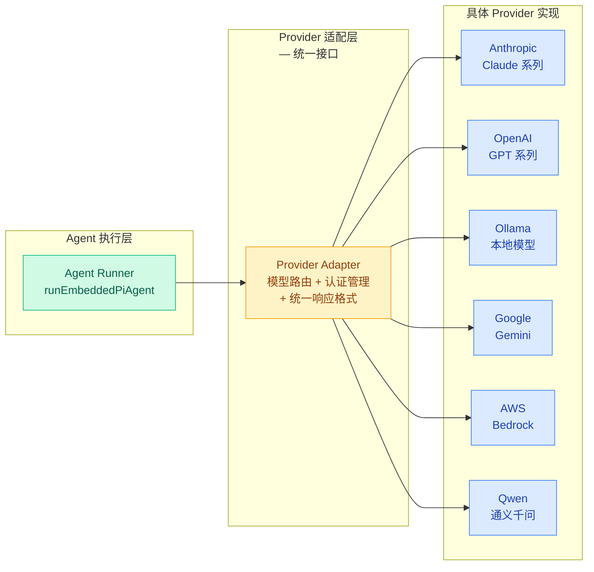
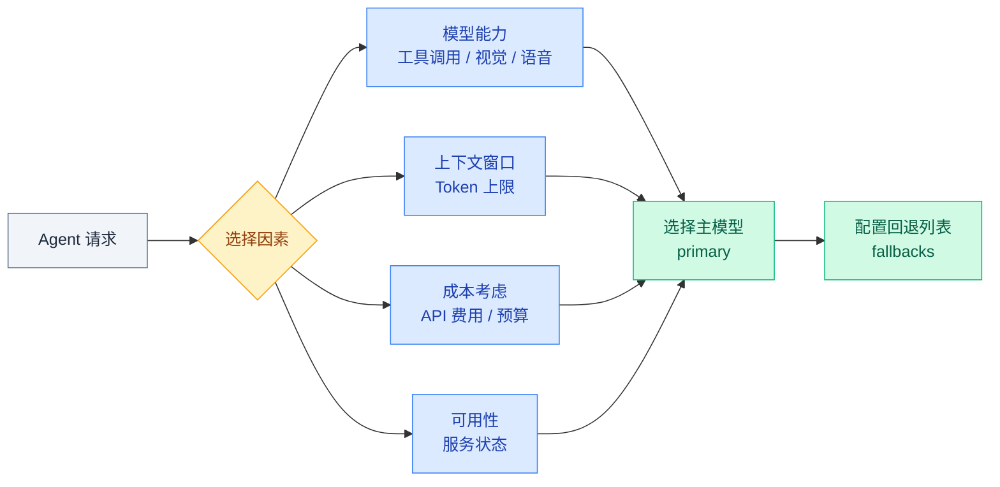

# 01 · Provider 适配层

> **学习要点**
> - Provider 适配层在架构中的定位是什么？Agent 调用和底层 Provider 如何解耦？
> - OpenClaw 支持哪些 Provider？各自的认证方式和特点是什么？
> - 模型选择流程考虑哪些因素？primary + fallbacks 的配置模式如何工作？
> - Provider 适配层的三层架构（调用层 → 适配层 → 实现层）如何协同？

---

## 1. Provider 层概述

AI Provider 层是 Gateway 的**模型中枢**，负责对接各种 LLM 提供商，提供统一的模型调用接口。



---

## 2. 支持 Provider 一览

| Provider | 认证方式 | 模型示例 | 特点 |
|----------|---------|----------|------|
| **Anthropic** 🏆 | API Key | Claude Sonnet 4.5 / Opus 4.6 | 原生最优支持，工具调用、思维链 |
| **OpenAI** | API Key | GPT-5.2 / GPT-4o / o3 | 广泛兼容，生态最丰富 |
| **Ollama** | 本地 HTTP | Llama 3 / Qwen / Mistral | 完全私有，无 API 费用 |
| **Google Gemini** | API Key | Gemini 2.0 Flash / Pro | 多模态原生支持 |
| **AWS Bedrock** | IAM | Claude 3 / Llama 3 | 企业级云服务 |
| **GitHub Copilot** | OAuth | GPT-4o / Claude | 企业授权场景 |
| **Qwen（通义）** | Portal OAuth | Qwen Max / Qwen Turbo | 中文优化 |
| **Moonshot（Kimi）** | API Key | kimi-latest | 长上下文（128K+）|
| **Together / HF** | API Key | 开源模型池 | 开源模型托管 |

---

## 3. 适配架构

Provider 适配层采用**三层架构**，上层（调用层）无需关心底层使用哪个 Provider：

```mermaid
flowchart TB
    subgraph 调用层["调用层 — Agent 视角"]
        direction TB
        C1["Agent Call<br/>model.generate(params)<br/>不知道底层是哪个 Provider"]:::call
    end

    subgraph 适配层["适配层 — 路由与适配"]
        direction TB
        A1["Provider Adapter<br/>统一调用接口"]:::adapter
        A2["Model Config<br/>模型路由表<br/>provider/model 映射"]:::adapter
        A3["Auth Manager<br/>认证信息管理<br/>API Key / OAuth 轮换"]:::adapter
    end

    subgraph 实现层["实现层 — 具体 Provider"]
        direction TB
        I1["Anthropic Adapter<br/>src/providers/anthropic.ts"]:::impl
        I2["OpenAI Adapter<br/>src/providers/openai.ts"]:::impl
        I3["Ollama Adapter<br/>src/providers/ollama.ts"]:::impl
        I4["Others<br/>Gemini / Bedrock / ..."]:::impl
    end

    C1 --> A1
    A1 --> A2 --> A3
    A2 --> I1 & I2 & I3 & I4

    classDef call fill:#d1fae5,stroke:#10b981,color:#065f46
    classDef adapter fill:#fef3c7,stroke:#f59e0b,color:#92400e
    classDef impl fill:#dbeafe,stroke:#3b82f6,color:#1e40af
```

### 模型命名规范

OpenClaw 使用 `provider/model` 格式唯一标识一个模型：

```json5
{
  agents: {
    defaults: {
      model: {
        primary: "anthropic/claude-sonnet-4-5",   // 主模型
        fallbacks: ["openai/gpt-5.2"],             // 回退模型
      },
    },
  },
}
```

| 命名示例 | 对应的 Provider | 模型 |
|----------|:---------------:|------|
| `anthropic/claude-sonnet-4-5` | Anthropic | Claude Sonnet 4.5 |
| `openai/gpt-5.2` | OpenAI | GPT 5.2 |
| `ollama/llama3` | Ollama | Llama 3（本地）|
| `gemini/gemini-2.0-flash` | Google | Gemini 2.0 Flash |

---

## 4. 模型选择流程

当 Agent 发起模型调用时，按以下流程选择模型：



| 选择因素 | 说明 | 影响 |
|:--------:|------|------|
| **模型能力** | 是否需要工具调用、视觉识别、语音处理 | 决定可选模型范围 |
| **上下文窗口** | 模型支持的最大 Token 数（4K / 8K / 32K / 100K / 200K）| 决定能处理多长的对话 |
| **成本考虑** | API 调用费用，不同模型价格差异大 | 影响日常运行成本 |
| **可用性** | 模型服务是否在线、有无速率限制 | 影响可靠性 |

---

## 5. 模型配置示例

```json5
{
  agents: {
    defaults: {
      model: {
        primary: "anthropic/claude-sonnet-4-5",
        fallbacks: ["openai/gpt-5.2"],
      },
      // 模型别名（可选）
      models: {
        "anthropic/claude-sonnet-4-5": { alias: "Sonnet" },
        "openai/gpt-5.2": { alias: "GPT" },
      },
    },
  },
}
```

### CLI 快速查看

```bash
# 列出可用模型
openclaw models list

# 查看当前配置
openclaw config get agents.defaults.model
```

---

## 6. 关键源码文件

| 文件 | 作用 |
|------|------|
| `src/providers/` | 各 Provider 适配实现 |
| `src/providers/anthropic.ts` | Anthropic（Claude）的适配实现 |
| `src/providers/openai.ts` | OpenAI（GPT）的适配实现 |
| `src/providers/ollama.ts` | Ollama 本地模型的适配实现 |
| `src/agents/model-fallback.ts` | 模型回退逻辑（主模型失败 → fallback）|

---

> **相关模块**：[02 - 模型故障转移](02-model-failover.md) · [03 - 认证管理](03-auth-cooldown.md) · [02 - 配置系统与热重载](../02-gateway-control/02-config-system.md) · [03 - 执行引擎](../03-execution-engine/01-agent-loop-workflow.md)
