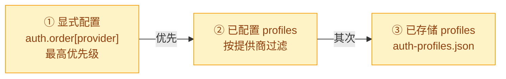
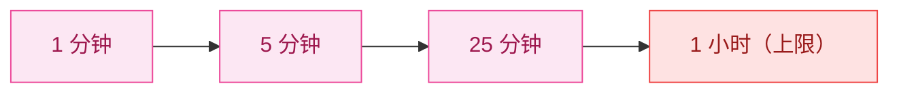

# 02 · 模型故障转移

> **学习要点**
> - 模型故障转移的两阶段处理分别做什么？失败后如何逐级降级？
> - Profile 轮换的优先顺序是什么？冷却（Cooldown）的指数退避如何工作？
> - 账单禁用（Billing Disable）的退避策略和普通冷却有什么不同？
> - Fallback 模型切换的适用场景和不适用场景分别是什么？

---

## 1. 两阶段故障处理

模型故障转移是 OpenClaw 的**韧性保障**，确保单模型失败不会导致整个系统不可用。

```mermaid
flowchart LR
    subgraph 阶段一["阶段一：主模型 Profile 轮换"]
        direction LR
        REQ["Agent 请求"]:::start
        P1["Profile 1<br/>anthropic:default"]:::profile
        P1A["Profile 2<br/>anthropic:backup"]:::profile
        P1B["Profile 3<br/>anthropic:secondary"]:::profile
    end

    subgraph 阶段二["阶段二：Fallback 模型切换"]
        direction LR
        FB1["Fallback 1<br/>openai/gpt-5.2"]:::fallback
        FB2["Fallback 2<br/>gemini/gemini-2.0"]:::fallback
        FAIL["All failed<br/>返回错误"]:::fail
    end

    REQ --> P1
    P1 -->|"认证/限流失败"| P1A
    P1A -->|"认证/限流失败"| P1B
    P1B -->|"全部 Profile 失败"| FB1
    FB1 -->|"失败"| FB2
    FB2 -->|"失败"| FAIL

    classDef start fill:#f1f5f9,stroke:#64748b,color:#1e293b
    classDef profile fill:#dbeafe,stroke:#3b82f6,color:#1e40af
    classDef fallback fill:#fef3c7,stroke:#f59e0b,color:#92400e
    classDef fail fill:#fee2e2,stroke:#ef4444,color:#991b1b
```



| 阶段 | 处理内容 | 失败处理 |
|:----:|----------|----------|
| **阶段一** | 主模型内的 Profile 轮换（如多个 API Key）| Profile 1 → Profile 2 → Profile 3 |
| **阶段二** | 跨模型 Fallback 切换 | fallback 1 → fallback 2 → 所有失败 |

---

## 2. Profile 轮换顺序

当主模型配置了多个认证 Profile 时，按以下优先级轮换：



### 凭证类型

```json5
// API Key 类型
{ type: "api_key", provider: "anthropic", key: "sk-ant-..." }

// OAuth 类型
{ type: "oauth", provider: "google-antigravity", access: "...", refresh: "...", expires: 123, email: "user@gmail.com" }
```

### Profile ID 格式

| 类型 | 格式 | 示例 |
|:----:|------|------|
| **默认** | `provider:default` | `anthropic:default` |
| **OAuth** | `provider:{email}` | `google-antigravity:user@gmail.com` |

---

## 3. 冷却机制（Cooldown）

当 Profile 由于认证/速率限制错误失败时，OpenClaw 将其标记为**冷却**并移到下一个 Profile：



### 冷却状态存储

```json5
{
  usageStats: {
    "anthropic:default": {
      lastUsed: 1736160000000,
      cooldownUntil: 1736160600000,  // 冷却到期时间
      errorCount: 2,                  // 连续错误次数
    },
  },
}
```

---

## 4. 账单禁用（Billing Disable）

当遇到 "insufficient credits" 等账单/额度失败时，使用**更长退避**，不适用短冷却：


| 字段 | 默认值 |
|------|--------|
| 账单退避起点 | 5 小时 |
| 翻倍 | 每次账单失败翻倍 |
| 上限 | 24 小时 |
| 计数器重置 | 24 小时未失败 |

---

## 5. 模型回退（Model Fallback）

如果提供商的所有 Profile 都失败，OpenClaw 移到 `agents.defaults.model.fallbacks` 中的下一个模型。

| ✅ 适用场景 | ❌ 不适用场景 |
|------------|-------------|
| 认证失败（所有 Profile 均失败）| 非认证类错误 |
| 速率限制（所有 Profile 均触发）| |
| 耗尽 Profile 轮换后的超时 | |

> 当运行以模型覆盖（钩子或 CLI）启动时，回退在尝试所有 fallback 后，最终回退到 `agents.defaults.model.primary`。

### 配置

```json5
{
  agents: {
    defaults: {
      model: {
        primary: "anthropic/claude-sonnet-4-5",   // 主模型
        fallbacks: ["openai/gpt-5.2"],              // 回退列表
      },
    },
  },
}
```

### 完整配置示例

```json5
{
  auth: {
    profiles: { "...": "..." },
    order: { anthropic: ["anthropic:default"] },
    cooldowns: {
      billingBackoffHours: 5,
      billingMaxHours: 24,
      failureWindowHours: 24,
    },
  },
  agents: {
    defaults: {
      model: {
        primary: "anthropic/claude-sonnet-4-5",
        fallbacks: ["openai/gpt-5.2"],
      },
    },
  },
}
```

---

> **相关模块**：[01 - Provider 适配层](01-provider-adapters.md) · [03 - 认证管理](03-auth-cooldown.md) · [02 - 配置系统与热重载](../02-gateway-control/02-config-system.md)
