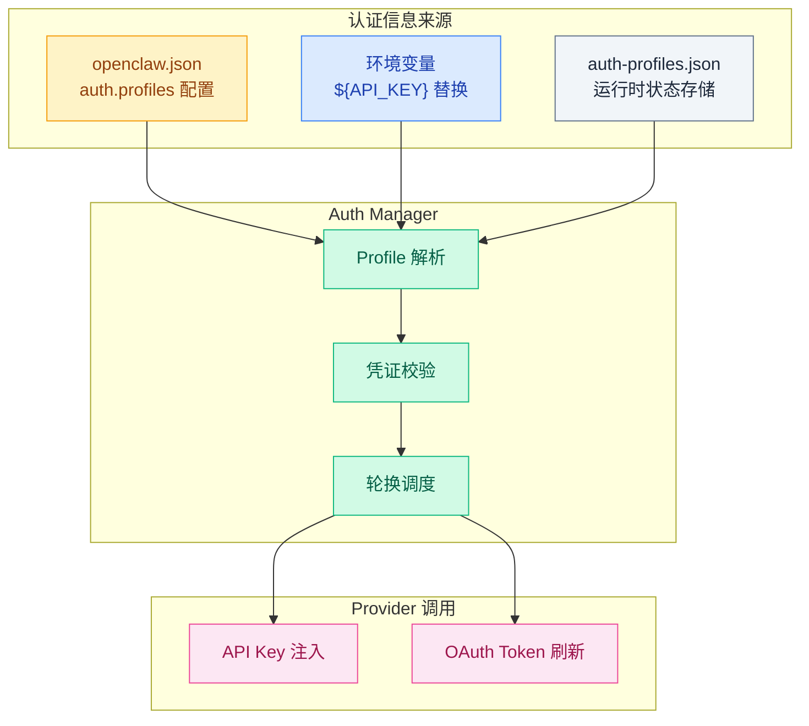
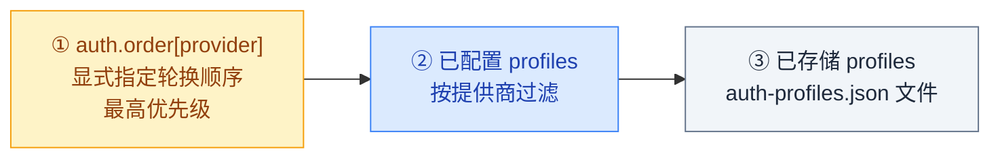

# 03 · 认证管理

> **学习要点**
> - OpenClaw 的认证凭证存在哪里？支持哪两种凭证类型？
> - Profile 轮换的优先级顺序是怎样的？
> - 如何通过环境变量注入 API Key？配置热重载如何影响认证变更？

---

## 1. 认证体系

OpenClaw 的认证管理负责所有 Provider 的 API Key、OAuth Token 等凭证的存储、轮换和故障恢复。



---

## 2. 凭证存储

### 存储路径

| 类型 | 路径 | 说明 |
|:----:|------|------|
| **主配置** | `~/.openclaw/openclaw.json` | `auth.profiles` 和 `auth.order` 配置（不含密钥明文） |
| **凭据文件** | `~/.openclaw/agents/{agentId}/agent/auth-profiles.json` | 实际凭证存储，含密钥 |
| **旧版兼容** | `~/.openclaw/agent/auth-profiles.json` | 旧版本使用的路径 |

### 凭证类型

```json5
// API Key 类型
{
  type: "api_key",
  provider: "anthropic",
  key: "sk-ant-...",
}

// OAuth 类型
{
  type: "oauth",
  provider: "google-antigravity",
  access: "ya29...",
  refresh: "1//...",
  expires: 1736160000000,
  email: "user@gmail.com",
}
```

| 类型 | 适用 Provider | 自动刷新 |
|:----:|--------------|:--------:|
| **api_key** | Anthropic, OpenAI, Ollama, Gemini | ❌ 需手动更新 |
| **oauth** | GitHub Copilot, Google, Azure | ✅ 自动刷新 Token |

---

## 3. Profile 轮换顺序

当 Provider 配置了多个认证 Profile 时，按以下优先级依次尝试：



### Profile ID 格式

| 类型 | 格式 | 示例 |
|:----:|------|------|
| **默认** | `{provider}:default` | `anthropic:default` |
| **OAuth** | `{provider}:{email}` | `google-antigravity:user@gmail.com` |

---

## 4. 环境变量注入

推荐将敏感凭证通过环境变量注入，避免明文存储在配置文件中：

```json5
{
  models: {
    providers: {
      anthropic: { apiKey: "${ANTHROPIC_API_KEY}" },
      openai: { apiKey: "${OPENAI_API_KEY}" },
    },
  },
}
```

```bash
# .env 文件（自动加载）
ANTHROPIC_API_KEY=sk-ant-...
OPENAI_API_KEY=sk-proj-...
GEMINI_API_KEY=AIza...
```

### 替换规则

| 语法 | 行为 |
|:----:|------|
| `${VAR}` | 替换为环境变量值，未设置时报错 |
| `${VAR:-default}` | 未设置时使用默认值 |
| `$${VAR}` | 转义为字面量 `$VAR` |

---

## 5. 认证与配置热重载

认证配置变更通过 Gateway 的热重载机制动态生效：

| 变更类型 | 是否热生效 | 说明 |
|----------|:----------:|------|
| 新增 API Key | ✅ 是 | 新 Profile 立即可用 |
| 修改 auth.order | ✅ 是 | 轮换顺序即时调整 |
| OAuth Token 自动刷新 | ✅ 是 | 后台静默更新 |
| 新增 Provider | ❌ 需要重启 | Provider 适配器需重新加载 |

---

## 6. 关键源码文件

| 文件 | 作用 |
|------|------|
| `src/gateway/auth.ts` | 连接认证 Token 验证 |
| `src/gateway/auth-rate-limit.ts` | 认证速率限制 |
| `src/gateway/auth-mode-policy.ts` | 鉴权策略决议 |
| `src/gateway/auth-surface-resolution.ts` | 鉴权作用域解析 |
| `src/agents/model-fallback.ts` | 认证失败后的回退逻辑 |

---

> **相关模块**：[01 - Provider 适配层](01-provider-adapters.md) · [02 - 模型故障转移](02-model-failover.md) · [02 - 配置系统与热重载](../02-gateway-control/02-config-system.md) · [02 - WebSocket 协议层](../02-gateway-control/03-websocket-protocol.md)
