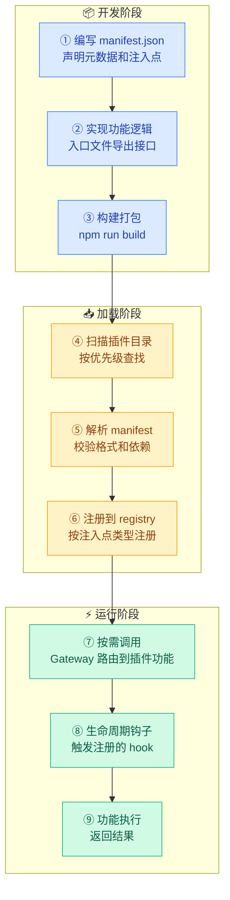
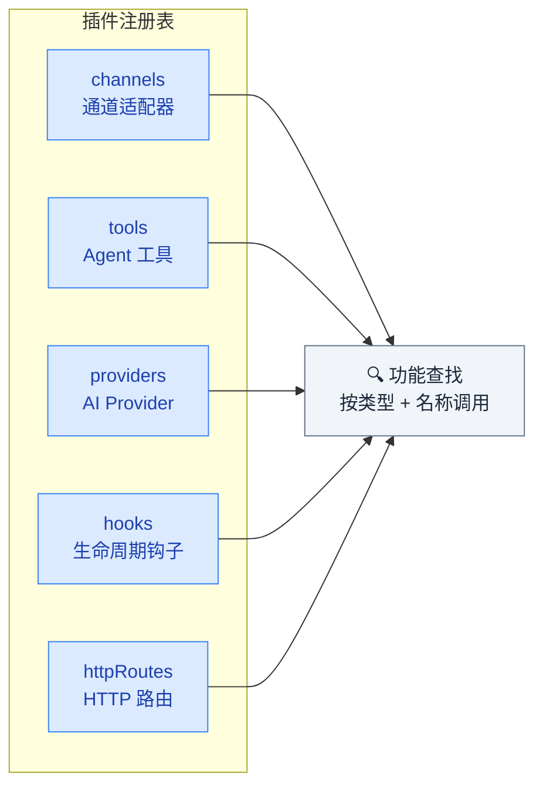

# 01 · 插件系统

> **学习要点**
> - 插件系统的四层架构（manifest → 规划 → 注册 → 查找）分别做什么？
> - 插件支持哪五种注入点？各自的用途是什么？
> - 插件的完整生命周期（开发 → 加载 → 运行时）是怎样的？
> - 如何获取和安装插件？插件目录的扫描顺序是怎样的？

---

## 1. 插件系统概述

插件是 OpenClaw 的**扩展骨架**，通过四层架构实现功能扩展。一个插件可以同时提供新通道、新工具、新 Provider、新钩子和新 HTTP 路由。


| 层 | 名称 | 职责 |
|:--:|------|------|
| **①** | **manifest** | 插件元数据声明：名称、版本、入口、注入点、依赖 |
| **②** | **规划** | 插件启用决策、依赖解析、加载顺序规划 |
| **③** | **运行时注册** | 将插件功能注册到系统注册表 |
| **④** | **registry** | 运行时按类型（channel/tool/hook 等）查找已注册的功能 |

---

## 2. 五种注入点

插件通过声明 `injects` 字段指定要扩展的能力类型：

| 注入点 | 扩展什么 | 示例 |
|:------:|----------|------|
| **channel** | 新消息通道 | Telegram、Discord、Slack 适配器 |
| **tool** | 新 Agent 工具 | 自定义脚本执行器、API 集成工具 |
| **provider** | 新 AI Provider | Ollama、Azure OpenAI、自定义模型 |
| **hook** | 生命周期钩子 | message_received、gateway_stop |
| **http-route** | 新 HTTP 路由 | Webhook 接收、自定义 API 端点 |

---

## 3. 插件生命周期



### 获取插件的方式

| 方式 | 说明 | 命令 |
|:----:|------|------|
| **ClawHub** | 官方插件市场 | `openclaw plugins install <name>` |
| **本地安装** | 从本地目录加载 | 放在 `~/.openclaw/plugins/` 下 |
| **工作区安装** | 工作区专用插件 | 放在 `workspace/plugins/` 下 |

---

## 4. manifest 元数据

```json5
{
  name: "my-plugin",           // 插件唯一标识
  version: "1.0.0",            // 语义化版本
  description: "自定义工具插件", // 描述
  entry: "./dist/index.js",    // 入口文件
  injects: ["channel", "tool"], // 注入点类型
  dependencies: {
    // 依赖的其他插件
    "base-plugin": "^1.0.0",
  },
}
```

| 字段 | 是否必需 | 说明 |
|:----:|:--------:|------|
| `name` | ✅ | 插件唯一标识，全局唯一 |
| `version` | ✅ | 语义化版本号 |
| `description` | ❌ | 插件描述 |
| `entry` | ✅ | 入口 JS 文件路径 |
| `injects` | ✅ | 注入点类型数组 |
| `dependencies` | ❌ | 依赖的其他插件（版本范围）|

---

## 5. 核心注册表（Registry）

所有已加载的插件功能按类型注册到 Registry，运行时按名查找：



### 关键源码文件

| 文件 | 作用 |
|------|------|
| `src/plugins/registry.ts` | 注册表管理：注册、注销、查找 |
| `src/plugins/loader.ts` | 插件加载器：目录扫描、manifest 解析、依赖解析 |
| `src/plugins/manifest.ts` | manifest 格式校验、版本比对 |
| `src/plugins/index.ts` | 插件系统入口：初始化、关闭清理 |

---

> **相关模块**：[02 - 钩子系统](02-hooks-system.md) · [03 - 多智能体路由](03-multi-agent-routing.md) · [07 - 工具系统架构](../07-tools-safety/01-tool-system.md)
