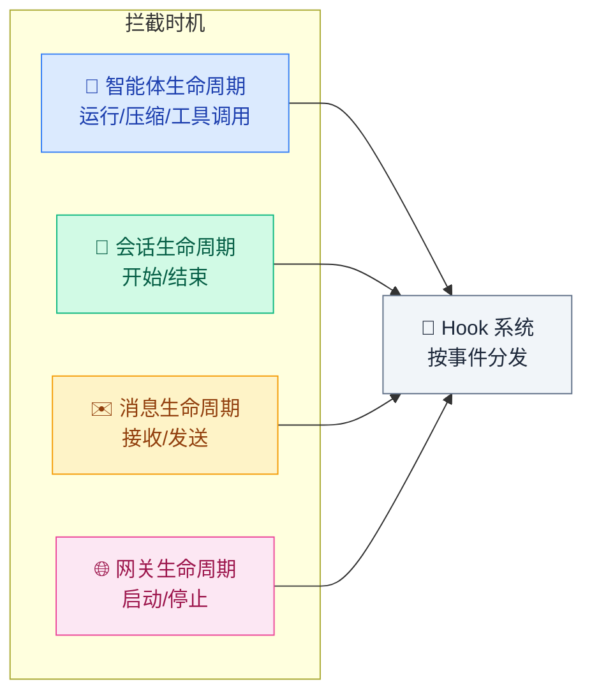
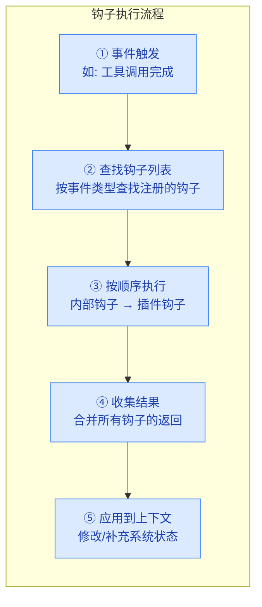

# 02 · 钩子系统

> **学习要点**
> - 钩子系统的四大生命周期分别是什么？它们在 Agent 执行时序中何时触发？
> - 内部钩子（网关钩子）和插件钩子有什么区别？
> - 钩子执行流程（触发 → 查找 → 执行 → 收集 → 应用）是怎样的？

---

## 1. 钩子系统概述

钩子是 OpenClaw 的**生命周期拦截点**，允许在关键节点注入自定义逻辑，而无需修改核心代码。



---

## 2. 四大生命周期钩子

```mermaid
flowchart TB
    subgraph AGENT["🤖 智能体生命周期"]
        direction TB
        AG1["before_agent_start<br/>运行前注入上下文"]:::agent
        AG2["agent_end<br/>完成后检查"]:::agent
        AG3["before_compaction<br/>压缩前观察"]:::agent
        AG4["after_compaction<br/>压缩后验证"]:::agent
        AG5["before_tool_call<br/>工具调用前拦截"]:::agent
        AG6["after_tool_call<br/>工具调用后处理"]:::agent
        AG7["tool_result_persist<br/>结果持久化"]:::agent
    end

    subgraph SESSION["💬 会话生命周期"]
        direction TB
        S1["session_start<br/>会话开始"]:::session
        S2["session_end<br/>会话结束"]:::session
    end

    subgraph MSG["✉️ 消息生命周期"]
        direction TB
        M1["message_received<br/>消息接收"]:::msg
        M2["message_sending<br/>消息发送前"]:::msg
        M3["message_sent<br/>消息已发送"]:::msg
    end

    subgraph GW["🌐 网关生命周期"]
        direction TB
        G1["gateway_start<br/>网关启动"]:::gw
        G2["gateway_stop<br/>网关停止"]:::gw
    end

    classDef agent fill:#dbeafe,stroke:#3b82f6,color:#1e40af
    classDef session fill:#d1fae5,stroke:#10b981,color:#065f46
    classDef msg fill:#fef3c7,stroke:#f59e0b,color:#92400e
    classDef gw fill:#fce7f3,stroke:#ec4899,color:#9d174d
```



---

## 3. 钩子类型汇总

| 类别 | 钩子 | 触发时机 | 典型用途 |
|:----:|------|----------|----------|
| **智能体** | `before_agent_start` | 运行开始前 | 注入上下文或覆盖系统提示词 |
| **智能体** | `agent_end` | 运行完成后 | 检查最终消息列表和运行元数据 |
| **智能体** | `before_compaction` | 压缩周期前 | 观察或注解上下文状态 |
| **智能体** | `after_compaction` | 压缩周期后 | 验证压缩结果 |
| **智能体** | `before_tool_call` | 工具调用前 | 拦截工具参数、审批检查 |
| **智能体** | `after_tool_call` | 工具调用后 | 拦截工具结果、后处理 |
| **智能体** | `tool_result_persist` | 结果写入前 | 同步转换工具结果格式 |
| **消息** | `message_received` | 消息接收时 | 入站消息处理 |
| **消息** | `message_sending` | 消息发送前 | 出站消息修改 |
| **消息** | `message_sent` | 消息已发送 | 日志记录、通知 |
| **会话** | `session_start` | 会话开始 | 初始化 |
| **会话** | `session_end` | 会话结束 | 清理 |
| **网关** | `gateway_start` | 网关启动 | 启动任务 |
| **网关** | `gateway_stop` | 网关停止 | 优雅关闭 |

---

## 4. 内部钩子 vs 插件钩子

钩子有两种注册方式，拦截相同的事件点但注册来源不同：

| 维度 | 内部钩子（网关钩子） | 插件钩子 |
|:----:|---------------------|----------|
| **注册方式** | 通过 `openclaw.json` 的 `hooks` 配置 | 通过插件 manifest 的 `injects` 声明 |
| **优先级** | 先执行 | 后执行 |
| **生命周期** | 与 Gateway 配置共存 | 插件加载时注册，卸载时移除 |

### 内部钩子示例

| 钩子 | 触发时机 |
|------|----------|
| `agent:bootstrap` | 系统提示词最终确定之前，构建引导文件时 |
| 命令钩子 | `/new`、`/reset`、`/stop` 等命令事件 |

### 插件钩子示例

| 钩子 | 触发时机 |
|------|----------|
| `before_agent_start` | 运行开始前注入上下文或覆盖系统提示词 |
| `before_tool_call` | 拦截工具参数 |
| `message_received` | 入站消息钩子 |
| `gateway_start` | 网关启动时启动任务 |

---

## 5. 钩子执行流程

当一个事件触发时，钩子系统按以下流程执行：



### 配置示例

```json5
{
  hooks: {
    // 运行前注入工作区上下文
    before_agent_start: [
      { type: "inject_context", path: "./AGENTS.md" },
    ],
    // 工具调用前做审批检查
    before_tool_call: [
      { type: "approval_check", mode: "auto" },
    ],
  },
}
```

---

## 6. 关键源码文件

| 文件 | 作用 |
|------|------|
| `src/agents/hooks.ts` | 钩子系统核心：事件分发、执行调度 |
| `src/agents/pi-embedded-runner/hooks/` | Agent 生命周期钩子实现 |
| `src/gateway/hooks/` | 网关生命周期钩子实现 |

---

> **相关模块**：[01 - 插件系统](01-plugin-system.md) · [03 - 多智能体路由](03-multi-agent-routing.md) · [03 - 执行引擎](../03-execution-engine/01-agent-loop-workflow.md)
