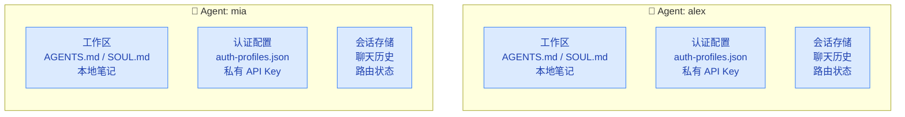
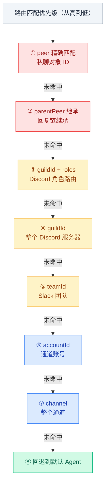

# 03 · 多智能体路由

> **学习要点**
> - 什么是"一个 Agent"？它在系统中拥有哪些独立的资源？
> - 路由规则如何按"最具体优先"原则决定消息去哪个 Agent？
> - 如何配置多 Agent 场景？binding 的匹配维度有哪些？
> - 每 Agent 如何独立配置沙箱和工具策略？

---

## 1. 什么是"一个 Agent"

一个 Agent 是完全作用域化的大脑，拥有自己独立的资源：



### 单智能体模式（默认）

```
agentId: main
会话键: agent:main:
工作区: ~/.openclaw/workspace
```

### 多智能体 = 多人格、多身份

```
agent:alex  → 工作区 + 认证 + 会话 完全隔离
agent:mia   → 工作区 + 认证 + 会话 完全隔离
```

---

## 2. 路由规则

绑定是**确定性的**且**最具体的优先**，逐级降级到兜底 Agent：



---

## 3. 配置示例

### 两个 WhatsApp → 两个 Agent

```json5
{
  agents: {
    list: [
      { id: "home", default: true, name: "Home", workspace: "~/.openclaw/workspace-home" },
      { id: "work", name: "Work", workspace: "~/.openclaw/workspace-work" },
    ],
  },
  bindings: [
    { agentId: "home", match: { channel: "whatsapp", accountId: "personal" } },
    { agentId: "work", match: { channel: "whatsapp", accountId: "biz" } },
  ],
}
```

### WhatsApp 日常聊天 + Telegram 深度工作

```json5
{
  agents: {
    list: [
      { id: "chat", name: "Everyday", workspace: "~/.openclaw/workspace-chat" },
      { id: "opus", name: "Deep Work", workspace: "~/.openclaw/workspace-opus" },
    ],
  },
  bindings: [
    { agentId: "chat", match: { channel: "whatsapp" } },
    { agentId: "opus", match: { channel: "telegram" } },
  ],
}
```

### 同一通道，一个 DM 到 Opus

```json5
{
  bindings: [
    // peer 精确匹配优先于通道匹配
    { agentId: "opus", match: { channel: "whatsapp", peer: { kind: "direct", id: "+15551234567" } } },
    { agentId: "chat", match: { channel: "whatsapp" } },
  ],
}
```

### 家庭群组 Bot

```json5
{
  agents: {
    list: [{
      id: "family",
      identity: { name: "Family Bot" },
      groupChat: { mentionPatterns: ["@family", "@familybot"] },
      sandbox: { mode: "all", scope: "agent" },
      tools: {
        allow: ["read", "sessions_list", "sessions_history", "sessions_send", "session_status"],
        deny: ["exec", "write", "edit", "browser", "nodes", "cron"],
      },
    }],
  },
  bindings: [
    { agentId: "family", match: { channel: "whatsapp", peer: { kind: "group", id: "1203639999@g.us" } } },
  ],
}
```

---

## 4. 每 Agent 沙箱和工具配置

可以为每个 Agent 独立配置沙箱模式和工具策略：

```json5
{
  agents: {
    list: [
      {
        id: "personal",
        sandbox: { mode: "off" },                // 个人 Agent 不使用沙箱
      },
      {
        id: "family",
        sandbox: { mode: "all", scope: "agent" }, // 家庭 Bot 全部沙箱化
        tools: {
          allow: ["read"],
          deny: ["exec", "write", "edit", "apply_patch", "browser"],
        },
      },
    ],
  },
}
```

---

> **相关模块**：[04 - 并行专家通道](04-parallel-lanes.md) · [05 - Agent Workspace 配置](05-workspace-config.md) · [04 - 路由层与 Session Key](../04-routing-session/01-routing-engine.md) · [02 - 配置系统与热重载](../02-gateway-control/02-config-system.md)
