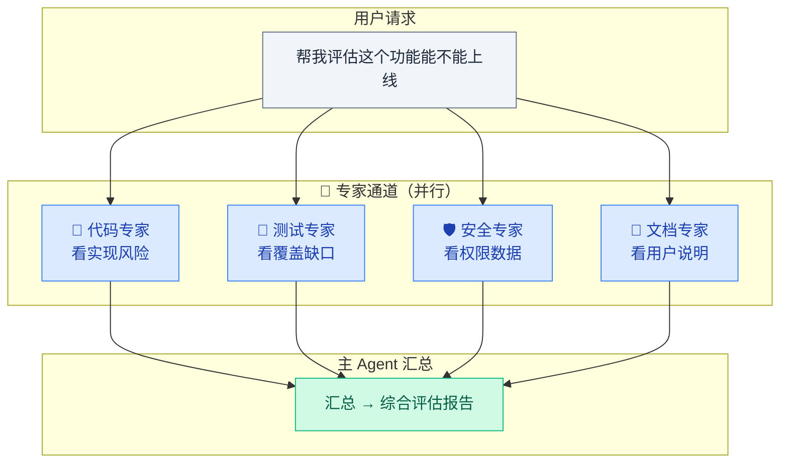
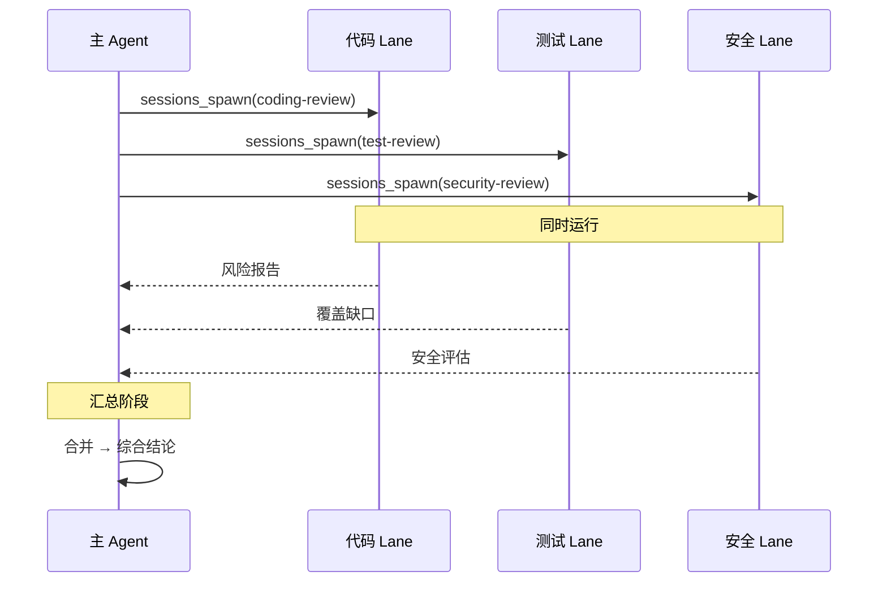

# 04 · 并行专家通道

> **学习要点**
> - 并行专家通道（Parallel Specialist Lanes）的设计思想是什么？和普通子智能体有什么本质区别？
> - 如何通过 sessions_spawn 实现并行架构？各 Lanes 如何独立执行再合并？
> - 并行架构的潜在风险有哪些？什么场景适合/不适合使用？

---

## 1. 设计思想

Parallel Specialist Lanes 是一种进阶 Agent 架构思路：**把一个复杂问题拆给多个"专家通道"并行处理，再由主 Agent 合并结果。**

> 核心思想：不是"开很多 Agent"，而是**每个 lane 有清楚的职责划分**。并行不是为了热闹，而是为了让不同角度同时推进。

---

## 2. 和普通子智能体的关系

| 维度 | 普通子智能体（Subagent） | 并行专家通道（Parallel Lanes） |
|:----:|------------------------|-------------------------------|
| **目标** | 把一个任务拆成顺序步骤 | 从不同角度同时分析同一问题 |
| **执行方式** | 顺序或按需派生 | **同时运行** |
| **职责** | 完成分配的子任务 | 提供专业视角的分析 |
| **汇总** | 逐步拼接 | **多路合并** |
| **实现** | 同 `sessions_spawn` | 同 `sessions_spawn` + 汇总阶段 |

> 并行专家通道建立在 subagents 的 `sessions_spawn` 机制之上，区别在于**执行时序**和**合并策略**。

---

## 3. 实现示意

通过 `sessions_spawn` 实现并行执行：

---

## 4. 风险与注意事项

| 风险 | 说明 | 缓解措施 |
|:----:|------|----------|
| **💰 成本更高** | 多个并行调用 = 多倍 Token 消耗 | 控制 lanes 数量（建议 3~5 个）|
| **🧩 上下文复杂** | 合并多个结果需要判断冲突 | 给主 Agent 明确的合并指令 |
| **🎯 分工不清** | lanes 之间功能重叠 → 重复劳动 | 每个 lane 定义清晰的职责边界 |
| **⏱ 等待时间** | 最慢的 lane 决定总耗时 | 设置合理的 `runTimeoutSeconds` |

### 适合 vs 不适合

| 适合场景 | 不适合场景 |
|----------|-----------|
| 需要多角度评估的问题 | 简单的单步问答 |
| 复杂决策需要多专业视角 | 可顺序完成的任务 |
| 风险分析、方案评审 | 实时聊天、快速回复 |
| 长时间运行的批处理 | 对成本敏感的场景 |

---

> **相关模块**：[03 - 多智能体路由](03-multi-agent-routing.md) · [05 - Agent Workspace 配置](05-workspace-config.md) · [03 - 会话工具与子智能体](../04-routing-session/03-session-tools.md)
