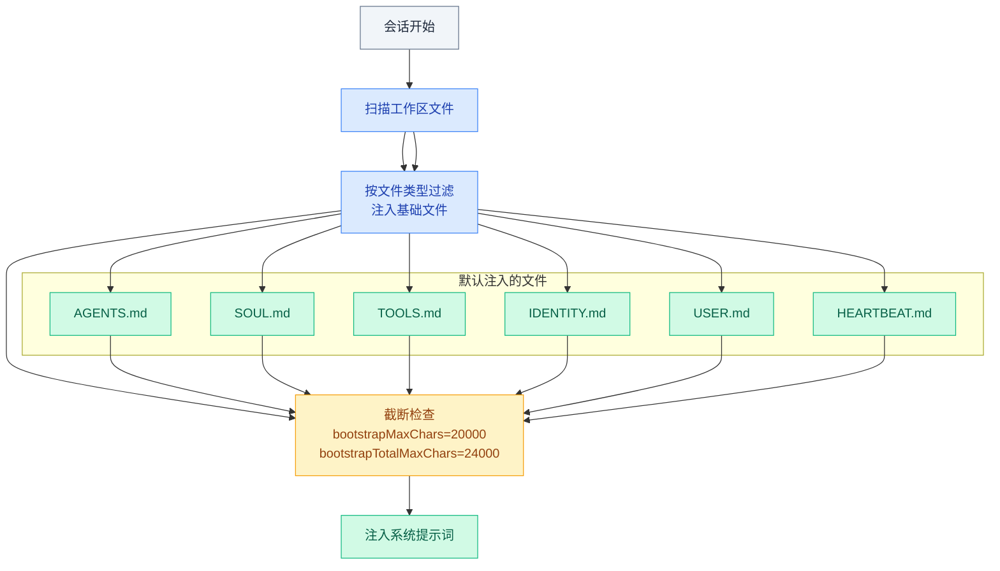

# 05 · 工作区配置

> **学习要点**
> - Agent Workspace 是什么？工作区文件在 Agent 启动时如何加载和注入？
> - 工作区包含哪些文件？各自的加载时机和作用域是什么？
> - AGENTS.md（工作手册）和 SOUL.md（人格说明）的核心区别是什么？各自适合写什么？
> - 如何用 Git 备份工作区？哪些内容不应提交？

---

## 1. Workspace 概述

工作区是智能体的主目录，是文件工具和工作区上下文使用的**唯一工作目录**。

### 目录结构

```
~/.openclaw/
├── workspace/              ← 工作区（Agent 的主目录）
│   ├── AGENTS.md           ← 操作指令（工作手册）
│   ├── SOUL.md             ← 人格配置（相处说明）
│   ├── USER.md             ← 用户信息
│   ├── IDENTITY.md         ← 身份信息（仅首次）
│   ├── TOOLS.md            ← 工具使用备注
│   ├── HEARTBEAT.md        ← 心跳清单（可选）
│   ├── BOOT.md             ← 重启清单（可选）
│   ├── BOOTSTRAP.md        ← 首次运行仪式（仅一次）
│   ├── MEMORY.md           ← 长期记忆
│   ├── memory/             ← 每日日志
│   ├── skills/             ← 工作区技能（可选）
│   └── canvas/             ← Canvas 文件（可选）
├── openclaw.json           ← 配置（不进入工作区）
├── credentials/            ← 凭证（不进入工作区）
└── agents/                 ← 状态（不进入工作区）
```

> 工作区是**默认 cwd**，而非硬隔离的沙箱。相对路径在工作区内解析，但绝对路径仍可访问宿主机其他位置（除非启用沙箱）。

### 默认位置与配置

```bash
# 默认路径
~/.openclaw/workspace

# OPENCLAW_PROFILE 环境变量自动切换
~/.openclaw/workspace           ← 未设置或 = default
~/.openclaw/workspace-<profile> ← OPENCLAW_PROFILE=xxx

# 配置覆盖
```

```json5
{
  agents: { defaults: { workspace: "~/.openclaw/custom-workspace" } },
}
```

---

## 2. 工作区文件加载流程

每次会话启动时，工作区文件按以下流程加载和注入系统提示词：



### 注入限制

| 参数 | 默认值 | 说明 |
|:----:|:------:|------|
| `bootstrapMaxChars` | 20000 | 单个文件最大注入字符数 |
| `bootstrapTotalMaxChars` | 24000 | 所有文件注入字符总数上限 |

> 大型文件超出 `bootstrapMaxChars` 时自动截断。`TOOLS.md` 是常见的被截断文件。

---

## 3. 工作区文件一览

| 文件 | 用途 | 加载时机 | 作用域 |
|------|------|----------|--------|
| **`AGENTS.md`** | 智能体操作指令、记忆使用规则 | 每次会话 | 所有会话 |
| **`SOUL.md`** | 人设、语调、边界 | 每次会话 | 所有会话 |
| **`USER.md`** | 用户信息、如何称呼 | 每次会话 | 私人会话 |
| **`IDENTITY.md`** | 名称、风格、表情符号 | 引导仪式期间 | 首次运行 |
| **`TOOLS.md`** | 本地工具和约定的备注 | 不控制可用性，仅指导 | 所有会话 |
| **`HEARTBEAT.md`** | 可选的心跳小清单 | 心跳检查时 | 保持简短 |
| **`BOOT.md`** | 网关重启时的启动清单 | 内部钩子启用时 | 重启后 |
| **`BOOTSTRAP.md`** | 一次性首次运行仪式 | 全新工作区 | 仪式后删除 |
| **`memory/`** | 每日记忆日志 | 读今天+昨天 | 私人会话 |
| **`MEMORY.md`** | 可选长期记忆 | 私人会话 | 私人会话 |
| **`skills/`** | 可选，工作区特定技能 | 名称冲突时覆盖 | 所有会话 |
| **`canvas/`** | 可选，Canvas UI 文件 | 节点显示时 | 节点会话 |

---

## 4. 不在工作区中的内容

以下内容位于 `~/.openclaw/` 下，**不应提交到工作区 Git 仓库**：

| 目录 | 内容 | 原因 |
|:----:|------|------|
| `openclaw.json` | 主配置 | 环境相关，不同环境配置不同 |
| `credentials/` | OAuth Token、API 密钥 | 敏感信息，不应提交 |
| `agents/<id>/sessions/` | 会话记录 | 隐私数据 |
| `skills/`（托管） | 托管技能 | 全局共享，非工作区专属 |

---

## 5. AGENTS.md — 工作手册

AGENTS.md 是 Agent 的"工作手册"，定义工作规则和项目约定。

### 适合写的内容

- 代码规范："使用 TypeScript 严格模式"
- 工作流程："提交前先跑测试"
- 项目约定："main 分支不能直接推送"
- 项目上下文："本项目使用 pnpm 而非 npm"
- 文件操作规则："配置文件修改后需要热重载"

### 不适合写的内容

- 大段 API 文档（模型不会读完）
- 临时任务清单（放在对话中更有效）
- 和项目无关的个人偏好（放 SOUL.md）

---

## 6. SOUL.md — 人格配置

SOUL.md 是 Agent 的"性格说明书"，定义说话风格和陪伴方式。

### 与 AGENTS.md 的区别

| 维度 | AGENTS.md | SOUL.md |
|:----:|-----------|---------|
| **定位** | 工作手册 | 相处说明 |
| **内容** | 项目规则、代码规范 | 说话风格、人格气质 |
| **语气** | 指令性、确定性 | 描述性、建议性 |
| **示例** | "提交前运行 npm test" | "回复时先给结论再展开" |

### 适合写的内容

- 说话风格："回答先给结论，再慢慢展开"
- 人格气质："语气温和，当我说'烦死了'时安慰我"
- 陪伴方式："我刚开始学编程，多解释基础概念"
- 互动偏好："不确定时直接问我，不要猜"

### 简短示例

```markdown
# SOUL.md — My Agent's Personality

- 语气温和，多用 "可以试试" 而不是 "你应该"
- 回答先给结论，再展开解释
- 我编码时少说话，我提问时多解释
- 不确定时承认不确定，不要编造答案
- 当我情绪不好时，先共情再解决问题
```

> SOUL.md 不用长。先写 5 到 10 条你最在意的风格要求就够。

---

## 7. BOOTSTRAP.md — 首次运行仪式

当工作区是全新创建时，`BOOTSTRAP.md` 会被加载一次，用于完成首次初始化配置。仪式完成后，该文件会自动删除。

### 典型用途

- 自我介绍给 Agent
- 配置初始的工具偏好
- 设置时区、语言等全局参数

---

## 8. Git 备份

工作区是纯文本文件，天然适合 Git 管理：

```bash
cd ~/.openclaw/workspace
git init
git add AGENTS.md SOUL.md TOOLS.md IDENTITY.md USER.md HEARTBEAT.md memory/
git commit -m "Add agent workspace"
git branch -M main
git remote add origin <https-url>
git push -u origin main
```

### .gitignore 建议

```
.DS_Store
.env
**/*.key
**/*.pem
**/secrets*
*.log
```

---

> **相关模块**：[03 - 多智能体路由](03-multi-agent-routing.md) · [04 - 并行专家通道](04-parallel-lanes.md) · [06 - 记忆存储层](../06-memory-systems/01-memory-storage-layer.md) · [06 - 主动检索层](../06-memory-systems/02-active-retrieval.md) · [02 - 配置系统与热重载](../02-gateway-control/02-config-system.md)
